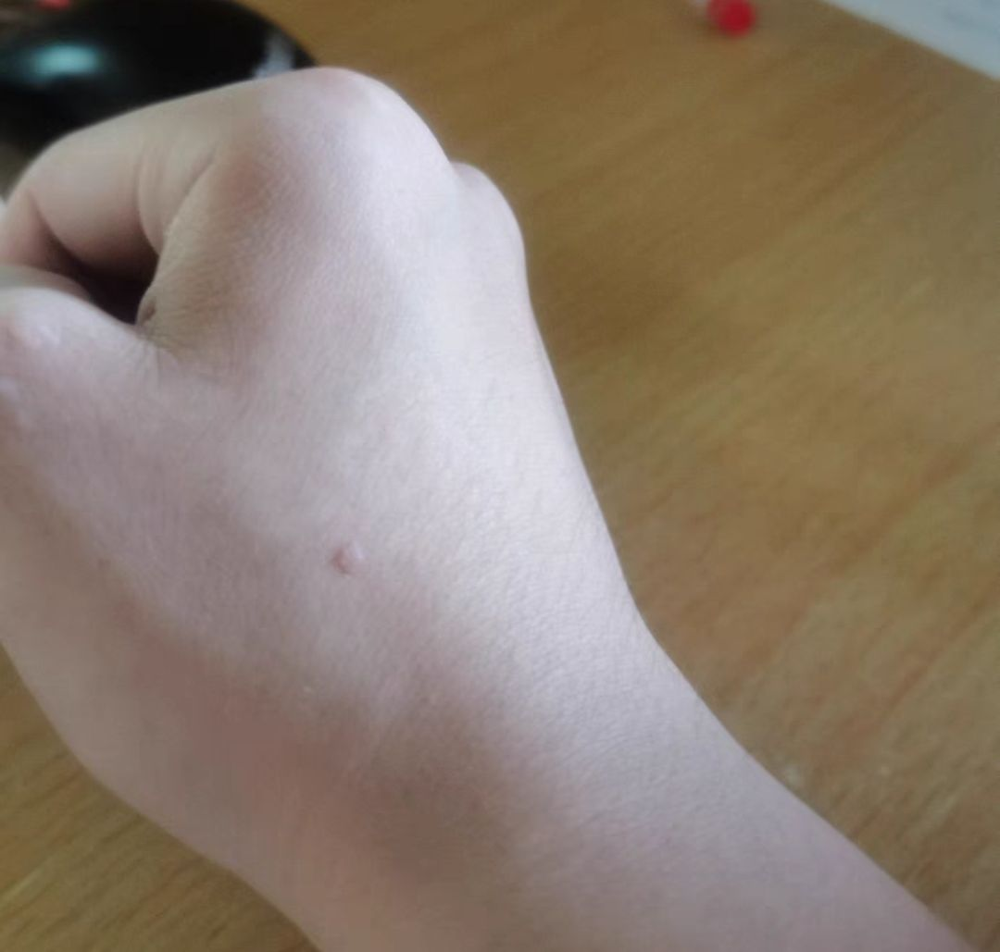

## 什么是扁平疣？

扁平疣是由HPV病毒（人类乳头瘤病毒）所引发的常见皮肤疾病之一。该病毒会使得皮肤表层细胞发生骤变，异常增生，继而在皮肤上形成一粒粒的「小疙瘩」。扁平疣常出现于脸上，颈部及手脚等暴露部位，且因其细小扁平无痛的特性，在疾病早期常被人们所忽略。

## **出现扁平疣后该怎么办？**

倘若发现自己患上了扁平疣，首先不要自行绕抓皮肤患处，降低大面积皮肤损伤的风险，以杜绝病情的恶化。同时，也应尽早寻求皮肤科医生的专业帮助，进行治疗，以免自己成为扁平疣病毒的传播源。此外，维持良好的卫生习惯，避免同他人使用共同个人物品，如：毛巾、刷子、美容工具等，以降低间接传播他人的风险。最后，保持健康的生活方式，如：早睡早起、均衡饮食等，也有助于提高自体免疫能力，令康复速度更加快速。

## **导致扁平疣出现的高危因素有哪些？**

导致扁平出现的原因基本可分为三大类：

1. 直接接触感染者：身边的亲人朋友是扁平疣患者，不经意间的亲密接触，如：拥抱、吃饭及共同使用私人物品，都有可能会令你患上扁平疣。
2. 经常身处于感染环境：经常处于多人公共场所，并使用未消毒的公共器材，如：健身器材、公用拖鞋、毛巾等，都极有可能提高感染风险。
3. 免疫系统低下者：免疫系统尚未发育完全，正在生病或生活不规律，都会导致自身抵抗力虚弱，继而也更容易被病毒入侵，从而诱发出扁平疣。

## **扁平疣会自己好吗？**

扁平疣是有自愈的可能，但其概率则微乎其微。对于孩童或青少年而言，机率可能会大些，这是因为随着年龄增长，自身免疫系统逐步发育完善，能更好的抵抗病毒，进而达到自愈的可能性。然而，对于成人而言，自愈的可能性就更小了。除了少部分的患者能通过改善不良习惯的方式，来提高抵抗力，从而消灭扁平疣。但是，绝大部分的感染者，还是会维持长达几年的扁平疣症状，乃至令病症逐渐恶化。

## **有什么有效的治疗方法推荐？**

市面常见的脱疣方案有：去疣药膏、冷冻脱疣、激光脱疣、中医疗法以及手术切除等等，多种多样的疗程方案。根据扁平疣的大小，感染深度不同，适合的疗程也会不一样。因此，为了达到最佳疗效，还是建议寻求皮肤科专科医生的诊断，选择出最适合自己的疗程，从而达到事半功倍的疗效。最重要的事，切勿自行切除或胡乱使用未受专业认可的三无产品，以避免出现不可逆的风险。

文章源地址：https://www.nhau.hk/wart-removal/flat-wart/#section_2

