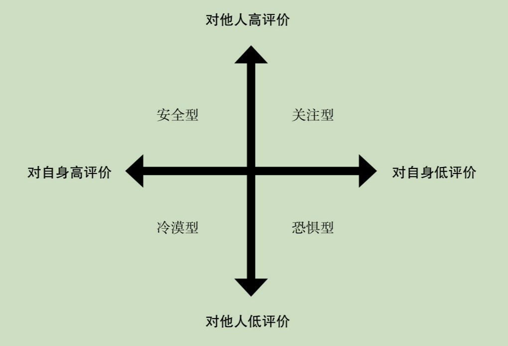

## 第一章：“剩时代”的情爱困境

（一）从“我”到“我们”的距离

爱的反义词不是恨，爱的反义词是冷漠。

冷漠代表着没有热切的诉求、没有行动的热情、没有执行力和成就所带来的满足感，这一点和拖延症很像，拖延症的表现就是双目无神地在电脑屏幕前耗过几个小时后，手头的任务还全无进展。

“爱无能”就是爱情的拖延症，它的发作让剩男剩女一直剩了下去，让激情褪去的夫妻继续凑合着过日子，让原本可以心心相印的人同床异梦，甚至背道而驰。

来时不厌、去时不念的人当不了爱人，可怕的是，很多人在追爱的路上碰不到什么“有感觉”的人，久而久之，甚至把追爱这件事本身都放下了。没爱人的时候，对寻找爱漠不关心；有爱人的时候，对培养爱毫无热情；爱情遇到问题的时候，搁置问题，跨过问题，压抑问题，否认问题，唯独不解决问题。没爱的时候远离爱，有爱的时候逃离爱，这就是对“我”这个单一身份的错误沉湎，也是**追爱拖延症**的典型表现。

走不出“我”的人是被爱情以及自己对爱情的错误认识所控制的可怜人，而迈进了“我们”的人却是能够用方法与技巧控制爱情的成功者。前者就像跳交谊舞时总踩到对方脚的人，连声道歉后逃离舞池再不愿尝试；而后者是一个舞姿优雅、脚步轻盈、能带给舞伴良好感受的人。有的人一跳舞就犯怵，而有的人不跳舞就难受。

（二）逃离“剩斗士”的土壤

开放型场合指的是那些不需要特定的交互就能完成其根本任务的场合，这样的场合不强调个体之间的互动，人们挖掘潜在的亲密关系的机会并不是很多。比如走在马路上、大操场上三三两两跑步、做广播操。在这些场合里，人们都普遍被同一化与匿名化，你做你的而我做我的，你我虽然同在一个时空，但并不存在什么沟通与发表见解的必要，彼此都是路人，看一眼就忘掉了长相。

闭合型场合就完全不同了，这样的场合如果没有深入的交流与互动，就很难达成场合存在的终极目的。比如读书分享会、面试、打麻将。在这些场合，单方面的深度展示以及彼此间的深度探讨就有了更好的氛围与效果。很多在开放型场合不可以说的话与做的事，放到闭合型场合简直再正常不过了。例如，你在大马路上一般很少兴高采烈地大喝一声“自摸”，但在麻将桌上可以。

很多人上学、工作、参加活动，其实还是以一个可有可无的状态融化在了某个开放型场合的大背景里，归根结底，还是把自己埋没在了准熟人社会的茫茫大海。要逃离“剩斗士”的土壤，就先从介入闭合型场合，以及**努力将开放型场合向闭合型场合进行转化**开始。

（三）病急也不能乱投医

也许从父母到七大姑、八大姨都在逼迫你去脱离单身状态，但是无论如何，你也不应当勉强自己找一个与自己并不合适的人。下面的六点能够让你在这个着急上火的逼迫情境中，维系一丝有科学根据的择偶标准：

1. 寻找恋爱对象的目的，是寻求进入一段长期稳定的亲密关系的可能性，而非必然性
2. 约会理应是有趣的
3. 好的恋情不会让你萌生更多的孤独
4. 随着恋情的深入，需要更深入的肢体亲密
5. 在适当的时机，有必要严肃地引入婚姻这一话题
6. 尝试胜任的新角色

（四）摒弃低效社交

在多个大型研究的成果中，心理学界总结出两点让人们从初次见面就感觉不错一直到白头偕老都维持着高效社交的重要因素。

第一点，在爱情发展的过程中仍然注重伴侣间的友谊的长期建设，好的情侣应当是好的朋友，他们在一起的沟通与交流才能积极而高效。

第二点，学会觉察沟通中的表达往往是一道选择题：同样的意思，你总能选择一种更好的方式去表达，而且他们也的确选择了说那句更暖心的话。像搭建房子一样，从点点滴滴开始把爱情经营完善。

（五）残酷与美好不矛盾

恋情中总有矛盾这件事情是残酷的，而不可调和的矛盾导致的结果，是恋爱双方或和平或不愉快地分手了。而失恋导致的情感伤害，本身就是爱情最剧烈的残酷。

面对这种残酷，人们有必要时时提示自己：“残酷的是失恋，这并不能抹杀爱情本身的美好。”提醒自己残酷与美好没有矛盾，或许可以从下面这些方面入手。

首先，不是恋情中的每个冲突都会有一个完美的说法的，不要在找说法的道路上钻牛角尖。其次，因为争吵、失望、被拒绝甚至分手本身所导致的难过是正常的，别拿自己的这份痛苦当成个例。某种程度上讲，这些残酷也是必要的。如果没有这些难过，行为会更加缺乏约束，人们就不会珍惜彼此，最终导致的失落，反而远远超过了一个短时间内的好心情。坦然接受情感的残酷一面带给你疼痛未必不明智，伤害导致疼痛，从肉体到心灵这都是一件再天经地义不过的事情。

不要因为这次爱情结束的残酷而没有结果，就否认了自己能爱与会爱的能力。分手对人最大的伤害，并不是那动不动难受一下的一年半载，而是一个人对自己可能由此而生的错误认识。“我不配”“我不敢”与“我不会”都可能成为某次多年前失败的恋情所留下的后遗症。负面地联结情感生活与自我，是“爱无能”的典型表现。

在追求爱情的道路上，自怨自艾是一件没有什么意义的事情。在这个领域，单纯从情感的角度上讲，更需讲究的是双方之间有没有产生火花、彼此之间是不是倾慕，没有什么“配不配得上”，而只有“适合或不适合”。有的“配不上”其实是一种被错误解读的“不适合”。

（六）是爱情让钻戒闪光

在安全感缺失的年代，“爱情让信物有意义”的简单道理被相当一部分人误解为“信物让爱情有意义”。虽然钻戒一向很重要，但我们并不能说信物就代表了爱情。在我看来，是爱情让钻戒闪光。纵然爱情的表现可以被一定程度上物化，可是爱情本身无法被物化。

（七）爱的选择题

爱情这道选择题比较复杂，因为在别人眼里，甚至在自己眼里，那些富于吸引力的好答案，其实都未必是对你而言最终的正确答案。谈恋爱亦如是。在充满困境的“剩时代”里，寻找美好爱情应当从寻找一个跟自己有相似之处的人开始。每一段自由而美好的恋爱，实际上依然是有限选择的结果。而恋爱双方的相似性，在给这个结果镶上浪漫花边的同时，也赋予了它更深刻的意义。

## 第二章：追爱路上

（一）吊诡的相亲

相亲应该有规则，比方说“七分钟相亲”。所谓“七分钟相亲”，即给每对异性七分钟的交流时间，在七分钟过后，不管交流成效如何，都必须寻找下一位异性再开始一段同样是七分钟的谈话，如此循环延续，直到与在场的每一位异性都聊过，而后再提供专门的时间来给有意向的人留下交流方式。

如果没有规则，那看似自由的相亲过程，恰恰是没有方向的。随心所欲的自由并不意味着能直奔主题，得到自己想得到的一切。很多相亲之所以容易引发尴尬的原因，就是它直接把两个人放到了一个场景，只告诉了他们最终的目的是“如果能在一起的话，那就在一起吧”——而没有任何规则与约束。

如果在“七分钟”这个限定时间规则内，双方没有任何进展，那就可以选择下一位。这样可以在短时间内接触更多的异性，增大相亲成功的可能性。

（二）初次约会聊点什么

能够决定一段情感的质量、稳固程度以及到底能延续多久的，并不一定是我们之前提到过的爱情三要素。在很多具体的情况下，亲密、激情抑或承诺这些常被当作重点的要素其实都只能起到锦上添花的作用，真正起到决定性作用的因素——一言以蔽之，是“合适”二字。

如果你喜欢一个人，可以考虑谈恋爱。如果你和一个人合适，可以考虑结婚。如果你喜欢一个人但不合适，进入婚姻只会把喜欢殆尽。如果你不喜欢一个人但是合适，爱情与你无缘，婚姻生活不会为难你。如果你喜欢一个人并且适合，那爱情已经握在你的手里。如果你不喜欢一个人并且不合适，你多看她一眼都是浪费时间。

在约会中来探讨双方“有什么”，远远不如探讨双方“经历过什么”来得有价值。因为对后者的探讨，更容易通过具体的事例和实际发生过的事情，来对个人的特质加以评估。

（三）谁更招人喜欢

- 恰当的礼节
- 谈论中对事不对人
- 给对方足够尊重
- 专注地倾听
- 对需求的敏感
- 征询对方的意见

你做到这些也未必赢得青睐，但你极度缺乏如上的能力，恐怕很难讨人喜欢。

（四）外貌到底有多重要

必须要承认，在谈恋爱的初级阶段，长得好看的确拥有不容忽略的优势。

长得好看的优势在于容易引人注意，而非容易带来美满爱情。谈恋爱的难度，一点儿也不会因为长得好看而降低。

（五）一见钟情与场景误读

一见钟情是一种情感爆炸，而这种情感爆炸的导火索，并不像人们通常认为的是一个具体的人。真实的情况是，诱发一见钟情的往往不是人，而是一个容易唤起人们某种剧烈情绪的场合，在那个场合中，人们更容易产生一见钟情的情况。

这种情况被叫作场景误读。有的时候，我们缺乏辨别到底是什么让我们高兴起来、紧张起来、兴奋起来甚至恐惧起来的能力，因此很容易把情绪的诱发原因归结到一个作为异性的第三方身上。事实上，让你感到情感爆炸的可能是酒精、音浪、运动、高度、困难、赞许——而你只是误把原因归结到了与这些因素相关的人，而让你感到了一见钟情。

（六）暗恋是笔不划算的买卖

暗恋的人，最好结合实际情况仔细评估一下继续投入的必要性。他们有必要提醒自己，在绝大多数情况下，这种爱的方式没有电影演得那么完美。

被暗恋的人，表达态度的时候完全可以再斩钉截铁一些，严肃地拒绝并不意味你就是一个不顾及别人感受的坏人，而意味着你对双方都有着应当的尊重。

（七）友达以上，恋人未满

“友达以上，恋人未满”并不是一个问题，问题是怎样鉴别当下的状态到底是朋友还是恋人，当下的感情到底是友情还是爱情。可以**参考**两个指标：彼此的性吸引和排他性。

（八）龙卷风的前因后果

对于大多数的分手而言，具体的矛盾只是一个表面的原因。矛盾可能是恋情结束的导火索，却通常不是爱情真正的杀手。

不少情侣没有熬到亲密关系的中期，他们的爱情冲劲儿太猛却后劲儿不足，搁浅在了沙滩上。一个非常重要的原因是，人们对于**长程亲密关系**（注重人的特质）与**短程亲密关系**（注重人的外貌）的核心诉求是不同的。一些能够有效维系短程亲密关系的核心特质，并不能够在有了一定经历的恋情中继续发挥作用。

“不合适”不仅仅是评估出来的，更是相处出来的。大量的短程恋情之所以成为短程恋情，是因为在双方交互的过程中，既没有在一开始就重视对方的内在品质，也没有给彼此内在特质的磨合事先做好心理铺垫。随着恋情的深入，人们自然而然地会开始关注道德、性格与生活习惯，引发了曾经激情的长相与身材，不再能够掩盖生活中琐碎的矛盾。如果依然一位强调着早期“秀恩爱”的激情种种，终归是跨不过这矛盾重重的阶段。

## 第三章：潜伏的爱情影响力

（一）“小白棍”的魅力

其他一些可能造成物质依赖的产品依然在今天沿用着以前烟草商们玩剩下的套路。比如众多含有牛磺酸与高糖分的功能性饮品，在广告和舆论中大量将产品与青年一代的活力、张扬与热情加以联系，赞助极限运动，却在广告里绝口不提他们的用户很多都是熬夜一族并饱受肥胖等问题的困扰。

面对叼着烟的异性感到惊艳非常，不仅仅是因为在生理上得到了激活，更有可能是在长期的成长经历中，被**广告和媒体洗脑的结果**。

有的爱情偏好是舆论在不知不觉中影响我们的，而非我们自己塑造而成的——虽然它看上去更像是后者。抽烟的形象只是其中的一个典型例子，更何况烟草与酒精饮品一类的东西本身就有促进情绪亢奋的功能。

但有些东西完全没有在心理学上的理论依据，却依然能够成为人们择偶的重要标准甚至唯一标准。这件事看上去比抽烟影响择偶还要荒唐，却蕴含着远超其表象的深刻寓意。

（二）星座不靠谱

在所谓的星座特质脱胎而生时，掺杂了太多的小动作，导致它看上去那么准。

首先，它非常强调正面评价与负面评价存在比例。鲜少有人在某些特质上是非常极端的，这就给了类似“你是一个喜欢交流的人，但很多时候你真的想一个人静静”这样的话大量的市场。在描述中，频繁地使用“但是”“不过”与“可是”这类转折词，挑一些人皆有之的方面，正反话全说到，由不得人们不信。

其次，它往往刻意强调神秘感与权威感，“看上去很厉害”让听到的人产生了不该产生的信任与崇拜。解读星座运程的人总是走偶像路线，而与星座相关的书籍和网站也都刻意渲染其神秘性。这样的舆论导向乱花渐欲迷人眼，大有蛊惑人心的功效。

最后，它的句子通常模糊，而没有具体的评价。“偶尔”“有的时候”“一些”等词汇都归于此流。凡是看上去肯定的话语，肯定连接着一个并不肯定的对象，导致解释起来并不费力——比如某个星座与某个星座并不般配一类的。
可一旦参与到对客观世界的真正评估与理性预测中来，星座所提供的信息就愈发微不足道起来。

（三）烂桃花的心理基础

在亲密关系中，情商高的表现即在恰当场合以恰当身份做出恰当的行为。

不管怎样，情商从侧面证明了爱以及对爱的追求都可以被当做一种个人能力来看待，而这种能力是可以通过经验和学习加以提升的。一旦加以把控，毋庸置疑对亲密关系与恋人间的情感产生积极的影响，并有着产生更深刻作用的潜力。

（四）父母决定安全感

（五）关系的继承

对于大多数人来说，这个软件的主要开发者与维护者都是我们的父母，在与他们共同生活的岁月中，我们渐渐被他们塑造与培养成了我们现在的自己。

她对我说：“别紧张，你见到的就是像我一样的两个人。你只要喜欢我，你就会喜欢他们的。因为我喜欢你，我想他们也会喜欢你的。”

这话的后半部分没有什么说服力，因为如果真的是这样，天下哪里还有那么多棒打鸳鸯的父母。但不可否认的是，这句话的前半部分起到了相当的效果——如果教科书上没有胡写，而我的发展心理学老师当年也没有乱讲的话，那么什么样的父母将塑造什么样的子女。这样一来，我即将面对的人并不像我想象的那么随机与不可预估，他们肯定与我的妻子分享着众多的共同点。

事实证明，我的妻子继承了她父亲的高效率以及发脾气的方式，也继承了她母亲的勤快和不同于常人的幽默感。有了这些体会与线索，与老人家的相处并不是一件难事了，我对于这次见面的愁思，全留在了飞机上。而更让我高兴的是，二老对我的评价一如我的妻子对我的评价，他们果然也有着差不多的审美与价值观。

如今，我结婚已经多年，更进一步地发现了父母的亲密关系对子女的亲密关系的影响。我的妻子在亲密关系上的表现极大程度上地沿袭了她的母亲，而对于我的期待也很大程度上来自于她对她父亲的认知。与此同时，我父母的关系也在我的身上有着类似的表现。我与我妻子的亲密关系，更像是我们各自父母的亲密关系的特殊嫁接。

（六）比鬼推磨还难的事

事实上，在全世界的范围内，虽然离婚率近几年一直在走高，但是人们对于爱情和亲密关系依然保持着积极与正向的态度。

物质水平决定了与亲密关系有关的部分行为和决策，却并没有影响人们对于亲密关系的看法和态度。无论收入程度高低，或者坐拥多少资产，20～24岁的年轻人依然对婚姻秉持着很高的期待与评价。在最近的一项调查之中，83%的青年男女对未来自己婚姻的重要性评级选择了“重要”与“非常重要”的选项，他们之中有90%的人希望在40岁之前拥有稳定的婚姻关系。即使在绝大多数国家，同性恋婚姻尚未获得合法化，但80%的同性恋者同样期待正式的婚姻。

在如今这个年代，婚姻的功能性已经大打折扣。它已经逐渐发展成为一种在个人情感上的印记与符号，但对于并不富裕的人而言，它依然维持着强劲的功能性——婚姻能整合更多的资源，并解决众多现实的问题。

综合了这些调查结果，我们不难发现，物质并不会影响人们对于爱情的态度与想法，但是会影响人们在亲密关系上的行为表现。有钱并不意味着你就能找到真命天子，或者娶到梦中情人；没钱也并不代表着你就要孤独终老，或者找一个差不多的异性凑活过日子得了。然而，你一旦找到了那个命中注定的人，有点儿钱终归不是什么坏事，起码不会对关系的维系与发展产生太负面的影响。

（七）酝酿的节点

婚姻在绝大多数时候看似自愿，实则是错综复杂的影响施加下的被迫抉择。只是这种抉择，参与进来的人多能受益。太多太多的话语、规矩、评价，看着是别人的嘴讨论别人的事儿，实际上却把句号画在了无辜的我们身上，挣不开，脱不离。

愿意不愿意相爱，是两个人的事；愿意不愿意结婚，却是两个人考虑了很多人的感受之后做出的决定。

酝酿爱情的节点，跟爱情本身一样，如鱼饮水，冷暖自知。

## 第四章：爱情的算无遗策

（一）方法大于说法

越来越多的人，或者是因为懒、或者是因为怕、或者是因为不愿意投入精力去细致思考自己的生活，就像在开封府前捶打鸣冤鼓一样敲响咨询师的屋门，并不是要讨一个解决问题的方法，而是要讨一个一劳永逸的说法，自己的生活却要让个只能负责帮你平和下来与陈清利害的外人来下决断。就比方说有一对夫妇就他们长期积郁的感情问题来找我做亲密关系方面的心理咨询，两个人一进屋，才放下包就撂下一句掷地有声的话：“老师，这日子没法过了！你就说我们离不离吧！”

如果把爱情中那些大大小小的窘境看做游泳过程中偶遇的微小险情，很多人以为自己要一个救生员，其实你真正需要的是一个救生圈。很多“人生某某法”“职场某某术”“人生忠告某某条”一类的看似心理学意味十足的书，作者都把自己粉饰成了神勇无比的救生员。作为迎合了“伸手党”们主要需求的书籍，它无视人与人之间个性的差异，还可以像中学数学题集一样告诉你面对什么样的问题应该怎么做以及应该做什么，仿佛生活的难题都有天衣无缝的标准答案。

要我说，“实用主义”大于“通用主义”。心理学跟人们生活中实际问题的距离，需要靠方法来弥合，而不是靠说法来补充。

注：救生员意味着他救，救生圈意味着自救

（二）很多时候，仅仅沟通是无效的

人们有时候太在乎恋人之间的交互，而淡漠了交互的具体环境。很多时候，仅仅沟通效果不大。沟通的大环境决定了就当下问题加以探讨才是最明智的选择。当务之急，应当是改善两个人之间的气场。

在很多时候，情侣们的当务之急其实并不是就事论事地解决当下问题，而是先把问题缓一缓，抬头看看天。看看今天的“心理天气”是不是早就超越了靠几句话就能改善的范围。很多臆想中的根本问题，其实都未必算得上是什么不可调和的矛盾。只是在一个狂风骤雨的关系之中，什么情况一不留神都可能演变成洪水猛兽。

很多时候，仅仅一味地沟通是没效的，改善沟通的心理背景才真正有用。只有当大环境得到改善的时候，关于技巧和方法的讨论放到桌面上来，才显得有意义。而人们在亲密关系中，丧失的第一个基本的沟通能力就是好好说话的能力。

（三）好好说话

既然是说过要天长地久的人，那么情侣之间为什么逐渐丧失了好好说话的能力，甚至还要故意地刻薄相待？别说那些伤害都是无意的。亲密关系之中，绝大多数的伤害都是有意的，是被**矛盾激发出来的**刻意行为。

平行线一样的两个人，无法成为情侣，一旦成为情侣，却也意味着不能无视生命交集之间的冲突。这些冲突的表现纵然多种多样，究其原因，也就只是一个人的目标干扰到了另一个人的目标。除非目标无交集，否则冲突无法避免。

矛盾本身是中性的，它普遍存在，却没有好坏之分。随着亲密关系越来越深入，冲突总是无法避免。如果两个人已经对彼此相当依赖，目标却依然背道而驰，那冲突将愈发庞杂激烈。

不快乐的情侣和夫妇到底做了什么？与其问他们“做了”什么，倒不如直接问他们“说了”什么来得直接一些。

不能好好说话的表现形式多种多样：

- 地漏问题：所谓的“地漏问题”是指一些具体的问题成为情侣们方方面面矛盾的代表，所有的矛盾都被归结到某一个具体问题上，比如“都是因为他懒”或者“都是因为她乱花钱”，而实际情况可能远远不止于此
- 试图总结对方：例如，“你是不是这个意思？”这些话虽然看着像是总结，但实际上充满了自以为是的曲解，只是控制欲的另一种表现罢了
- 预先归因：例如，还没有等对方把话说完，就表明了“他说这个话的意思就是嫌弃我爱花钱。”
- 封闭型问题：就是类似“你说你到底当时有没有给我打电话”的问题，其实这是一种强烈的指责，缺乏讨论的基础
- 把问题转变成了骂街：这很常见，如“你这个人是不是有病？”就是典型
- 由翻旧账组成的多重抱怨：把一个问题变成一堆问题来一起争吵
- 好为人师的说教：例如，“你闭嘴，听我说，你什么都不懂！”伴侣的地位本应当是平等的，却偏偏有一方希望能够处处强势，指导一切

（四）不必回头的矛盾

一些情侣相处的问题即使剧烈，也不会太影响情侣的亲密关系满意度。因为吵架和冷战本身就是矛盾的一种处理方式，它背后的心理机制是情侣们自身情绪管控的能力欠佳，或者缺少了解决问题的技巧和方法。

但是有一些情侣相处的问题是一方对另一方的绝对控制，这是藏在背后的真实原因。它不是面对问题的愤怒感，而是纯粹的控制欲！它虽然在表现形式上很可能跟普通的情侣矛盾完全一样，但在本质上它由控制他人的欲望造成，它不需要有某个具体的矛盾作为诱因，它本身既是矛盾也是诱因。

情侣们难免有矛盾，关系再好的夫妻也经历过不快乐的冲突。如果矛盾有一个就事论事的基础，那这些问题完全可以成为让俩人爱情步步登高的台阶。但是，如果表面的问题并不是实质的问题，对爱情的绝对掌控欲望才是实质问题的时候，这个矛盾就没什么可以缓冲的余地了。

（五）爱情最大的不幸

父母的影响、环境的约束、七大姑八大姨或喜或悲的情感历程、看过的电影和书，都影响着人们对自身感情的期望。在人们还没经历爱情的时候，文化就影响了人们对爱情的看法。**文化本身就是爱情选择与期望中最大的霸权**。只是人们还是倾向于自欺欺人地告诉自己，“择偶”是一种自发自愿的行为。所以初恋大多数都走向了失败，因为你初恋时，带着的期望并没有经历过任何修正。那臆想中的爱情太美好，多巴胺的大量分泌又太甜蜜，可是热恋过后，期望和现实总有落差。

如果你的表现与人格真的符合了他/她针对你的期望，有一个信号可以轻易让你捕捉到这个信息——那就是笑。

（六）己所欲，勿强施于人

牢固建立“己所不欲，勿施于人”和“己所欲，勿强施于人”的信念。适合你的未必适合你的伴侣，找那些合适的方法与手段，才是最正确的途径。己之蜜糖，彼之砒霜，懂得做合适的，而不是自以为正确的，就已经算在亲密关系中迈出了至关重要的一步。

（七）好聚好散，谁说了算

很多情况下，我们不得不坦诚地接受，分手也许是对两个人都有利的选择。可一旦选择了结束这段恋情，尤其是在某些负面事件作为导火索的情况下，好聚好散就成了一件非常有难度的事情。昔日的爱侣翻脸比翻书都快，美好和甜蜜瞬间烟消云散，“一日夫妻百日恩”早就成了废话，鸳鸯则变成了仇人。

有很多人面对他人的亲密关系问题，从来都是劝和不劝分的。我从来都不主观地把自己向劝和的方向偏斜，你没处在当事人的角度，其实是没有资格直接替当事人做决策的。一个女性天天被酗酒后的丈夫暴打，自己又不是受虐癖，不抓紧时间离婚还等什么呢？难道一定要寄希望于一个缺乏稳定性的酒徒改过自新吗？

分手就是分手，分手不是别的。大家都是成年人，只是考虑到过去、当下与未来，做出了一个可能正确也可能错误的决定而已，真诚地表达离开的意愿。
