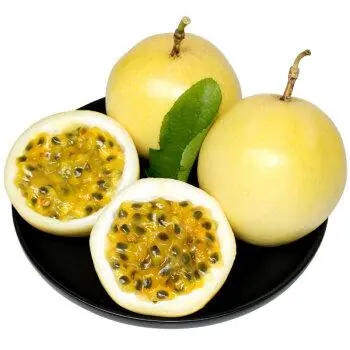
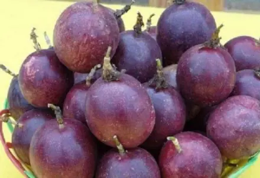
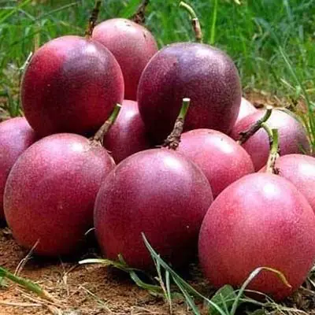
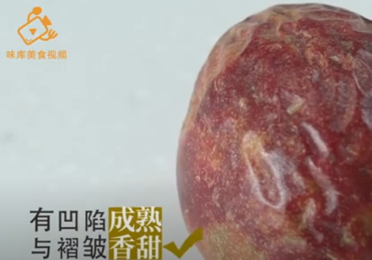
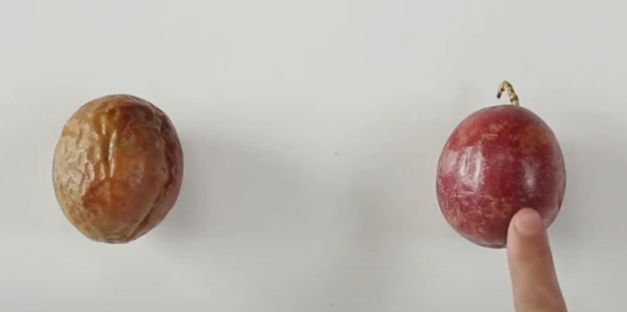

## 介绍

西番莲，又名百香果、热情果、鸡蛋果，产于美洲的热带及亚热带地区。原产于巴西，巴拉圭，1610年间传入欧洲西番莲的果汁**常被用作香料，加在其他果汁中**

黄色百香果：营养价值最高，最优选择

紫色百香果

紫红色百香果

## 名称的来源

西番莲自西班牙语转译至英语称passion fruit，**意即“受难果”**，“百香果”这个名称实际上是“passion”一字为音译。当时西班牙传教士发现其花的形状极似基督之十字架刑具，柱头上3个分裂，极似3根钉，花瓣红斑、恰似耶稣头部被荆棘刺出血形象，5个花药，恰似钉子或伤痕。西班牙人以Passioflos名之，直译为受难花（Passion Flower）。**但英语中passion一词还有“热情”之意，故也常被误译为“热情果”，与原意无关**

## 营养

| 名称       | 含量 |
| ---------- | ---- |
| 水分       | 73%  |
| 碳水化合物 | 22%  |
| 蛋白质     | 2%   |
| 脂肪       | 0.7% |

每100克（3.5盎司）的生西番莲提供97卡路里的热量，是**维生素C（33%每日摄入量）的丰富来源**（指比每日摄入量的20%更多），也是**核黄素与钾的中等来源（10-19%每日摄入量）**。其他微量营养素的含量不显著

## 注意点

 一般3~4个就好，多了容易胃酸

因此，对于部分患有胃肠炎、胃溃疡、十二指肠溃疡的患者应谨慎食用

## 挑选方法

1. 观察百香果果皮的质感：最佳选择是**果皮微皱**的略带深紫色的果子，这样的果子最成熟也最甜。可能你想买干净的卖相好的果子，但实际上这并不重要，因为你只吃里面的果肉。果壳越软，果实越成熟
2. 摇一摇：如果晃动强，说明果肉与果皮分离，很可能是坏的
3. 闻一闻：通过闻也可以判断口味。如果闻起来有热带水果的香味，一定很香甜；如果闻不出任何味道，果肉要么很酸要么淡而无味

果皮微皱

颜色深，为深紫色（紫红色百香果）

## 参考链接

[维基百科](https://zh.wikipedia.org/wiki/西番莲)

[百度百科](https://baike.baidu.com/item/%E7%99%BE%E9%A6%99%E6%9E%9C/1484850)

[wikiHow](https://zh.wikihow.com/%E4%BA%AB%E7%94%A8%E7%99%BE%E9%A6%99%E6%9E%9C)