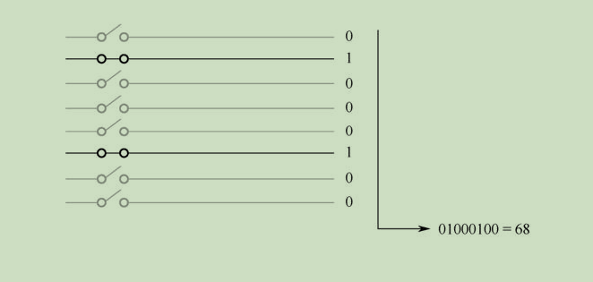
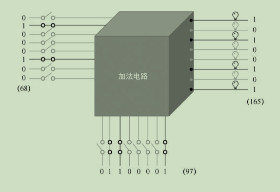
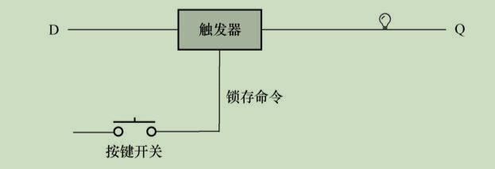
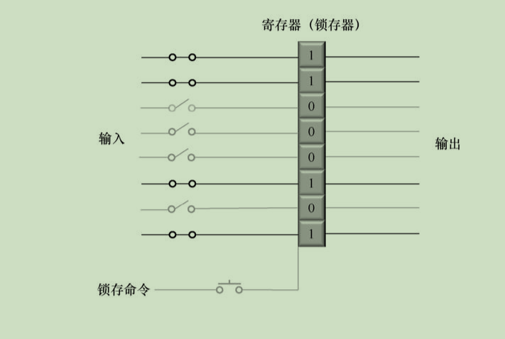
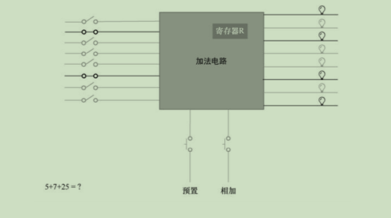
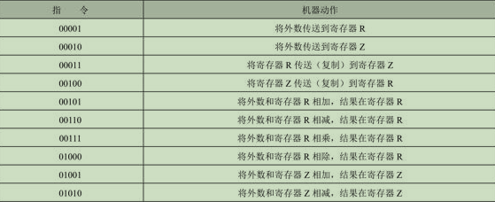
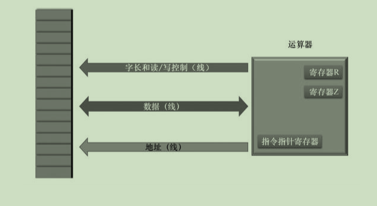

## 二进制计数法

在计算机里，二进制数字对应着高、低电平的组合

参与计算的数字通过电线送往计算机器，高电平被认为是“1”，低电平被认为是“0”，这样就形成了一个序列“11111010”，这就是一个二进制数，在数值上等于十进制数250

（1）二进制到十进制的转换

二进制和十进制都是进位计数法。进位计数法的一个特点是，符号的值和它在这个数中所处的位置有关

> 比如，十进制数356，数字6处在个位上，所以是“6个”；5处在十位上，所以是“50个”；3处在百位上，所以是“300个”，即百位3、十位5、个位6 = 3 * 10^2 + 5 * 10^1 + 6 * 10^0 = 356
>

由于所处的位置不同，每个数位都有一个不同的放大倍数，这称为“权”。每个数位的权是这样计算的（这里仅讨论整数）：**从右往左开始，以基数为底，指数从0开始递增的幂**

> 每种计数法都有自己的符号（数符）。比如，十进制有0、1、2、3、4、5、6、7、8、9这10个符号；二进制呢，则只有0、1这两个符号。这些数字符号的个数称为基数。也就是说，十进制有10个基数，而二进制只有两个

比如一个二进制数10101，它的基数是2，下面是转换为十进制的过程

1 * 2 ^ 4 + 0 * 2 ^ 3 + 1 * 2 ^ 2 + 0 * 2 ^ 1 + 1 * 2 ^ 0 = 22

（2）十进制到二进制的转换

为了将一个十进制数转换成二进制数，可以采用将它不停地除以二进制的基数2，直到商为0，然后将每一步得到的余数串起来即可

## 十六进制计数法

这16个数符分别是0、1、2、3、4、5、6、7、8、9、A、B、C、D、E、F

（1）十六进制到十进制的转换

在计算各个数位的权时，幂的底数是16。将十六进制数125转换成十进制数的方法如下：

1 * 16 ^ 2 + 2 * 16 ^ 1 + 5 * 16 ^ 0 = 293

（2）十进制到十六进制的转换

把一个十进制数转换成十六进制数，则可以采取不停地除以16并取其余数的策略

## 题外话：为什么需要十六进制

如果将一个二进制数从右往左，**分成4比特为一组的形式**，分别将每一组的值转换成十六进制数，就可以得到这个二进制数所对应的十六进制数

这样一来，如果我们稍加努力，将0～F这16个数所对应的二进制数背熟，并能换算自如的话，那么，当我们看到一个十六进制数3F8时，我们就知道，因为3对应的二进制数为0011，F对应的二进制数是1111，8对应的二进制数是1000，所以3F8=0011 1111 1000

同理，如果一个二进制数是1101 0010 0101 0001，那么，将它们按4比特为一组，分别换算成十六进制数，就得到了D251

## 计算机和汇编语言

（1）用电表示数字

前面已经讲用电来表示数字，通电代表1，不通电代表0，为了可观用灯泡来做出提示

下面就是通过电的开和关表明当前数是 68 = 00100010

（2）二进制加法机

我们不去看加法机内部的实现机制，看看如此简陋的加法机如何把两个数相加

这个加法机器的作用是**接受左边和下面的输入**，把它们当成两个二进制数，并做加法操作，相加得出一个和数

这个加法电路的工作是实时的，输入端的任何变化都将立即导致输出端的变化。当你拨动左边或者下边的任何一个开关时，右边的输出也将立即有所变化，某些灯泡会灭掉，而有些灯泡会亮起来

（3）具有记忆力功能的器件--寄存器

在此之前，得先介绍触发器

触发器的特点是它可以把输入保存起来，这叫作锁存。一个特制的触发器有一个输入端D，以及一个输出端Q

平时，按键开关处于断开状态，触发器不会执行锁存动作，无论从输入端D来的是0还是1，都不会进入触发器内部，都不会被触发器内部的电路保存，更不会出现在输出端Q，即不影响输出端Q原来的状态

但是，一旦我们按下按键开关，则触发器会立即执行一个锁存动作，不管输入端是0还是1，都会被触发器锁存起来，并立即出现在输出端Q。**锁存之后，无论输入端D再怎么变化，都不会影响到锁存的内容，也不会影响输出端Q原来的输出，除非再次按下按键开关发送锁存命令**

一个触发器只能保存1比特。为了保存一个比较大的二进制数，**用若干个触发器，将它们组合在一起**，这样就形成了一个新的器件，**叫作寄存器**

寄存器是一个多输入、多输出的器件，它的两边都连着一排导线，左边的导线用来提供输入，右边的导线用来提供输出；下面的按键开关用来向组成寄存器的所有触发器发送锁存命令

 如果需要，寄存器可以随时锁存新的数字，以前锁存的数字会被新的数字冲掉。从这个意义上来说，任何数字都是临时被保存在这里的，不会长久，属于**临时性寄存**。这就是“寄存器”一词的由来

（4）带寄存器的加法机

前面的加法机需要两个输入，有寄存器只需要有一个输入即可实现两数相加（不止两个）

首先，拨动左边的一排开关，准备好第一个要相加的数字5，然后按一下“预置”按钮，将这个数字保存到寄存器R。接着，再次拨动左侧的那排开关，准备好另一个要相加的数字7，然后按一下“相加”按钮。此时，左边的数字7和寄存器R里原有的数字5相加，相加的结果12依然保存在寄存器R中。因为还有一个数字25需要相加，于是我们再次拨动左侧的那排开关，准备好要相加的数字25，准备好之后，按一下“相加”按钮，此时，左边的数字25和寄存器R里原有的数字12相加，相加的结果37依然保存在寄存器R中

   如果还有更多的数字要加，那么，操作过程和上面一样，反正就是准备数字，然后按一下“相加”开关

（5）能做四则运算的机器

寄存器的作用是参与运算，并临时保存运算结果。但是，如果只有一个寄存器，那么，在进行一些复杂的运算时，肯定是不够用的。比方说：(207+9)÷(56-48)

需要用两个寄存器，寄存器R存储207+9计算结果，寄存器Z存储56-48计算结果，让寄存器R和寄存器Z值相除，最后保存到寄存器R中即可

（6）机器指令

尽管只是增加了一个寄存器，但是这台机器的操作却复杂了很多。比如，可以将左边的数字传送或者预置到寄存器R中，也可以传送到寄存器Z中；可以将寄存器R中的数字和左边来的数字做加减乘除，也可以将寄存器Z中的数字和外来的数字做加减乘除...

粗略地估计了一下，这里共有大约20个动作。对于以上所列举的每个动作或者说每个操作，都需要一个按键开关来触发，所以至少需要20个按键开关。这还只是两个寄存器，如果以后再增加寄存器或者别的功能，开关就更多了。这不是长久之计，我们得另想办法

为此，我们在运算电路的下面安装5个铡刀开关。和往常一样，开关的闭合代表这根线上是1，开关的断开代表这根线上是0，于是可以组合出一个5位的二进制数字。不同的二进制数字具有不同的含义，代表不同的操作。当我们拨动这一排开关时，就是指定这台机器所要执行的操作，因此，我们把这些开关所代表的数字叫作指令(Instruction)。指令就是给这台机器下达的操作命令。下面展示部分指令

（7）内存

通过拨动开关来形成指令，然后让运算器执行指令，可随着机器功能的增加，手工操作越来越烦琐

这些手工操作表示的指令就是一些二进制数，把这些代表指令的二进制数保存到某个容器里，让机器自动按顺序一条一条地取出来执行岂不美哉？这个容器就是内存

内存是由大量的内存单元组成的，故内存使用一排电线，称为地址线，来指定单元的编号（找到数据）

> 当我们访问某个内存单元时，就通过这排地址线输入单元的编号。显然，地址线的数量决定了我们最多可以访问几个单元。
>
> 比如说，如果内存只有两根地址线，这两根线只能组合出4个二进制数，分别是00、01、10和11。这4个二进制数代表着4个地址，因此，只能访问到4个单元。如果用十进制数来表示单元的编号，这几个单元的编号分别是0、1、2和3。
>
> 由此可知：如果地址线的数量是N，那么，可以通过它访问的内存单元的数量是2的N次方

内存用来保存或者读出数据。为此，内存上还需要另一排导线，这排导线叫作数据线。要写入的数据通过数据线进入内存；读出来的数据也通过数据线送到外面（存储数据）

 可以往内存里写数据，也可以从内存里读出数据，读和写统称为“访问”。为了访问内存，还需要一个读写控制线，用来指明是读操作还是写操作。举个例子来说，读写控制线平时没有输入，为0，表示处于随时可以读取的状态；如果它为1，则表明执行的是写入操作（访问数据）

在写入的时候，我们先在地址线上给出一个地址，在数据线上给出一个要写入的数字，通过读写控制线发出写命令，内存就会把数据线上的数字写入指定的地址

在读出时，先在地址线上给出一个地址，然后通过读写控制线发出读命令，那么，就会从指定的地址读出数据并送到数据线上

（8）自动计算

在引入了内存之后，人们对运算器也做了改进。经过改进之后的运算器通过地址线、数据线和读/写控制线与内存相连，而且它现在的最大变化是可自主工作，可**自动地从内存里面按顺序取指令并执行指令**

为了跟踪每条需要执行的指令，运算器内部有一个指令指针寄存器，这个寄存器保存着指令的地址。刚开始的时候，它的内容是第一条要执行的指令的内存地址

当运算器开始工作时，它先将指令指针寄存器的内容送到地址线上，这是要执行的第一条指令的地址。然后，运算器通过读/写控制线发出读内存的命令。之后，内存将该地址上的内容放到数据线上。因为现在是取指令阶段，所以，运算器收到数据后，把它当成指令进行译码，然后根据指令的内容做相应的操作，也就是执行指令

与此同时，指令指针寄存器的内容被修改，修改为下一条指令的地址。问题是，处理器怎么知道下一条指令的地址呢？答案是，它可以根据当前这条指令的地址和长度来计算下一条指令的地址。它怎么知道当前这条指令的长度呢？不同的指令具有不同的功能，也具有固定的长度。最后，在当前指令执行完成后，接着重复以上过程

运算器一旦开启，它就自动取指令和执行指令。在内存中，有些内容并不是指令。但是，机器在工作时，你插不上手，不可能在它恰好执行到最后一条指令时让它停下来。因此，最好的办法就是设计一条停机指令，让运算器执行这条指令后自动停止工作并保持停止前状态

（9）处理器

我们从加法机讲到全自动的运算器。运算器功能有限，经过一代又一代的反复改进后，它就变成我们现在所说的处理器，即CPU

处理器是一台电子计算机的核心，它会在振荡器脉冲的激励下，从内存中获取指令，并发起一系列由该指令所定义的操作。当这些操作结束后，它接着再取下一条指令。在通常情况下，这个过程是连续不断、循环往复的

处理器的工作是自动取指令并执行指令。对于任何一款处理器来说，它可以识别哪些指令，是在设计和制造的时候就已经决定了的。任何一款处理器，它可以识别的所有指令的集合，叫作这款处理器的指令集

对于任何一款处理器来说，它所包含的指令都可以分为以下几种：算术运算指令、逻辑运算指令、数据传送指令和处理器状态控制指令

（10）汇编的诞生

为了减轻程序员的负担，人们发明了汇编语言(Assembly Language)。汇编语言使用文本符号来代表处理器指令，由于和人类的自然语言比较接近，所以很容易看懂，也很容易书写

常见的汇编指令如下

| 指令    | 含义                | 示例           | 说明                                           |
| ------- | ------------------- | -------------- | ---------------------------------------------- |
| MOV     | 数据传送            | `MOV AX, BX`   | 将BX寄存器的值传送到AX寄存器                   |
| ADD     | 加法运算            | `ADD AX, 1`    | 将AX寄存器的值加1                              |
| SUB     | 减法运算            | `SUB AX, 1`    | 将AX寄存器的值减1                              |
| MUL     | 无符号乘法          | `MUL BX`       | 将AX寄存器的值与BX寄存器的值相乘               |
| DIV     | 无符号除法          | `DIV BX`       | 将AX寄存器的值除以BX寄存器的值                 |
| INC     | 加1运算             | `INC AX`       | 将AX寄存器的值加1                              |
| DEC     | 减1运算             | `DEC AX`       | 将AX寄存器的值减1                              |
| AND     | 按位与运算          | `AND AX, 0xFF` | 将AX寄存器的值与0xFF进行按位与运算             |
| OR      | 按位或运算          | `OR AX, 0xFF`  | 将AX寄存器的值与0xFF进行按位或运算             |
| XOR     | 按位异或运算        | `XOR AX, BX`   | 将AX寄存器的值与BX寄存器的值进行按位异或运算   |
| NOT     | 按位取反            | `NOT AX`       | 将AX寄存器的值按位取反                         |
| CMP     | 比较                | `CMP AX, BX`   | 比较AX和BX寄存器的值，不存储结果，仅设置标志位 |
| JMP     | 无条件跳转          | `JMP 0x1000`   | 跳转到内存地址0x1000                           |
| JE/JZ   | 等于/零跳转         | `JE 0x1000`    | 如果前面的比较结果等于，则跳转到0x1000         |
| JNE/JNZ | 不等于/非零跳转     | `JNE 0x1000`   | 如果前面的比较结果不等于，则跳转到0x1000       |
| JG/JNLE | 大于/不小于等于跳转 | `JG 0x1000`    | 如果前面的比较结果大于，则跳转到0x1000         |
| JL/JNGE | 小于/不大于等于跳转 | `JL 0x1000`    | 如果前面的比较结果小于，则跳转到0x1000         |
| CALL    | 调用子程序          | `CALL 0x2000`  | 调用内存地址0x2000处的子程序                   |
| RET     | 返回到调用程序      | `RET`          | 从子程序返回到调用程序                         |
| PUSH    | 压栈                | `PUSH AX`      | 将AX寄存器的值压入堆栈                         |
| POP     | 出栈                | `POP AX`       | 将堆栈顶的值弹出到AX寄存器                     |
| NOP     | 空操作              | `NOP`          | 不执行任何操作，仅占用一个周期                 |
| HLT     | 停止程序            | `HLT`          | 停止处理器执行，进入停机状态                   |

⭐️内容取自李忠老师《x86汇编语言：从实模式到保护模式（第2版）》，仅从中取出个人以为需要纪录的内容。不追求内容的完整性，却也不会丢失所记内容的逻辑性。如果需要了解细致，建议读原书

