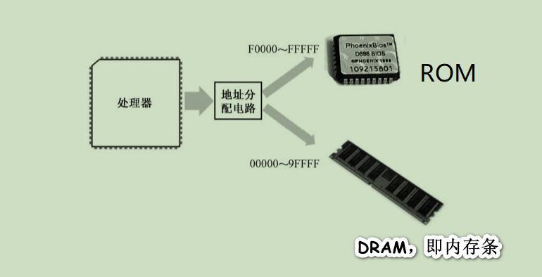

## 计算机的启动过程

在处理器众多的引脚中，有一个是**RESET**，用于接受复位信号。每当处理器加电，或者RESET引脚的电平由低变高时，处理器都会执行硬件初始化，以及一个可选的内部自测试，然后将内部所有寄存器的内容初始化到预置的状态

处理器的主要功能是取指令和执行指令，加电或者复位之后，它就会立刻尝试去做这样的工作。不过，在这个时候，内存中还没有任何有意义的指令和数据，它该怎么办呢？

（一）内存的特点

为了节约成本，并提高容量和集成度，在内存中，每比特的存储都是靠一个极其微小的晶体管，外加一个同样极其微小的电容来完成的。可以想象，这样微小的电容，其泄漏电荷的速度当然也非常快。所以，个人计算机中使用的内存需要**定期补充电荷**，这称为刷新，这种存储器也称为*动态随机访问存储器（DRAM）*。**随机访问的意思是，访问任何一个内存单元的速度和它的位置（地址）无关**。比方说读写地址为0x00001的内存单元，和读写地址为0xFFFF0的内存单元，所需要的时间是一样的

在内存刷新期间，处理器将无法访问它。这还不是最麻烦的，最麻烦的是，在它**断电之后，所有保存的内容都会统统消失**。所以，每当处理器加电之后，它无法从内存中取得任何指令

（二）基本输入输出系统

**INTEL 8086可以访问1MB的内存空间，地址范围为0x00000到0xFFFFF**。出于各方面的考虑，计算机系统的设计者将这1MB的内存空间从物理上分为几个部分

8086有20根地址线，但并非全都用来访问DRAM，也就是内存条。事实上，这些地址线经过分配，**大部分用于访问DRAM，剩余的部分给了只读存储器(ROM)和外围的板卡**

与DRAM不同，**ROM不需要刷新，它的内容是预先写入的，即使掉电也不会消失，但也很难改变**。这个特点很有用，比如，可以将一些程序指令固化在ROM中，使处理器在每次加电时都自动执行。处理器醒来后不能饿着，这是很重要的

> 在以INTEL 8086为处理器的系统中，ROM占据着整个内存空间顶端的64KB，物理地址范围是0xF0000～0xFFFFF，里面固化了开机时要执行的指令；DRAM占据着较低端的640KB，地址范围是0x00000～0x9FFFF；中间还有一部分分给了其他外围设备，这个以后再说。

因为8086加电或者复位时，CS=0xFFFF，IP=0x0000，所以，它取的第一条指令位于物理地址0xFFFF0，正好位于ROM中，那里固化了开机时需要执行的指令

处理器取指令执行的自然顺序是从内存的低地址往高地址推进。如果从0xFFFF0开始执行，这个位置离1MB内存的顶端（物理地址0xFFFFF）只有16字节的长度，一旦IP寄存器的值超过0x000F，比如IP=0x0011，那么，它与CS一起形成的物理地址将因为溢出而变成0x00001，这将回绕到1MB内存的最底端

所以，ROM中位于物理地址0xFFFF0的地方，通常是一个跳转指令（jmp），它通过改变CS和IP的内容，使处理器从ROM中的较低地址处开始取指令执行

这块ROM芯片中的内容包括很多部分，主要是进行硬件的诊断、检测和初始化。所谓初始化，就是让硬件处于一个正常的、默认的工作状态。最后，它还负责提供一套软件例程，让人们在不必了解硬件细节的情况下从外围设备（比如键盘）获取输入数据，或者向外围设备（比如显示器）输出数据。设备当然是很多的，所以这块ROM芯片只针对那些最基本的、对于使用计算机而言最重要的设备，而它所提供的软件例程，也只包含最基本、最常规的功能。正因为如此，这块芯片又叫基本输入输出系统(Base Input ＆ Output System, BIOS)ROM，简称**ROM-BIOS**

   ROM-BIOS的容量是有限的，当它完成自己的使命后，最后所要做的，就是从辅助存储设备读取指令数据，然后转到那里开始执行。基本上，这相当于接力赛中的交接棒

（三）一切从主引导扇区开始

ROM-BIOS在完成自己的使命之前，最后要做的一件事是从外存储设备读取更多的指令来交给处理器执行。现实的情况是，对于ROM-BIOS来说，绝大多数时候，硬盘都是首选的外存储设备

硬盘的第一个扇区是0面0道1扇区，或者说是0头0柱1扇区，这个扇区称为主引导扇区。如果计算机的设置是从硬盘启动的，那么，ROM-BIOS将读取硬盘主引导扇区的内容，将它加载到内存地址0x0000:0x7c00（也就是物理地址0x07C00），然后用一个jmp指令跳到那里接着执行

通常，主引导扇区的功能是继续从硬盘的其他部分读取更多的内容加以执行。像Windows这样的操作系统，就是采用这种接力的方法一步一步把自己运行起来的

（四）欢迎来到主引导扇区

如果硬盘是首选的启动设备，那么，ROM-BIOS将试图读取硬盘的0面0道1扇区。传统上，这就是主引导扇区(Main Boot Sector, MBR)

读取的主引导扇区数据有512字节，ROM-BIOS程序将它加载到逻辑地址0x0000:0x7c00处，也就是物理地址0x07c00处，然后判断它是否有效

 **一个有效的主引导扇区，其最后2字节应当是0x55和0xAA**。ROM-BIOS程序首先检测这两个标志，如果主引导扇区有效，则以一个段间转移指令jmp 0x0000:0x7c00跳到那里继续执行

一般来说，主引导扇区是由操作系统负责的。正常情况下，一段精心编写的主引导扇区代码将检测用来启动计算机的操作系统，并计算出它所在的硬盘位置。然后，它把操作系统的自举代码加载到内存，也用jmp指令跳转到那里继续执行，直到操作系统完全启动

