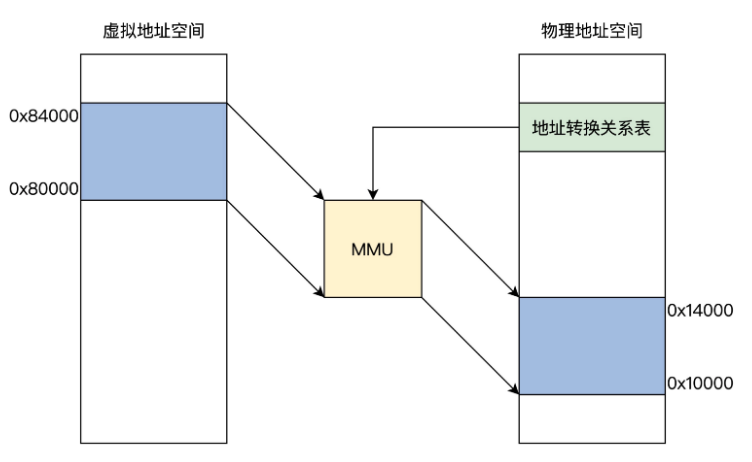
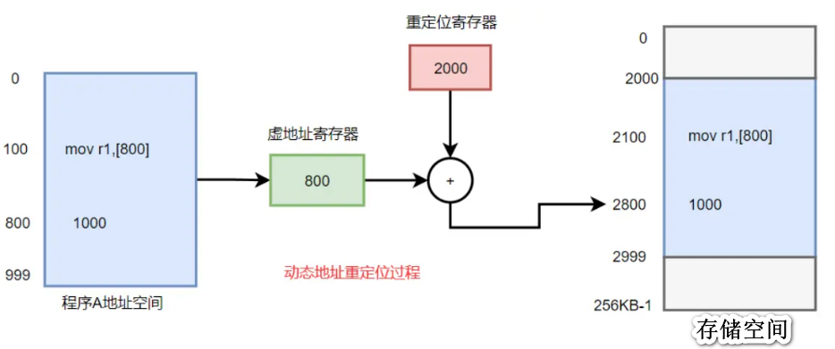
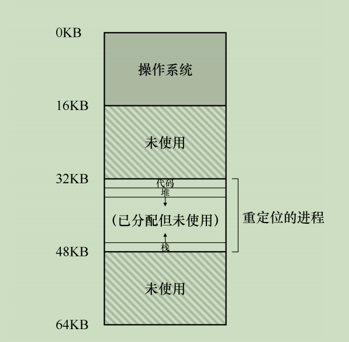
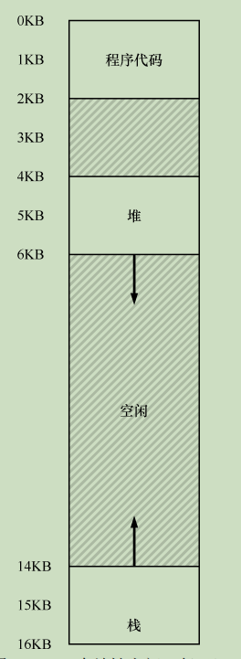
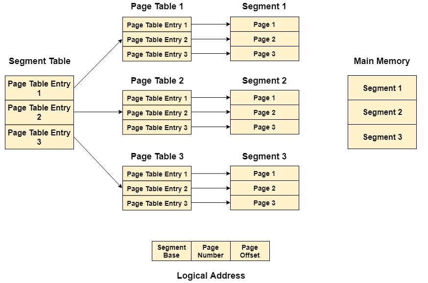
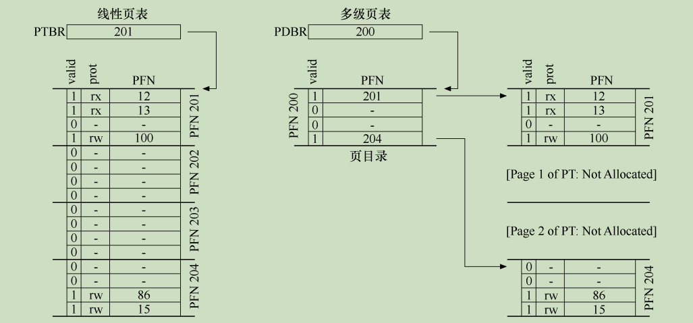
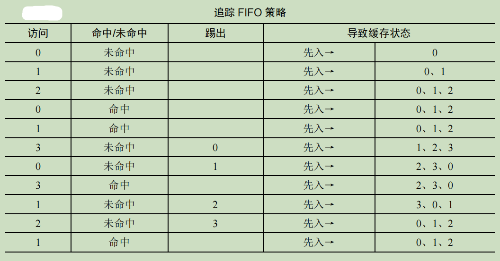
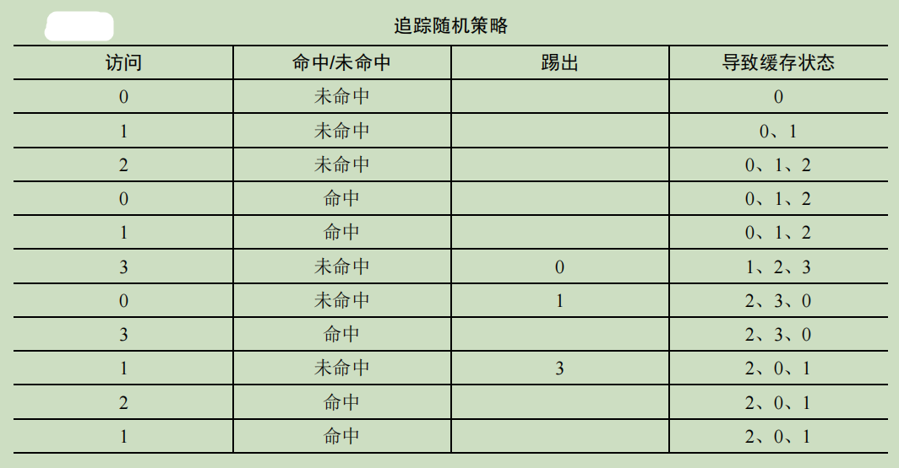
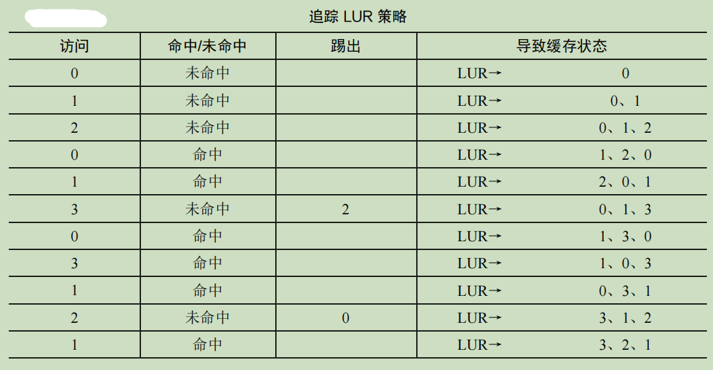

## 抽象：地址空间

当我们描述地址空间时，所描述的是操作系统**提供给运行程序的抽象**。程序不在物理地址 0～16KB 的内存中，而是加载在任意的物理地址。当操作系统这样做时，我们说操作系统在虚拟化内存，因为运行的程序**自认为**它被加载到特定地址（例如 0）的内存中，并且具有非常大的地址空间。

比方说下图中进程 A 尝试在地址 0（我们将称其为虚拟地址）执行加载操作时，然而操作系统在硬件的支持下，出于某种原因，必须确保不是加载到物理地址 0，而是物理地址 320KB（这是 A 载入内存的地址）。


虚拟系统内存的目标：

- 透明：操作系统实现虚拟内存的方式，应该让运行的程序看不见。因此，程序不应该感知到内存被虚拟化的事实，相反，程序的行为就好像它拥有自己的私有物理内存。在幕后，操作系统（和硬件）完成了所有的工作，让不同的工作复用内存，从而实现这个假象
- 效率：操作系统应该追求虚拟化尽可能高效，包括时间上（即不会使程序运行得更慢）和空间上（即不需要太多额外的内存来支持虚拟化）。在实现高效率虚拟化时，操作系统将不得不依靠硬件支持，包括 TLB 这样的硬件功能
- 保护：操作系统应确保进程受到保护，不会受其他进程影响，操作系统本身也不会受进程影响。当一个进程执行加载、存储或指令提取时，它不应该以任何方式访问或影响任何其他进程或操作系统本身的内存内容（即在它的地址空间之外的任何内容）。因此，保护让我们能够在进程之间提供隔离的特性，每个进程都应该在自己的独立环境中运行，避免其他出错或恶意进程的影响

## 机制：地址转换

利用地址转换，硬件对每次内存访问进行处理（即指令获取、数据读取或写入），将**指令中的虚拟地址转换为数据实际存储的物理地址**。因此，在每次内存引用时，硬件都会进行地址转换，将应用程序的内存引用重定位到内存中实际的位置。

仅仅依靠硬件不足以实现虚拟内存，因为它只是提供了底层机制来提高效率。操作系统必须在关键的位置介入，设置好硬件，以便完成正确的地址转换。因此它**必须管理内存**，记录被占用和空闲的内存位置，并明智而谨慎地介入，保持对内存使用的控制。



综述的一切，只是为了给程序营造一种假象，即每个程序都拥有私有的内存，那里存放着它自己的代码和数据。实际情况是，许多程序是在同一时间共享着内存。

---

为了一步步推导出当前操作系统真实的内存虚拟化情况，我们需要暂时做出如下假设：

- 设用户的地址空间必须连续地放在物理内存中
- 地址空间不是很大，具体来说，小于物理内存的大小
- 每个地址空间的大小完全一样

---

前面介绍的基于硬件的地址转换，又称为动态重定位。具体来说，每个 CPU 需要两个硬件寄存器：基址（base）寄存器和界限（bound）寄存器。这组基址和界限寄存器，让我们能够将地址空间放在物理内存的任何位置，同时又能确保进程只能访问自己的地址空间。

注：起始地址记录在基址寄存器中。

```basic
physical address = virtual address + base
```

进程中使用的内存引用都是虚拟地址（virtual address），硬件接下来将虚拟地址加上基址寄存器中的内容，得到物理地址（physical address），再发给内存系统。如果进程需要访问超过这个界限或者为负数的虚拟地址，CPU 将触发异常，进程最终可能被终止。界限寄存器的用处在于，它确保了进程产生的所有地址都在进程的地址“界限”中。

一个基址寄存器（重定位寄存器）将虚拟地址转换为物理地址，一个界限寄存器确保这个地址在进程地址空间的范围内。它们一起提供了既简单又高效的虚拟内存机制。



这种基址寄存器配合界限寄存器的硬件结构是芯片中的（每个 CPU 一对）。有时我们将CPU 的这个负责地址转换的部分统称为内存管理单元（MMU）。

补充：界限寄存器通常有两种使用方式。在一种方式中（像上面那样），它记录地址空间的大小，硬件在将虚拟地址与基址寄存器内容求和前，就检查这个界限。另一种方式是界限寄存器中记录地址空间结束的物理地址，硬件在转化虚拟地址到物理地址之后才去检查这个界限。这两种方式在逻辑上是等价的。

简单总结一下需要的硬件支持，见下表。


为了支持动态重定位，硬件添加了新的功能，使得操作系统有了一些必须处理的新问题。硬件支持和操作系统管理结合在一起，实现了一个简单的虚拟内存。具体来说，在一些关键的时刻操作系统需要介入，以实现基址和界限方式的虚拟内存。


对于基址/界限管理中，每个 CPU 毕竟只有一个基址寄存器和一个界限寄存器，但对于每个运行的程序，它们的值都不同，因为每个程序被加载到内存中不同的物理地址。因此，在切换进程时，操作系统必须保存和恢复基础和界限寄存器。具体来说，当操作系统决定中止当前的运行进程时，它必须将当前基址和界限寄存器中的内容保存在内存中，放在某种每个进程都有的结构中，如进程结构（process structure）或进程控制块（PCB）中。类似地，当操作系统恢复执行某个进程时（或第一次执行），也必须给基址和界限寄存器设置正确的值。

---

遗憾的是，这个简单的动态重定位技术有效率低下的问题。从下图中可以看到，重定位的进程使用了从 32KB 到 48KB 的物理内存，但**由于该进程的栈区和堆区并不很大，导致这块内存区域中大量的空间被浪费**（即图中*已分配但未使用*）。这种浪费通常称为内部碎片，指的是已经分配的内存单元内部有未使用的空间（即碎片），造成了浪费。

在我们当前的方式中，即使有足够的物理内存容纳更多进程，但我们目前要求将地址空间放在固定大小的槽块中，因此会出现内部碎片。所以，我们需要更复杂的机制，以便更好地利用物理内存，避免内部碎片。第一次尝试是**将基址加界限的概念稍稍泛化，得到分段的概念**。



## 分段

我们依旧需要用到前面那张图，来引出为什么需要考虑分段（尽管这还完全不够）。

到目前为止，我们一直假设将所有进程的地址空间完整地加载到内存中。利用基址和界限寄存器，操作系统很容易将不同进程重定位到不同的物理内存区域。但是，对于这些内存区域，你可能已经注意到一件有趣的事：栈和堆之间，有一大块“空闲”空间。

如果我们将整个地址空间放入物理内存，那么栈和堆之间的空间并没有被进程使用，却依然占用了实际的物理内存。因此，简单的通过基址寄存器和界限寄存器实现的虚拟内存很浪费。另外，如果剩余物理内存无法提供连续区域来放置完整的地址空间，进程便无法运行。这种基址加界限的方式看来并不像我们期望的那样灵活。

没错，如果分配的物理内存没有被实际使用，又不能分配给他人使用就会浪费。为了解决这个问题，分段的概念应运而生。

这个想法很简单，在 **MMU 中引入<u>不止一个</u>基址和界限寄存器对**，而是给地址空间内的每个逻辑段（segment）一对。一个段只是地址空间里的一个连续定长的区域，在典型的地址空间里有 3 个逻辑不同的段：代码、栈和堆。**分段的机制使得操作系统能够将不同的段放到不同的物理内存区域，从而避免了虚拟地址空间中的未使用部分占用物理内存**。



上面是一个进程被分配内存大小的情况，有许多为使用的内存空间，我们用三组寄存器就能够把已经使用的内存空间（图中程序代码、栈和堆）标记出来，那么其余部分就是可以被利用的内存了。


---

硬件在地址转换时使用段寄存器。它如何知道段内的偏移量，以及地址引用了哪个段？

一种常见的方式，就是用虚拟地址的开头几位来标识不同的段。在我们之前的例子中，有 3 个段，因此需要两位来标识。如果我们用 14 位虚拟地址的前两位来标识，那么虚拟地址如下所示：


那么在我们的例子中，如果前两位是 00，硬件就知道这是属于**代码段的地址**，因此使用代码段的基址和界限来重定位到正确的物理地址。如果前两位是 01，则是**堆地址**，对应地，使用堆的基址和界限。

从下图中可以看到，前两位（01）告诉硬件我们引用哪个段。剩下的 12 位是段内偏移：0000 0110 1000（即十六进制 0x068 或十进制 104）。因此，硬件就用前两位来决定使用哪个段寄存器，然后用后 12 位作为段内偏移。偏移量与基址寄存器相加，硬件就得到了最终的物理地址。请注意，偏移量也简化了对段边界的判断。我们只要检查偏移量是否小于界限，大于界限的为非法地址。

你或许已经注意到，上面使用两位来区分段，但实际只有 3 个段（代码、堆、栈），因此有一个段的地址空间被浪费。因此有些系统中会将堆和栈当作同一个段，因此只需要一位来做标识。


我们似乎还没有提及栈，这是因为栈的增长方向还需要进行识别。首先，我们需要一点硬件支持。除了基址和界限外，硬件还需要知道段的增长方向（用一位区分，比如 1 代表自小而大增长，0 反之）。


随着分段机制的不断改进，系统设计人员很快意识到，通过再多一点的硬件支持，就能实现新的效率提升。具体来说，要节省内存，有时候在地址空间之间**共享某些内存段**是有用的。尤其是，代码共享很常见，今天的系统仍然在使用。

为了支持共享，需要一些额外的硬件支持，这就是保护位（protection bit）。基本为每个段增加了几个位，标识程序是否能够读写该段，或执行其中的代码。通过将代码段标记为只读，同样的代码可以被多个进程共享，而不用担心破坏隔离。虽然每个进程都认为自己独占这块内存，但操作系统秘密地共享了内存，进程不能修改这些内存，所以假象得以保持。


---

现在你应该大致了解了分段的基本原理。系统运行时，地址空间中的不同段被重定位到物理内存中。与我们之前介绍的整个地址空间只有一个基址/界限寄存器对的方式相比，大量节省了物理内存。具体来说，栈和堆之间没有使用的区域就不需要再分配物理内存，让我们能将更多地址空间放进物理内存。

分段也带来了一些新的问题，重点谈外部碎片的产生。前面我们没有讲分段的时候，之前的基址/界限寄存器对的方式会产生内部碎片，因为分配给进程的内存有大部分没有被使用。现在我们用分段机制解决内部碎片问题，却引出外部碎片问题，即物理内存很快充满了许多空闲空间的小洞，因而很难分配给新的段，或扩大已有的段。比方说，一个进程需要分配一个 20KB 的段。当前有 24KB 空闲，但并不连续（是3 个不相邻的块）。因此，操作系统无法满足这个 20KB 的请求。

后面我们会谈解决内部碎片问题，但提前预告，无论算法多么精妙，都无法完全消除外部碎片，因此，好的算法只是试图减小它。

比方说接下来要介绍的分页机制。内存分页由于内存空间都是预先划分好的，也就不会像内存分段一样，在段与段之间会产生间隙非常小的内存，这正是分段会产生外部内存碎片的原因。而**采用了分页，页与页之间是紧密排列的，所以不会有外部碎片。**但是，因为内存分页机制分配内存的最小单位是一页，即使程序不足一页大小，我们最少只能分配一个页，所以页内会出现内存浪费，所以针对**内存分页机制会有内部内存碎片**的现象。

## 分页

将空间分割成固定长度的分片。在虚拟内存中，我们称这种思想为分页。分页不是将一个进程的地址空间分割成几个不同长度的逻辑段（即代码、堆、段），而是分割成固定大小的单元，每个单元称为一页。相应地，我们把物理内存看成是定长槽块的阵列，叫作页帧。每个这样的页帧包含一个虚拟内存页。

为了记录地址空间的每个虚拟页放在物理内存中的位置，操作系统通常为每个进程保存一个数据结构，称为页表。页表的主要作用是为地址空间的每个虚拟页面保存地址转换，从而让我们知道每个页在物理内存中的位置。

在分页机制下，虚拟地址分为两部分，**页号**和**页内偏移**。页号作为页表的索引，**页表**包含物理页每页所在**物理内存的基地址**（物理页号），这个基地址与页内偏移的组合就形成了物理内存地址。


总结一下，对于一个内存地址转换，其实就是这样三个步骤：

- 把虚拟内存地址，切分成页号和偏移量
- 根据页号，从页表里面，查询对应的物理页号
- 直接拿物理页号，加上前面的偏移量，就得到了物理内存地址


注：暂时假定页表信息存储在物理内存中

:deciduous_tree:（一）分页：快速地址转换（TLB）

使用分页作为核心机制来实现虚拟内存，可能会带来较高的性能开销。因为要使用分页，就要将内存地址空间切分成大量固定大小的单元（页），并且需要记录这些单元的地址映射信息。因为这些映射信息一般存储在物理内存中，所以在转换虚拟地址时，分页逻辑上需要一次额外的内存访问。每次指令获取、显式加载或保存，都要额外读一次内存以得到转换信息，这慢得无法接受。

利用缓存来加速访问，即TLB（它就是频繁发生的虚拟到物理地址转换的硬件缓存）。对每次内存访问，硬件先检查 TLB，看看其中是否有期望的转换映射，如果有，就完成转换（很快），不用访问页表（其中有全部的转换映射）。

那如果TLB没有命中，由谁来处理呢？可能有两个答案：硬件或软件（操作系统）

- 硬件处理：为了做到这一点，硬件必须知道页表在内存中的确切位置（通过页表基址寄存器），以及页表的确切格式。发生未命中时，硬件会“遍历”页表，找到正确的页表项，取出想要的转换映射，用它更新 TLB，并重试该指令
- 软件处理：更现代的体系结构。发生 TLB 未命中时，硬件系统会抛出一个异常，这会暂停当前的指令流，将特权级提升至内核模式，跳转至陷阱处理程序。接下来你可能已经猜到了，这个陷阱处理程序是操作系统的一段代码，用于处理 TLB 未命中。这段代码在运行时，会查找页表中的转换映射，然后用特别的“特权”指令更新 TLB，并从陷阱返回。此时，硬件会重试该指令（导致 TLB 命中）

接下来讨论几个重要的细节：

1. 这里的从陷阱返回指令稍稍不同于之前提到的服务于系统调用的从陷阱返回。在后一种情况下，从陷阱返回应该继续执行陷入操作系统之后那条指令，就像从函数调用返回后，会继续执行此次调用之后的语句。在前一种情况下，在从 TLB 未命中的陷阱返回后，硬件必须从导致陷阱的指令继续执行。这次重试因此导致该指令再次执行，但这次会命中 TLB。因此，根据陷阱或异常的原因，系统在陷入内核时必须保存不同的程序计数器，以便将来能够正确地继续执行
2. 在运行 TLB 未命中处理代码时，操作系统需要格外小心避免引起 TLB 未命中的无限递归

软件管理的方法，主要优势是灵活性：操作系统可以用任意数据结构来实现页表，不需要改变硬件。另一个优势是简单性。从 TLB 控制流中可以看出，硬件不需要对未命中做太多工作，它抛出异常，操作系统的未命中处理程序会负责剩下的工作。

有了 TLB，在进程间切换时（因此有地址空间切换），会面临一些新问题。具体来说，**TLB 中包含的虚拟到物理的地址映射只对当前进程有效，对其他进程是没有意义的**。所以在发生进程切换时，硬件或操作系统（或二者）必须注意确保即将运行的进程不要误读了之前进程的地址映射。

当一个进程（P1）正在运行时，假设TLB 缓存了对它有效的地址映射，即来自 P1 的页表。对这个例子，假设 P1 的 10 号虚拟页映射到了 100 号物理帧。假设还有一个进程（P2），操作系统不久后决定进行一次上下文切换，运行 P2。这里假定 P2 的 10 号虚拟页映射到 170 号物理帧。如果这两个进程的地址映射都在 TLB 中，TLB 的内容如下图所示。


这里很明显有一个问题：VPN 10 被转换成了 PFN 100（P1）和 PFN 170（P2），但硬件分不清哪个项属于哪个进程。所以我们还需要做一些工作，让 TLB 正确而高效地支持跨多进程的虚拟化。这个问题有些可能的解决方案：

（一）上下文切换的时候清空 TLB

上下文切换时，简单地清空（flush）TLB，这样在新进程运行前 TLB 就变成了空的。如果是软件管理 TLB 的系统，可以在发生上下文切换时，通过一条显式（特权）指令来完成。如果是硬件管理 TLB，则可以在页表基址寄存器内容发生变化时清空 TLB。不论哪种情况，清空操作都是把全部有效位（valid）置为 0，本质上清空了 TLB。

上下文切换的时候清空 TLB，这是一个可行的解决方案，进程不会再读到错误的地址映射。但是，有一定开销：每次进程运行，当它访问数据和代码页时，都会触发 TLB 未命中。如果操作系统频繁地切换进程，这种开销会很高。

（二）增加硬件支持，实现跨上下文切换的 TLB 共享

为了减少这种开销（上下文切换的时候清空 TLB，进程频繁切换开销很高），一些系统增加了硬件支持，实现跨上下文切换的 TLB 共享。比如有的系统在 TLB 中添加了一个地址空间标识符（ASID）。可以把ASID 看作是进程标识符（PID），但通常比 PID 位数少（PID 一般 32 位，ASID 一般是 8 位）。


因此，有了地址空间标识符，TLB 可以同时缓存不同进程的地址空间映射，没有任何冲突。当然，硬件也需要知道当前是哪个进程正在运行，以便进行地址转换，因此操作系统在上下文切换时，必须将某个特权寄存器设置为当前进程的 ASID。

补充一下，你可能想到了另一种情况，TLB 中某两项非常相似。如下图中，属于两个不同进程的两项，将两个不同的 VPN 指向了相同的物理页。


如果两个进程共享同一物理页（例如代码段的页），就可能出现这种情况。在上面的例子中，进程 P1 和进程 P2 共享 101 号物理页，但是 P1 将自己的 10 号虚拟页映射到该物理页，而 P2 将自己的 50 号虚拟页映射到该物理页。共享代码页（以二进制或共享库的方式）是有用的，因为它减少了物理页的使用，从而减少了内存开销。

注：TLB 和其他缓存一样，还有一个问题要考虑，即缓存替换。具体来说，向 TLB 中插入新项时，会替换一个旧项，这样问题就来了：应该替换那一个？在讨论页换出到磁盘的问题时，我们将详细研究这样的策略。

:deciduous_tree:（二）分页：较小的表

**混合方法：分页和分段**

分段解决内部碎片引出外部碎片，分页解决外部碎片引出内部碎片，我们能否结合二者的优点而避开缺点呢？

我们的杂合方法不是为进程的整个地址空间提供单个页表，而是为每个逻辑分段提供一个。在这个例子中，我们可能有 3 个页表，地址空间的代码、堆和栈部分各有一个。现在，回忆在分段中，有一个基址（base）寄存器，告诉我们每个段在物理内存中的位置，还有一个界限（bound）或限制（limit）寄存器，告诉我们该段的大小。在杂合方案中，我们仍然在 MMU 中拥有这些结构。在这里，我们使用基址不是指向段本身，而是保存该段的页表的物理地址。界限寄存器用于指示页表的结尾（即它有多少有效页）。

现在，回忆在分段中，有一个基址（base）寄存器，告诉我们每个段在物理内存中的位置，还有一个界限（bound）或限制（limit）寄存器，告诉我们该段的大小。在杂合方案中，我们仍然在 MMU 中拥有这些结构。在这里，我们使用基址不是指向段本身，而是保存该段的页表的物理地址。界限寄存器用于指示页表的结尾（即它有多少有效页）。



我们通过一个简单的例子来澄清。假设 32 位虚拟地址空间包含 4KB 页面，并且地址空间分为 4 个段。在这个例子中，我们只使用 3 个段：一个用于代码，另一个用于堆，还有一个用于栈。

要确定地址引用哪个段，我们会用地址空间的前两位。假设 00 是未使用的段，01 是代码段，10 是堆段，11 是栈段。因此，虚拟地址如下所示：


在硬件中，假设有 3 个基本/界限对，代码、堆和栈各一个。当进程正在运行时，每个段的基址寄存器都包含该段的线性页表的物理地址。因此，系统中的每个进程现在都有 3 个与其关联的页表。在上下文切换时，必须更改这些寄存器，以反映新运行进程的页表的位置。

在 TLB 未命中时（假设硬件管理的 TLB，即硬件负责处理 TLB 未命中），硬件使用分段位（SN）来确定要用哪个基址和界限对。然后硬件将其中的物理地址与 VPN 结合起来，形成页表项（PTE）的地址。


杂合方案的关键区别在于，每个分段都有界限寄存器，每个界限寄存器保存了段中最大有效页的值。例如，如果代码段使用它的前 3 个页（0、1 和 2），则代码段页表将只有 3个项分配给它，并且界限寄存器将被设置为 3。内存访问超出段的末尾将产生一个异常，并可能导致进程终止。

但是，你可能会注意到，这种方法并非没有问题。首先，它仍然要求使用分段。正如我们讨论的那样，分段并不像我们需要的那样灵活，因为它假定地址空间有一定的使用模式。例如，如果有一个大而稀疏的堆，仍然可能导致大量的页表浪费。其次，这种杂合导致外部碎片再次出现。尽管大部分内存是以页面大小单位管理的，但页表现在可以是任意大小（是 PTE 的倍数）。因此，在内存中为它们寻找自由空间更为复杂。出于这些原因，人们继续寻找更好的方式来实现更小的页表。

**多级页表**

多级页表的基本思想很简单。首先，将页表分成页大小的单元。然后，如果整页的页表项（PTE）无效，就完全不分配该页的页表。为了追踪页表的页是否有效（以及如果有效，它在内存中的位置），使用了名为页目录的新结构。页目录因此可以告诉你页表的页在哪里，或者页表的整个页不包含有效页。

下图的左边是经典的线性页表。即使地址空间的大部分中间区域无效，我们仍然需要为这些区域分配页表空间（即页表的中间两页）。右侧是一个多级页表。页目录仅将页表的两页标记为有效（第一个和最后一个）；因此，页表的这两页就驻留在内存中。因此，你可以形象地看到多级页表的工作方式：它只是让线性页表的一部分消失（释放这些帧用于其他用途），并用页目录来记录页表的哪些页被分配。



多级页表虽然解决了空间上的问题，但是虚拟地址到物理地址的转换就多了几道转换的工序，这显然就降低了虚拟地址到物理地址转换的速度，也就是带来了时间上的开销。比方说二级页表中，在 TLB 未命中时，需要从内存加载两次，才能从页表中获取正确的地址转换信息（一次用于页目录，另一次用于 PTE 本身），而用线性页表只需要一次加载。

## 超越物理内存：机制

到目前为止，我们一直假定地址空间非常小，能放入物理内存。事实上，我们假设每个正在运行的进程的地址空间都能放入内存。实际情况是内存并没有想象中那么大，特别是在当前上百个进程运行的电脑上，我们需要把目标放到更大的磁盘空间上，尽管磁盘访问要比内存访问慢的多。

为什么我们要为进程支持巨大的地址空间？答案还是方便和易用性。有了巨大的地址空间，你不必担心程序的数据结构是否有足够空间存储，只需自然地编写程序，根据需要分配内存。这是操作系统提供的一个强大的假象，使你的生活简单很多。

我们要做的第一件事情就是，在硬盘上开辟一部分空间用于物理页的移入和移出。在操作系统中，一般这样的空间称为**交换空间**（swap space），因为我们将内存中的页交换到其中，并在需要的时候又交换回去。因此，我们会假设操作系统能够以页大小为单元读取或者写入交换空间。为了达到这个目的，操作系统需要记住给定页的硬盘地址。


从上图中你可以看到一个 4 页的物理内存和一个 8 页的交换空间。在这个例子中，3 个进程（进程 0、进程 1 和进程 2）主动共享物理内存。但 3 个中的每一个，都只有一部分有效页在内存中，剩下的在硬盘的交换空间中。第 4 个进程（进程 3）的所有页都被交换到硬盘上，因此很清楚它目前没有运行。有一块交换空间是空闲的，从这你应该也能看出，使用交换空间如何让系统假装内存比实际物理内存更大。

:christmas_tree:存在位

如果希望允许页交换到硬盘，必须添加更多的机制。具体来说，当硬件在 PTE中查找时，可能**发现页不在物理内存中**。硬件（或操作系统，在软件管理 TLB 时）判断是否在内存中的方法，是通过页表项中的一条新信息，即**存在位**。如果存在位设置为 1，则表示该页存在于物理内存中，并且所有内容都如上所述进行。如果存在位设置为零，则页不在内存中，而在硬盘上。访问不在物理内存中的页，这种行为通常被称为**页错误**。

:christmas_tree:页错误

在页错误时，**操作系统被唤起来处理页错误**。一段称为“页错误处理程序”的代码会执行，来处理页错误。如果一个页不存在，它已被交换到硬盘，在处理页错误的时候，操作系统需要将该页交换到内存中。那么，问题来了：操作系统如何知道所需的页在哪儿？在许多系统中，页表是存储这些信息最自然的地方。因此，操作系统**可以用 PTE 中的某些位来存储硬盘地址**，这些位通常用来存储像页的 PFN 这样的数据。当操作系统接收到页错误时，它会在 PTE 中查找地址，并将请求发送到硬盘，将页读取到内存中。

当硬盘 I/O 完成时，操作系统会更新页表，将此页标记为存在，更新页表项（PTE）的PFN 字段以记录新获取页的内存位置，并重试指令。下一次重新访问 TLB 还是未命中，然而这次因为页在内存中，因此会将页表中的地址更新到 TLB 中（也可以在处理页错误时更新 TLB 以避免此步骤）。最后的重试操作会在 TLB 中找到转换映射，从已转换的内存物理地址，获取所需的数据或指令。

注意： I/O 在运行时，进程将处于阻塞状态。因此，当页错误正常处理时，操作系统可以自由地运行其他可执行的进程。因为 I/O 操作是昂贵的，一个进程进行I/O（页错误）时会执行另一个进程，这种交叠是多道程序系统充分利用硬件的一种方式。

再注：如果内存满了，操作系统可能希望先交换出（page out）一个或多个页，以便为操作系统即将交换入的新页留出空间。选择哪些页被交换出或被替换（replace）的过程，被称为页交换策略（后面详解）。

:christmas_tree:页错误处理流程

首先，操作系统必须为将要换入的页找到一个物理帧，如果没有这样的物理帧，我们将不得不等待交换算法运行，并从内存中踢出一些页，释放帧供这里使用。在获得物理帧后，处理程序发出 I/O 请求从交换空间读取页。最后，当这个慢操作完成时，操作系统更新页表并重试指令。重试将导致 TLB 未命中，然后再一次重试时，TLB 命中，此时硬件将能够访问所需的值。

到目前为止，我们一直描述的是操作系统会等到内存已经完全满了以后才会执行交换流程，然后才替换（踢出）一个页为其他页腾出空间。正如你想象的那样，这有点不切实际的，因为操作系统可以更主动地预留一小部分空闲内存。

为了保证有少量的空闲内存，大多数操作系统会设置高水位线和低水位线，来帮助决定何时从内存中清除页。原理是这样：当操作系统发现有少于低水位线个页可用时，后台负责释放内存的线程会开始运行，直到有高水位线个可用的物理页。这个后台线程有时称为交换守护进程或页守护进程，它然后会很开心地进入休眠状态，因为它毕竟为操作系统释放了一些内存。

## 超越物理内存：策略

由于内存只包含系统中所有页的子集，因此可以将其视为系统中虚拟内存页的缓存（cache）。因此，在为这个缓存选择替换策略时，我们的目标是让缓存未命中（cache miss）最少，即使得从磁盘获取页的次数最少。或者，可以将目标看成让缓存命中（cache hit）最多，即在内存中找到待访问页的次数最多。

下面简单介绍一些缓存未命中的情况下的页交换策略。

（一）简单策略：FIFO

当发生替换时，队列尾部的页（“先入”页）被踢出。



（二）简单策略：随机

在内存满的时候它随机选择一个页进行替换。



（三）利用历史数据：LRU

页替换策略可以使用的一个历史信息是频率（frequency）。如果一个页被访问了很多次，也许它不应该被替换，因为它显然更有价值。页更常用的属性是访问的近期性（recency），越近被访问过的页，也许再次访问的可能性也就越大。



---

⭐️内容取自译者王海鹏《操作系统导论》，仅从中取出个人以为需要纪录的内容。不追求内容的完整性，却也不会丢失所记内容的逻辑性。如果需要了解细致，建议读原书