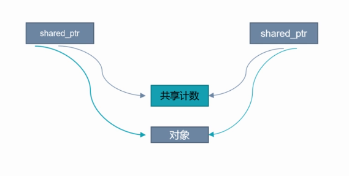
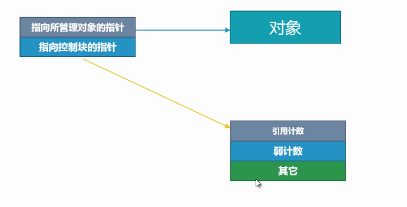
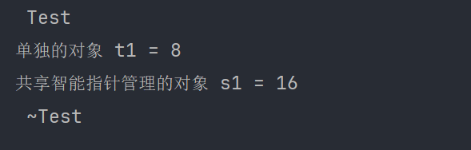
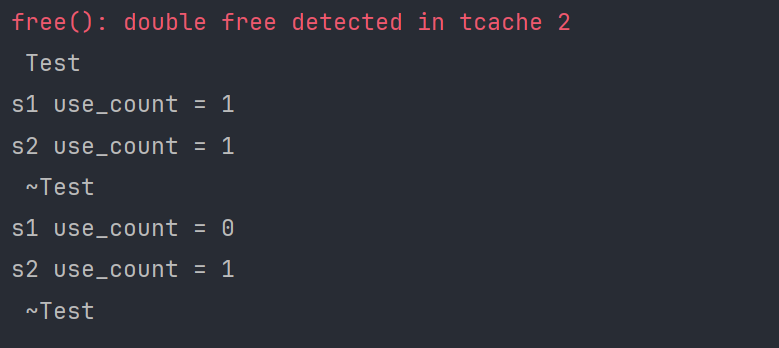
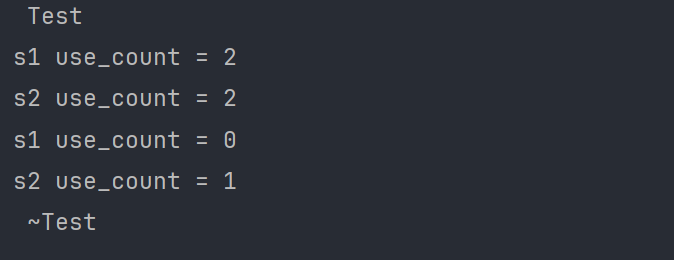
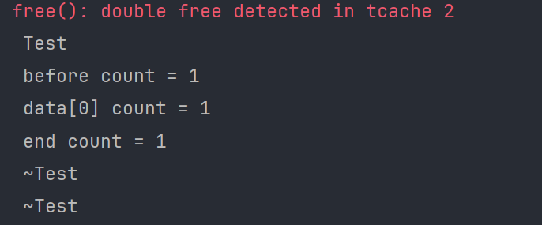
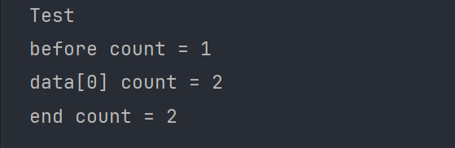
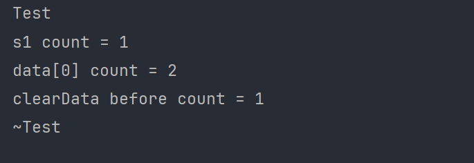
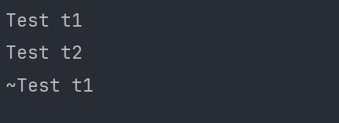

程序员可以自由分配堆内存，而栈内存由编译器申请和释放。内存管理针对的就是堆内存，在C++11的智能指针没有出现之前，为了保证内存合理的申请释放，需要配对操作，即new和delete，malloc和free，来避免内存泄漏。


## 内存管理及C++ RAII手法

RAII 是 C++ 所特有的资源管理方式，它**依托栈和析构函数**，来对所有的资源(包括堆内存在内)进行管理。它提供了一种**异常安全的资源管理方式**，对RAII的使用，使C++不需要类似于 Java 那样的垃圾收集方法，也能有效的内存进行管理。

```c++
template<class T>
class manageMemory{
 public:
  explicit manageMemory(T *data):data_(data){
    std::cout<<" manageMemory "<<std::endl;
  }
  ~manageMemory(){
    std::cout<<" ~manageMemory "<<std::endl;
    delete data_;
    data_ = nullptr;
  }
 private:
  T* data_;
};

class Test{
 public:
  explicit Test(int num):num_(num){
    std::cout<<" Test "<<std::endl;
  }
  ~Test(){
    std::cout<<" ~Test "<<std::endl;
  }
 private:
  int num_ = 0;
};

int main() {

  {
    Test* t = new Test(10);
    manageMemory<Test> mt(t);
  }

  system("pause");

  return 0;
}
```

前面讲 RAII 这种内存管理方法是依托 栈和析构函数，从上面的代码中可以看到 manageMemory 类中的析构函数将传递进来的对象进行 delete（清理类对象的成员变量），并且明显是在 函数中完成对内存进行管理的（这里是在 main 函数中），即栈中（退出栈，清理类对象本身）。

那么还提到异常安全的资源管理方式又是那里体现的呢？假定现在没有采用RAII 这种内存管理方法，而是用之前 delete 裸指针进行内存管理，看如下简略代码：

```c++
void func(){
  Test* t = new Test(10);
  
  // 出现异常

  delete t;
}
```

按理我们也写出已申请内存对应的 delete，可如果在 delete 之前出现异常，那么内存泄漏还是出现了。但是我们的 RAII 这种内存管理方法就不会，因为内部不会出现异常。

## 共享智能指针 shared_ptr

| 构造函数                              | 说明                     |
| ------------------------------------- | ------------------------ |
| `shared_ptr()`                        | 默认构造函数，指针为空   |
| `shared_ptr(T* ptr)`                  | 用裸指针构造，拥有对象   |
| `shared_ptr(const shared_ptr& other)` | 拷贝构造函数，共享所有权 |
| `shared_ptr(shared_ptr&& other)`      | 移动构造函数，转移所有权 |

| 方法                      | 说明                         |
| ------------------------- | ---------------------------- |
| `reset()`                 | 释放当前持有对象，指针为空   |
| `reset(T* ptr)`           | 释放当前持有对象并拥有新对象 |
| `get()`                   | 返回原始指针（裸指针）       |
| `use_count()`             | 返回引用计数                 |
| `unique()`                | 判断是否是唯一所有者         |
| `swap(shared_ptr& other)` | 交换两个 `shared_ptr` 的内容 |

共享所有权，具有复制语义，多个 shared_ptr 指向同一个对象时，每个 shared_ptr 的引用计数都会记录指向该对象的 shared_ptr 的数量，当最后一个指向对象（和共享计数）的 shared_ptr 析构时，它会删除对象和共享计数，通过 use_count 方法可以获取 shared_ptr 对象的共享计数值。正以为是共享所有权，那么在多线程中要注意数据竞争问题，当操作同一个对象时记得加锁。



### 智能指针的大小

std::shared_ptr 的尺寸大于裸指针，一般是裸指针的两倍，因为它内部既包含一个指向到资源的裸指针，也包含一个指向该资源的引用计数的裸指针。其中引用计数的内存是动态分配的，且递增和递减是原子操作。



下面通过 sizeof 看看是否如此：

```c++
class Test{
 public:
  explicit Test(int num):num_(num){
    std::cout<<" Test "<<std::endl;
  }
  ~Test(){
    std::cout<<" ~Test "<<std::endl;
  }
 private:
  int num_ = 0;
};

int main() {

  Test* t1 = new Test(10);
  std::shared_ptr<Test> s1(t1);

  std::cout<<"单独的对象 t1 = "<<sizeof(t1)<<std::endl;
  std::cout<<"共享智能指针管理的对象 s1 = "<<sizeof(s1)<<std::endl;

  return 0;
}
```

输出结果：



### 避免通过同一个裸指针创建多个 shared_ptr 对象 

:star: shared_ptr 对象**只能通过复制其值来共享所有权**：如果两个 shared_ptr 是从同一个（非 shared_ptr）指针构造（或创建）的，它们将各自拥有该指针而不共享它，这可能导致访问问题，因为当其中一个释放它（删除其管理的对象）时，另一个将指向一个无效的位置。

```c++
void func(){
  Test* t1 = new Test(10);

  // 两个指针指针分别指向 t1对象
  std::shared_ptr<Test> s1(t1);
  std::shared_ptr<Test> s2(t1);

  std::cout<<"s1 use_count = "<<s1.use_count()<<std::endl;
  std::cout<<"s2 use_count = "<<s2.use_count()<<std::endl;

  // 其中一个智能指针 释放管理的对象
  s1.reset();
  std::cout<<"s1 use_count = "<<s1.use_count()<<std::endl;
  std::cout<<"s2 use_count = "<<s2.use_count()<<std::endl;
}
```

输出结果：



这边有提示重复析构的错误，这是错误使用智能指针出现的问题。 shared_ptr 对象只能通过复制其值来共享所有权，否则会导致计数错误，而 shared_ptr  恰恰是通过 计数来决定管理对象是否析构的，如果计数出现错误，那么管理对象也就会出现错误。在上面的代码中创建两个智能指针 s1 和 s2，直接管理 同一个对象 t1，但是这种错误示范导致无法跟踪真实的计数，导致两个智能指针 s1 和 s2都自以为最开始就管理这个对象。由于接管的这个对象计数是0，它们各自加 1，所以打印智能指针 s1 和 s2的计数情况都是 1，这位后面埋下隐患，即多重析构。我们通过 reset 方法重置 智能指针 s1 的计数为0，那么就会析构管理的对象，但是 s2 却始终以为管理的对象还存在（从输出情况中可以看出，智能指针 s1 的计数已经为 0，但是 s2 的计数还为 1 ），等到退出函数作用域，智能指针 s2 查看计数为 1 并去执行析构函数，导致出现重复析构的错误。

下面修正代码的错误，再看看是否管理内存正确

```c++
void func(){
  Test* t1 = new Test(10);

  // 两个指针指针分别指向 t1对象
  std::shared_ptr<Test> s1(t1);
  std::shared_ptr<Test> s2(s1);

  std::cout<<"s1 use_count = "<<s1.use_count()<<std::endl;
  std::cout<<"s2 use_count = "<<s2.use_count()<<std::endl;

  // 其中一个智能指针 释放管理的对象
  s1.reset();
  std::cout<<"s1 use_count = "<<s1.use_count()<<std::endl;
  std::cout<<"s2 use_count = "<<s2.use_count()<<std::endl;
}
```

输出结果：



### 避免通过 this 指针创建 shared_ptr 对象

```c++
class Test{
 public:
  explicit Test(int num){
    std::cout<<" Test "<<std::endl;
  }
  ~Test(){
    std::cout<<" ~Test "<<std::endl;
  }
  void process(){
    data.emplace_back(this);
    std::cout<<" data[0] count = " << data[0].use_count() <<std::endl;
  }
 private:
  using pTest = std::shared_ptr<Test>;
  std::vector<pTest> data;
};

void func(){
  Test* t1 = new Test(10);

  std::shared_ptr<Test> s1(t1);
  std::cout<<" before count = " << s1.use_count() <<std::endl;
  s1->process();
  std::cout<<" end count = " << s1.use_count() <<std::endl;
}
```

输出结果：



创建一个 shared_ptr 对象 s1，并用 t1 初始化它，引用计数加 1，当前引用计数为 1。然后调用 `process` 方法，将 shared_ptr 对象 s1 传递给 shared_ptr 对象 管理，并将其添加到 data 容器中，按理来说引用计数加 1，当前引用计数为 2，但是输出显示当前引用计数为 1，说明 this 不是返回的shared_ptr 对象 s1，而返回的裸指针 t1。

C++11 提供这个问题的解决方案，即 enable_shared_from_this 和 shared_from_this。

如果一个类继承自 std::enable_shared_from_this，那么这个类的实例对象可以通过调用 shared_from_this() 成员函数，**获得一个指向自己的 std::shared_ptr 智能指针**。这个指针可以和其他 std::shared_ptr 共享控制块，从而安全地管理对象的生命周期。

```c++
#include <iostream>
#include <vector>
#include <memory>

class Test : public std::enable_shared_from_this<Test> {
public:
    explicit Test(int num) {
        std::cout << " Test " << std::endl;
    }
    ~Test() {
        std::cout << " ~Test " << std::endl;
    }
    void process() {
        data.emplace_back(shared_from_this());
        std::cout << " data[0] count = " << data[0].use_count() << std::endl;
    }
private:
    using pTest = std::shared_ptr<Test>;
    std::vector<pTest> data;
};

void func() {
     Test* t1 = new Test(10);
     std::shared_ptr<Test> s1(t1);
    std::cout << " before count = " << s1.use_count() << std::endl;
    s1->process();
    std::cout << " end count = " << s1.use_count() << std::endl;
}

int main() {
    func();
    return 0;
}
```

输出结果：



从输出结果可以看出，没有出现前面的重复析构，并且计数得到正确的增加，因为确实是被两个智能指针指向，计算就应该为 2。但同时我们也看到析构没有被执行，表明 Test 没有被正确管理，这是因为 s1 销毁之后，裸指针 t1 的成员变量 data中还存储着 t1的 shared_ptr 对象，导致引用计数没有归 0。如果你在 Test 的析构函数中对其进行清理是无效的，计数不为 0 的情况下析构函数不会被执行，下面通过一个公共方法来清理内部成员。

```c++
class Test : public std::enable_shared_from_this<Test> {
 public:
  explicit Test(int num) {
    std::cout << " Test " << std::endl;
  }
  ~Test() {
    std::cout << " ~Test " << std::endl;
  }
  void process() {
    data.emplace_back(shared_from_this());
    std::cout << " data[0] count = " << data[0].use_count() << std::endl;
  }
  void clearData(){
    data.clear();
  }
  int getCount(){
    if (!data.empty()){
      return data[0].use_count();
    }
    return 0;
  }
 private:
  using pTest = std::shared_ptr<Test>;
  std::vector<pTest> data;
};

void func() {
  Test* t1 = new Test(10);
  {
    std::shared_ptr<Test> s1(t1);
    std::cout << " s1 count = " << s1.use_count() << std::endl;
    s1->process();
  }

  std::cout << " clearData before count = " << t1->getCount() << std::endl;

  t1->clearData();
  std::cout << " clearData end count = " << t1->getCount() << std::endl;
}

int main() {
  func();
  return 0;
}
```

输出结果：



Test类对象 t1 被创建，执行构造函数。被 shared_ptr对象 s1 管理，引用计数加 1，当前引用计数为 1。调用 process 方法，把对象 t1 加入到 data容器中被 shared_ptr 管理，引用计数加 1，当前引用计数为 2。s1 离开作用域之后被销毁，引用计数减 1，当前引用计数为 1。调用 clearData 方法，清理 data 中的一个 shared_ptr 对象，引用计数减 1，当前引用计数为 0，调用管理的对象 t1 的析构函数。shared_ptr 就是等到管理对象的引用计数为 0 就调用管理对象的析构函数，析构函数本身就是对对象的成员变量的清理，至于对象本身要等到离开作用域之后才会被栈清理。

### 优先使用 make_shared 创建 shared_ptr 对象

- make_shared 会在一个连续的内存块中同时分配控制块和对象本身，即只会产生一次内存分配，对象与计数对象共用一块区域。而使用 new 则需要两次内存分配，一次是对象本身，另一次是为 shared_ptr 的控制块
- 异常安全的构造 shared_ptr

```c++
void func(std::shared_ptr<Test> t1,int Ret){
  std::cout<<"func"<<std::endl;
}

int process(){
  // 可能发生异常
  return 0;
}

int main() {
  func(std::shared_ptr<Test>(new Test(10)), process());
  return 0;
}
```

这种创建 shared_ptr 对象的方式可能出现问题，可能的执行顺序如下：

1. new Test(10)
2. process()
3. 构造一个 shared_ptr 对象

但如果 process 出现异常，那么 构造一个 shared_ptr 对象 失败，导致内存泄漏，因为 new Test(10) 已经创建成功。我们现在推荐 make_shared 来创建 shared_ptr 对象。

```c++
func(std::make_shared<Test>(10), process());
```

## 弱引用指针 weak_ptr

| 构造函数                            | 说明                                 |
| ----------------------------------- | ------------------------------------ |
| `weak_ptr()`                        | 默认构造函数，指针为空               |
| `weak_ptr(const weak_ptr& other)`   | 拷贝构造函数，共享被管理对象的弱引用 |
| `weak_ptr(const shared_ptr<T>& sp)` | 从 `shared_ptr` 构造，创建弱引用     |

| 方法                    | 说明                                                         |
| ----------------------- | ------------------------------------------------------------ |
| `reset()`               | 释放当前持有对象的弱引用                                     |
| `use_count()`           | 返回被管理对象的引用计数                                     |
| `expired()`             | 判断被管理对象是否已被销毁（非线程安全）                     |
| `lock()`                | 返回 `shared_ptr`，如果被管理对象已被销毁则返回空 `shared_ptr` |
| `swap(weak_ptr& other)` | 交换两个 `weak_ptr` 的内容                                   |

weak_ptr 用来表示临时所有权(弱引用，不会增加引用计数)，它需要配合 shared_ptr 使用，追踪 shared_ptr 所管理的对象是否有效。当需要临时所有权时，则将其转换为 shared_ptr，这样对象的引用计数会加 1，来保证正在访问的对象有效性。也就是说，你如果用 weak_ptr 是无法调用监视对象的成员方法的，需要提升为 shared_ptr 对象才可以。

weak_ptr 具有复制语义，可以通过一个 weak_ptr 对象构造另一个 weak_ptr 对象，通过一个 shared_ptr 构造一个 weak_ptr 对象。

### expired 和 lock 

可以利用 expired 先检查管理的对象是否已被销毁，然后选择把 weak_ptr 转换为 shared_ptr 对象。就像下面这样：

```c++
std::shared_ptr<Test> t1 = std::make_shared<Test>(10);
std::weak_ptr<Test> w1(t1);
std::cout<<"w1 use_count = "<<w1.use_count()<<std::endl;
if (!w1.expired()){ // false 意味着没有被销毁
  std::shared_ptr<Test> t2(w1);
  std::cout<<"w1 use_count = "<<t2.use_count()<<std::endl;
}
```

但是这里有个问题，如果`!w1.expired()`通过，但是正准备创建 shared_ptr 对象t2，发现被其它线程已经把 t1销毁，就会出现未定义错误，这不是线程安全的写法。

lock 方法可以很好的解决这个问题，因为如果 t1 没有被销毁，就会 lock 成功，否则失败。

```c++
std::shared_ptr<Test> t1 = std::make_shared<Test>(10);
std::weak_ptr<Test> w1(t1);
std::cout<<"w1 use_count = "<<w1.use_count()<<std::endl;
if (w1.lock ()){ //  true 意味着 还没有被销毁
  std::shared_ptr<Test> t2(w1);
  std::cout<<"w1 use_count = "<<t2.use_count()<<std::endl;
}
```

### weak_ptr 与 shared_ptr 避免循环引用

```c++
#include <iostream>
#include <memory>

class B; // 前向声明

class A {
 public:
  std::shared_ptr<B> b_ptr;
  A(){std::cout << "A\n";}
  ~A() { std::cout << "~A\n"; }
};

class B {
 public:
  std::shared_ptr<A> a_ptr;
  B(){std::cout << "B\n";}
  ~B() { std::cout << "~B\n"; }
};

int main() {
  {
    // 创建循环引用
    std::shared_ptr<A> a = std::make_shared<A>();
    std::shared_ptr<B> b = std::make_shared<B>();
    a->b_ptr = b;
    b->a_ptr = a;
  }
  // 循环引用导致 A 和 B 没有被销毁


  return 0;
}
```

输出结果：


从结果上可以看到，没有执行所创对象的析构函数，这明显是 shared_ptr 管理的对象引用计数没有 归 0。

创建 shared_ptr<A>对象 a 管理类 A 对象，a 的引用计数加 1，当前引用计数为 1。创建 shared_ptr<B> 对象 b 管理类 B 对象，b 的引用计数加 1，当前引用计数为 1。接下来将类对象 A 的 成员变量 b_ptr 赋值为前面创建的 b，b 的引用计数加 1，当前引用计数为 2。接下来将类对象 B 的 成员变量 a_ptr 赋值为前面创建的 a，a 的引用计数加 1，当前引用计数为 2。离开作用域之后，a 和 b 都被销毁，各自对应的引用计数减 1，且当前引用计数为 1。也就是说引用计数都没有归 0，这是没有析构的原因。

只需要把其中任意一方从 shared_ptr 用 weak_ptr 替代即可，因为 weak_ptr 不增加引用计数。

```c++
class B; // 前向声明

class A {
 public:
  std::shared_ptr<B> b_ptr;
  A(){std::cout << "A\n";}
  ~A() { std::cout << "~A\n"; }
};

class B {
 public:
  std::weak_ptr<A> a_ptr;
  B(){std::cout << "B\n";}
  ~B() { std::cout << "~B\n"; }
};
```

输出结果：


## 独占智能指针 unique_ptr

| 构造函数                     | 说明                     |
| ---------------------------- | ------------------------ |
| `unique_ptr()`               | 默认构造函数，指针为空   |
| `unique_ptr(T* ptr)`         | 用裸指针构造，拥有对象   |
| `unique_ptr(unique_ptr&& u)` | 移动构造函数，转移所有权 |
| `operator=(unique_ptr&& u)`  | 移动赋值，转移所有权     |

| 方法                      | 说明                             |
| ------------------------- | -------------------------------- |
| `reset()`                 | 释放当前持有对象，指针为空       |
| `reset(T* ptr)`           | 释放当前持有对象并拥有新对象     |
| `release()`               | 释放所有权并返回裸指针           |
| `get()`                   | 返回裸指针                       |
| `swap(unique_ptr& other)` | 交换两个 `unique_ptr` 的内容     |
| `make_unique<T>(...)`     | 创建并返回一个 `std::unique_ptr` |

unique_ptr 代表的是独占私有权，它没有拷贝语义（没有赋值构造函数和赋值函数），只可以通过移动操作move来转移所有权。

注：make_unique 是C++14 才补充的

### move 转移所有权

```c++
#include <iostream>
#include <memory>
#include <unistd.h>

class Test{
 public:
  Test(const std::string &str):str_(str){
    std::cout<<"Test "<<str_<<std::endl;
  }
  ~Test(){
    std::cout<<"~Test "<<str_<<std::endl;
  }
 private:
  std::string str_;
};

int main() {

  std::unique_ptr<Test> t1 = std::make_unique<Test>("t1");
  std::unique_ptr<Test> t2 = std::make_unique<Test>("t2");
  t1 = std::move(t2);   // t2 所有权转移给 t1

  pause();
  return 0;
}
```

输出结果：



把 unique_ptr 对象 t2 的所有权转移给 unique_ptr 对象 t1，执行 t1 的析构函数。也就是说接受所有权的 t1 会把之前管理的对象进行析构，然后接受最新对象的所有权。

### release 和 get 的区别

 release 释放所有权并返回裸指针，并不会销毁管理的对象，即不会调用其析构函数。只是单纯的不再用 unique_ptr 管理这个对象而已，所以要必须在某个时候负责删除该对象，避免内存泄漏。

get 不会释放所有权并返回裸指针，它仍负责在某个时间点删除托管数据。因此，此函数返回的值不得用于构造新的托管指针。

```c++
#include <iostream>
#include <memory>

class MyClass {
public:
    MyClass() { std::cout << "MyClass Constructor\n"; }
    ~MyClass() { std::cout << "MyClass Destructor\n"; }
};

int main() {
    // 创建一个 unique_ptr，管理一个 MyClass 实例
    std::unique_ptr<MyClass> up1(new MyClass());

    // 使用 get() 方法获取裸指针
    MyClass* rawPtr = up1.get();

    // 尝试用裸指针构造新的 unique_ptr
    // 这是错误的，因为两个 unique_ptr 都会尝试管理同一个指针
    std::unique_ptr<MyClass> up2(rawPtr);

    // 当 up1 和 up2 作用域结束时，都会尝试删除同一个 MyClass 实例，导致未定义行为
    return 0;
}
```

### unique 的实际应用

1. 配合 shared_ptr 实现工厂模式
2. unique_ptr 不支持拷贝语义，直接将一个 unique_ptr 对象存入容器是不行的，必须通过 std::move 将 unique_ptr 对象"移动"到容器
3. unique_ptr 有个数组版本，支持动态数组（shared_ptr 就不可以）

## shared_ptr 与 uinque_ptr 的删除器

删除器决定了智能指针在销毁时如何释放所管理的资源。shared_ptr 不能删除数组，但是 unique_ptr 可以删除数组。

```c++
#include <iostream>
#include <memory>

void customDeleter(int* ptr) {
    std::cout << "Custom deleter called\n";
    delete ptr;
}

int main() {
    std::shared_ptr<int> sp(new int(42), customDeleter);

    std::cout << "Value: " << *sp << std::endl;

    // 当 sp 超出作用域时，customDeleter 会被调用
    return 0;
}
```

```c++
#include <iostream>
#include <memory>

int main() {
    std::unique_ptr<int[]> up(new int[5]);

    for (int i = 0; i < 5; ++i) {
        up[i] = i * 10;
    }

    for (int i = 0; i < 5; ++i) {
        std::cout << up[i] << " ";
    }
    std::cout << std::endl;

    // 当 up 超出作用域时，delete[] 会被调用
    return 0;
}
```

