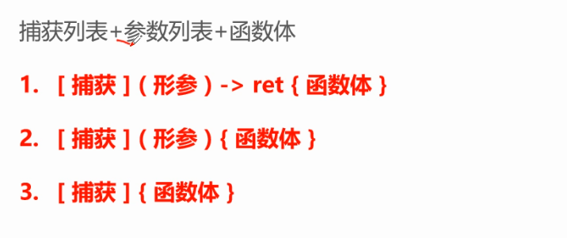

任何需要可调用对象的接口，都可以传入一个lambda表达式



`捕获`：捕获 lambda 表达式以外的参数，可以按值捕获（不可修改外部捕获的变量或对象）或按引用捕获（可修改外部捕获的变量或对象）

`形参 和 ret`：lambda表达式又名匿名函数，函数当然可以有形参和返回值，这里的形参有类型并且支持默认参数

`函数体`：函数的功能，即实际的逻辑代码

一个普通函数不仅可以没有实参，也可以无需具体的返回值类型，但是必须要有函数体。lambda表达式又名匿名函数，即没有函数名的函数，形参和返回值也可以不必有，但是函数体不能丢。至于捕获也可以不进行任何捕获，但是却必须标识它的存在。

1. `[]` ：不捕捉任何变量
2. `[&]` ：按引用捕获
3. `[=]`： 按值捕获
4. `[=, &foo]` ： 按值捕获外部作用域中所有变量, 并按照引用捕获外部变量 foo
5. `[bar]`： 按值捕获 bar 变量, 同时不捕获其他变量
6. `[&bar]`： 按引用捕获 bar 变量, 同时不捕获其他变量
7. `[this]`： 捕获当前类中的this指针
   1. 让lambda表达式拥有和当前类成员函数同样的访问权限
   2. 如果已经使用了 & 或者 =，默认添加此选项


关于 lambda 表达式捕获 this 需要注意的一个问题，即操作 this对象的时候，需要确保对象没有被销毁。如下由于我们已经提前把对象 e 删除，在此之前尽管已经保存其返回的lambda，但由于这个函数操作对象的成员变量，再调用就是不合法的。

```c++

#include <iostream>
#include <vector>
#include <functional>

class Example {
 public:
  Example() {}

  std::function<void()> getShowLambda() {
    // 捕获 this 指针并返回 lambda
    return [this]() {
      // 访问类成员
      for (auto i : data) {
        std::cout << i << " ";
      }
      std::cout << std::endl;
    };
  }

 private:
  std::vector<int> data = {1, 2, 3, 4};
};

int main() {
  Example* e = new Example();
  auto f = e->getShowLambda(); // 获取 lambda

  delete e; // 销毁对象
  e = nullptr;

  f(); 

  return 0;
}
```

lambda表达式是可调用对象，因此当你按照前面所讲的格式写出来之后，你有两种方式进行调用：原地调用和后续调用。

```c++
  // 原地调用
  [](int num1,int num2) -> int {
    return num1 + num2;
  }(10,20);

  // 后续调用
  auto f1 =   [](int num1,int num2) -> int {
    return num1 + num2;
  };
  f1(10,20);
```


