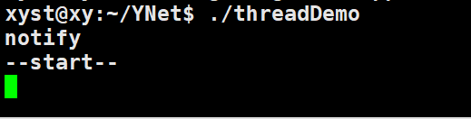
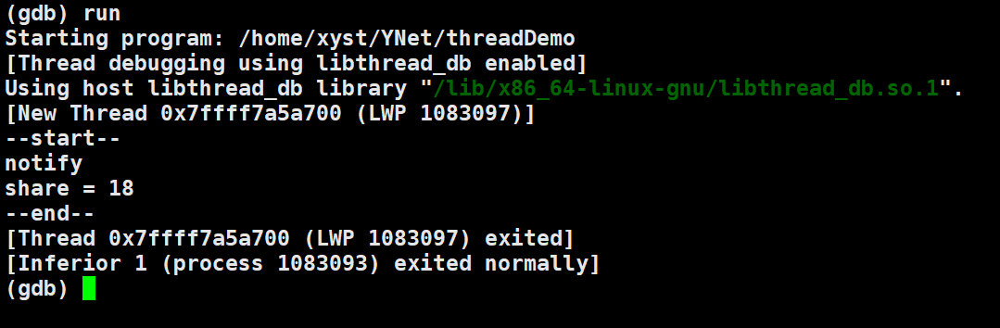
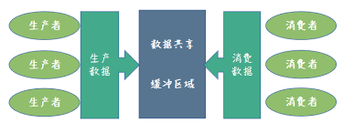

## 条件变量的正确使用方法

这里只介绍 wait，至于其他如 wait_fo r和 wait_until 自己查阅即可，无外乎增加一些新的功能而已。wait 提供两种方式：无条件等待和有条件等待

```c++
void wait (unique_lock<mutex>& lck);	// 无条件等待

template <class Predicate> void wait (unique_lock<mutex>& lck, Predicate pred);	// 有条件等待
```

无条件等待只有在唤醒的情况下才会解除阻塞，否则一直阻塞。阻塞期间释放锁（即不占有锁），被唤醒就会重新获取锁，解除阻塞往下执行。

有条件等待在阻塞前会判断谓词 pred，如果为 true 就不会阻塞，如果为false 就会阻塞。当条件变量被通知时，线程会尝试重新获取锁，然后再次评估谓词。如果谓词返回 `true`，线程继续执行；否则，它会再次阻塞。

总的来说无条件等待一上来就会阻塞，直到被唤醒，唤醒就会立即解除阻塞。有条件等待不会立即阻塞，而是先判断谓词情况。也可以说不会立即解除阻塞，要先判断谓词情况。如果为 true 就不阻塞而往下执行，否则就会阻塞。直到下一次被唤醒，再次检测谓词情况，如果为 true 就不阻塞而往下执行，否则就会阻塞。如此反复。

```c++
while(!condition){
    g_cnd.wait(g_mtx);
}
// 等价于 有条件等待
```

通常条件变量被唤醒，需要配合一个判断条件。当这个条件不满足时，线程应该会再次阻塞。如果条件满足则不会阻塞。

为了对这段描述有清晰的认识，还是有必要看看如果不这么做会有什么不恰当的现象。

```c++
#include <iostream>
#include <thread>
#include <condition_variable>
#include <mutex>

using namespace std;

condition_variable cond_;
mutex mtx_;
int share = 0;

void func(){
  std::cout<<"--start--"<<std::endl;
  unique_lock<mutex> um(mtx_);
  cond_.wait(um);
  std::cout<<"share = "<<share<<std::endl;
  std::cout<<"--end--"<<std::endl;
}

int main() {

  thread t1(func);

  while (true){
    lock_guard<mutex> mtt(mtx_);
    share++;
    if (share == 18){
      std::cout<<"notify"<<std::endl;
      cond_.notify_all();
      break;
    }
  }
  
  t1.join();
  return 0;
}
```

创建一个线程 t1 并执行线程函数 func，等待被外部线程唤醒并输出 share 的值。主线程中循环 自增share，如果share 等于 18 就唤醒其它线程。执行该程序情况如下：



线程中还没有执行 wait 等待被唤醒，主线程这边已经满足 share 等于 18 的条件就执行唤醒操作，我们的线程 t1 就错过被唤醒的机会了，所以会一直阻塞。因为代码中 t1.join 代表 等待线程 t1 结束，否则阻塞。

修改代码（while循环前面添加 sleep(3) 休眠三秒），让主线程必然在子线程 t1 执行到 wait 阻塞操作后 才执行 share 的自加操作并唤醒。



尽管已经解决这个问题，但是这种处理方式相当愚蠢，因为不可能在我们的代码中随意加入 sleep 这样的睡眠函数，如何设置恰当的时间？这个地方如果频繁执行，效率影响是否严重？最恰当的还是能够在合适的时候通知并必然能够接受到通知。

这就是前面所讲通常条件变量被唤醒，需要配合一个判断条件。

```c++
condition_variable cond_;
mutex mtx_;
bool isSuccess = false; // 让 条件变量合理地被正常唤醒
int share = 0;

void func(){
  std::cout<<"--start--"<<std::endl;
  unique_lock<mutex> um(mtx_);
  cond_.wait(um,[](){			// 添加等待条件
    return isSuccess;
  });
  std::cout<<"share = "<<share<<std::endl;
  std::cout<<"--end--"<<std::endl;
}

int main() {

  thread t1(func);

  while (true){
    lock_guard<mutex> mtt(mtx_);
    share++;
    if (share == 18){
      std::cout<<"notify"<<std::endl;
      isSuccess = true;			// 表明 share 满足要求
      cond_.notify_all();
      break;
    }
  }

  t1.join();
  return 0;
}
```

先看现象是否合理：

我们有 t1.join 操作保证主线程不会先于子线程退出，所以子线程有**可能**会接收到主线程的唤醒。但如果我们继续添加一个变量来让 子线程中的 wait 操作不断检测 条件是否满足（isSuccess 是否为 true），并且主线程唤醒之前 提前把 isSuccess 设置为true 再进行唤醒。哪怕最后这个唤醒失效，也必然能保证线程 1 能正常获取 share 的值并安全退出。因为你从图中可以看到 主线程提前唤醒，我的子线程都还没有准备好，即子线程还没有执行到 wait 阻塞等待。可即便如此，由于在唤醒之前，isSuccess必然已经被 设置为 true。等到子线程真的执行到 wait 阻塞等待时，发现 阻塞条件居然已经满足（isSuccess 检测到为true），子线程就知道主线程已经通知过，只不过这边没有收到而已，share明显已经可以被获取（因为子线程希望share = 18的时候被接收）。

到这个时候我们终于弄明白，条件变量被唤醒，需要配合一个判断条件（往往是bool值）是为了避免唤醒被错过而加的一层保护机制。

最后有个条件变量中的虚假唤醒没有讲，这已经在我的另一篇文章中讨论，感兴趣的可以去阅读：[多线程中的虚假唤醒](https://xiaoyangst.github.io/post/duo-xian-cheng-zhong-de-xu-jia-huan-xing/)

结合前面的讨论和另一篇虚假唤醒的讨论，我们对使用条件变量的人提出如下要求，即你必须谨记下面的这两句：

- 判断条件是否满足使用while，不可以用if
- 务必添加变量来保证等待线程不会错过其他线程发送的唤醒信号

## 锁的选择

C++11提供四种语义的互斥量：独占互斥量`std::mutex`，带超时的独占互斥量`std::timed_mutex`，递归互斥量`std::recursive_mutex`，带超时的递归互斥量`std::recursive_timed_mutex`。应该优先选择std::mutex，因为它满足我们所有的需要使用互斥的场景。

对于 mutex 的关键两个操作是 lock 和 unlock，将需要保护的临界区用这两个方法包裹即可。C++11为了方便锁的使用，提供 std::lock_guard 和 unique_lock 给我们使用：

`std::lock_guard`：只是对操作系统锁的API进行RAII的封装，构造时获得锁（加锁），析构时释放锁（解锁），并不提供额外的方法，也不提供 lock 和 unlock 方法。

`unique_lock`：它除了对操作系统锁的API进行RAII的封装，还提供手动控制锁的方法，即 lock 和 unlock 方法。并且提供给多的 lock 策略，比如 try_lock，try_lock_until等。

## 生产者-消费者队列

### 生产者-消费者队列简介

它是实现线程间协作，交互的一种重要手段。从一端放数据（生产者），从另一端取数据（消费者）。生产者和消费者可以有一个或多个。



- 队列作为临界区需要被保护，消费者与生产者间要互斥
- 当有多个生产者或多个消费者时，生产者之间，消费者之间需要互斥
- 生产者在队列满的时候，不能再往队列中放入数据
- 消费者在队列空的时候，不能再从队列中取数据

在用途这个方向的划分，对于队列的实现，没有太大区别。只是队列中放的数据类型不一样。一种是业务的数据，一种是可调用的对象。但是有界队列和无界队列恰恰相反，在队列的实现方式上是有很大的不同，也是后面会用代码实现的内容。

（一）按用途将队列分为两类

**数据分发的队列**

队列中存放的业务数据，可以有一个或多个生产者，消费者线程。生产者线程产生不同类型的数据，通过队列分发给不同消费者线程。

**任务队列**

队列中存放的是可调用对象，可以有一个或多个生产者，消费者线程

- 在调用**要求时序**的情况下，应该只有一个生产者和一个消费者线程，一个队列。时序的要求由队列的先进先出的特性保证
- 在调用**不要求时序**的情况下，则可以有多个生产者，消费者线程

通过任务队列，来实现异步调用。**发起业务操作的线程不会被阻塞，业务执行函数被放到另外一个线程执行**，比如释放过程耗时高的资源且释放操作不能并发进行时。可以将释放操作专门放到一个线程中去做，此时可以有多个生产者线程，一个消费者线程，生产者将需要释放的资源对象放入队列，消费者线程依次取出后进行释放操作。此时就需要队列来实现异步操作。

（二）根据队列的容量划分

**有界队列**

容量有大小限制，当满了后，生产者线程需要等待，为空的时候，消费者线程需要等待。这种队列可以用于数据分发的场景，但不能用于异步调用(异步调用的特性是生产者调用能马上返回，所以如果生产者阻塞在等待容器空闲显然是不满足要求的)。

**无界队列**

容量大小无限制，生产者线程可以一直放数据，队列为空的时候，消费者线程需要等待。这种队列即可以用于数据分发，也可以用于异步操作。这种情况下，消费者线程数量要大于生产者线程，是让数据或任务及时被处理，避免堆积。

### 生产者-消费者队列（有界队列）

```c++
template<class T>
class BoundQueue {
 private:
  int maxSize_{1024}; // 最大容量
  int size{0};  // 当前队列容量
  mutex mutex_;
  condition_variable full_;     // 每次生产每次唤醒消费者
  condition_variable empty_;    // 每次消费每次唤醒生产者
  queue<T> boundQueue_;

 public:
  explicit BoundQueue(int maxSize) : maxSize_(maxSize) {}
  ~BoundQueue() = default;

  T get() { // 消费
    unique_lock<mutex> um(mutex_);
    full_.wait(um, [this](){
      return !isEmpty();
    });
    T re = boundQueue_.front();
    boundQueue_.pop();
    size--;
    empty_.notify_all();
    return re;
  }

  void post(const T &data) {  // 生产
    unique_lock<mutex> um(mutex_);
    empty_.wait(um, [this](){
      return !isFull();
    });
    boundQueue_.push(data);
    size++;
    full_.notify_all();
  }

 private:
  bool isEmpty(){
    return boundQueue_.empty();
  }

  bool isFull(){
    return size >= maxSize_;
  }
};
```

### 生产者-消费者队列（无界队列）

```c++
template<class T>
class UnBoundQueue{
 private:
  mutex mutex_;
  condition_variable full_;     // 每次生产每次唤醒消费者
  queue<T> unboundQueue_;
 public:
  explicit UnBoundQueue() {};
  ~UnBoundQueue() = default;
  T get() { // 消费
    unique_lock<mutex> um(mutex_);
    full_.wait(um, [this](){
      return !isEmpty();
    });
    T re = unboundQueue_.front();
    unboundQueue_.pop();
    return re;
  }

  void post(const T &data) {  // 生产
    {
      lock_guard<mutex> lock_guard(mutex_);
      unboundQueue_.push(data);
    }

    full_.notify_all();
  }
 private:
  bool isEmpty(){
    return unboundQueue_.empty();
  }
};
```

## 异步操作

### future 与 promise

它提供了一种机制可以获取异步操作的结果，因为一个异步操作的结果不能马上获取，只能在未来某个时候从某个地方获取。这个异步操作的结果是一个未来的期待值，所有称为 future，可以称它为未来量。

std::future 通常结合 std::promise，std::package_task，std::async使用。因为 future 本身只是用来存储某个结果，所以实际代码的执行还是需要借助其它函数。获取 future  存储结果的方法是 get()，并且只能获取一次，再次获取会异常。

```c++
//std::future 是一个类模板，模板参数需要传入一个类型
template <class T>
future;template <class R&> future<R&>;
```

std::promise 是一个协助线程赋值的类，它能够将数据和 future 对象绑定起来，为获取线程函数中的某个值提供便利。std::future 通常结合 std::promise 就相当于给线程间**建立一个通道**，分为以下几步：

1. 在主线程中创建一个 std::promise 对象，promise<int> count_value
2. 将 count_value 传给线程 t1
3. 线程 t1 使用 std::promise 对象 count_value 的 get_future 方法获得一个 std::future对象，因为前面说过 std::future对象 可以存储异步操作的结果。截止到这个时候，通道已经建立，就可以使用通道了
4. 在主线程中调用调用std::promise 对象 count_value 的 get 方法，如果 count_value 没有被设置只，主线程就会一直阻塞
5. 在子线程中调用 set_value 方法给 count_value 设置一个值

```c++
#include <iostream>
#include <future>

using namespace std;

void thr_func(int num,promise<int> &p){
    int count = 0;
    for (int i = 0; i < num; ++i) {
        count += i;
    }
    p.set_value(count);	//将需要的结果存储起来
}

int main(){

    promise<int> count_value;

    thread t1(thr_func,10, ref(count_value));
    
    
    t1.join();

    cout<<"0~10之间数字的总和："<<count_value.get_future().get()<<endl;	//获取返回值

    return 0;
}
```

### future 与 package_task

`packaged_task` 包装了一个可调用对象，并允许其结果以异步方式获取。它类似于 `std::function`，但会将结果**自动传递**给一个 `future` 对象。它的内部包含两个元素：

1. 存储的任务（用户传递），这是某种可调用对象（如函数指针、成员函数指针或函数对象）
2. 共享状态（自动传递），能够存储调用存储任务的结果（类型为 `Ret`），并通过 `future` 异步访问

通过调用成员函数 `get_future`，共享状态与 `future` 对象关联。调用后，这两个对象共享相同的共享状态。

比方说下面的代码中，先把普通函数 thr_func 包装成 packaged_task 类型的对象（返回值类型和参数列表要一直） task，最终的得到的这个 task 需要通过**引用的方式传递到子线程内部**，这样才能在主线程的最后通过任务对象的 get_future 方法得到 future 对象，打包的 task 代码中 return 的返回值就存储在 future 对象里。前面我们讲过 future 对象 获取存储结果的方式就是 get 方法。

```c++
#include <iostream>
#include <future>

using namespace std;

int thr_func(int num){      //  普通函数
    int count = 0;
    for (int i = 0; i < num; ++i) {
        count += i;
    }
    return count;
}

int main(){

    packaged_task<int(int)> task(thr_func);     //将函数thr_func 打包为 task函数

    future<int> result = task.get_future();     //返回值存储在future中

    thread t1(ref(task),10);        //将打包的函数task传递进去，包括这个函数所需要的参数

    t1.join();

    cout<<"0~10之间数字的总和："<<result.get()<<endl;       //拿到返回值

    return 0;
}
```

### future 与 async

可以直接启动一个子线程并在这个子线程中执行对应的任务函数，异步任务执行完成返回的结果也是存储到一个future对象中。也就是说调用 async 的返回值是一个 future 对象，里面存储返回值。这么看要比 package_task 方便很多，因为不需要取打包可调用对象，直接传递进去即可。

```c++
template< class Function, class... Args>
std::future<std::result_of_t<std::decay_t<Function>(std::decay_t<Args>...)>>
    async( Function&& f, Args&&... args );


template< class Function, class... Args >
std::future<std::result_of_t<std::decay_t<Function>(std::decay_t<Args>...)>>
    async( std::launch policy, Function&& f, Args&&... args );
```

函数参数:

- f：可调用对象，这个对象在子线程中被作为任务函数使用
- Args：传递给 f 的参数（实参）
- policy：可调用对象f的执行策略（std::launch::async 创建新线程启动函数，std::launch::deferred 在主线程中启动函数）

```c++
#include <iostream>
#include <future>

using namespace std;

int thr_func(int num){      //  普通函数
    int count = 0;
    for (int i = 0; i < num; ++i) {
        count += i;
    }
    return count;
}

int main(){


    future<int> result = async(launch::async,thr_func,10);      //自动创建线程，并返回thr_func的返回值

    cout<<"0~10之间数字的总和："<<result.get()<<endl;       //拿到返回值

    return 0;
}
```

### future 与 shared_future

`std::funture` 只支持移动语义，它要求类型参数也支持移动语义。它的get方法只能调用 1 次，调用get相当于将结果移走(移动语义的通俗意义)。再次调用会抛异常。

`std:shared_future` 可以共享结果，可以多次调用get方法，它要求类型参数支持复制语义。

### 总结

1. future 是异步函数存储结果的所在
2. promise 异步函数相当于创建一个变量给到线程，然后在线程中把值存储到变量中之后，主线程再进行获取
3. packaged_task 异步函数对函数进行封装，这样线程函数可以有 return 返回值，不像 promise 是将在线程函数中把值存储起来，但是 packaged_task 却可以有 return 返回值
4. async 异步函数更加高级，前面需要的两个线程函数需要创建子线程，但是它自动创建并且返回传递可调用对象的返回值

future 存储结果，其它三个异步函数中 async 要更灵活且简单，能够真正做到异步（可以自启动一个线程去执行函数）