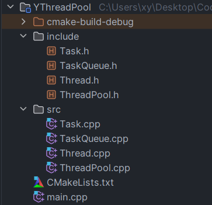
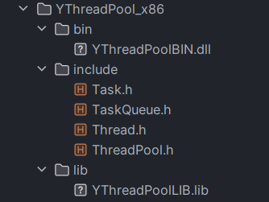

我最近在尝试手写线程池，尽管还有很多改进的地方，但用来学习本节内容足够了



## 构建静态库和动态库

光是构建静态库和动态库还不够， 还需要指定生成路径，这样别人使用你的库文件将相当方便（后面你就知道了）

先看看如何构建静态库和动态库

```cmake
add_library(静态库名称 STATIC 源文件) 
add_library(动态库名称 SHARED 源文件) 
```

对于安装路径、头文件安装路径、静态库安装路径、动态库安装路径已在上节介绍

这里重点讲 install 的配置，即用户在终端使用 install 命令就能生成提前配置好的安装路径

```cmake
install(TARGETS <target>... [...])              # 安装指定的目标（可执行文件、库等）
install(DIRECTORY <dir>... [...])                # 安装指定的目录及其内容

#本节尚未应用
install(IMPORTED_RUNTIME_ARTIFACTS <target>... [...])  # 安装导入的运行时文件（通常由外部构建导入）
install({FILES | PROGRAMS} <file>... [...])      # 安装指定的文件或程序
install(SCRIPT <file> [...])                     # 执行指定的安装脚本
install(CODE <code> [...])                       # 执行指定的 CMake 代码段
install(EXPORT <export-name> [...])              # 导出指定的目标到一个 CMake 导出文件
install(RUNTIME_DEPENDENCY_SET <set-name> [...]) # 安装运行时依赖项集合
```

因此，我们的重点关注静态库和动态库以及头文件的安装路径，那我们先设置路径和配置生成库文件的命令

```cmake
cmake_minimum_required(VERSION 3.26)
project(YThreadPool)
set(CMAKE_CXX_STANDARD 17)

include_directories((${PROJECT_SOURCE_DIR}/include))

aux_source_directory(src SRC_LIST)

set(CMAKE_INSTALL_PREFIX YThreadPool_x86)   # 指定安装路径的前缀

set(CMAKE_INSTALL_INCLUDEDIR include)       # 设置基于安装路径的前缀的头文件生成路径

set(CMAKE_INSTALL_LIBDIR lib)       # 设置基于安装路径的前缀的静态库生成路径 lib
add_library(YThreadPoolLIB STATIC ${SRC_LIST})     # 生成静态库

set(CMAKE_INSTALL_BINDIR bin)       # 设置基于安装路径的前缀的动态库生成路径 bin
add_library(YThreadPoolBIN SHARED ${SRC_LIST})     # 生成动态库
```

但如果我们希望用户应用 install 命令来把这些文件全部放在安装路径下，就还需要继续往下配置

下面的配置中有些新参数在前面没有介绍，比如：DESTINATION、ARCHIVE、RUNTIME、LIBRARY

```cmake
install(DIRECTORY  ${PROJECT_SOURCE_DIR}/include/   #安装 include 目录中的文件到指定安装的头文件目录
        DESTINATION ${CMAKE_INSTALL_INCLUDEDIR})

install(TARGETS YThreadPoolLIB                      #安装静态库 YThreadPoolLIB 到指定安装的库文件目录
        ARCHIVE DESTINATION ${CMAKE_INSTALL_LIBDIR})

install(TARGETS YThreadPoolBIN                      # 安装动态库 YThreadPoolBIN 到指定安装的可执行文件和库文件目录
        RUNTIME DESTINATION ${CMAKE_INSTALL_BINDIR}
        LIBRARY DESTINATION ${CMAKE_INSTALL_LIBDIR})
```

对出现的新参数，下面用列表来展示

| 目标文件 | 内容             | 安装目录变量             | 默认安装文件夹 |
| -------- | ---------------- | ------------------------ | -------------- |
| ARCHIVE  | 静态库           | ${CMAKE_INSTALL_LIBDIR}) | lib            |
| LIBRARY  | 动态库           | ${CMAKE_INSTALL_LIBDIR}) | lib            |
| RUNTIME  | 可执行二进制文件 | ${CMAKE_INSTALL_BINDIR}  | bin            |

还有非常关键的指令：DESTINATION  <dir>

即指定磁盘上要安装文件的目录。`<dir>` 应为相对路径。 绝对路径是允许的，但不建议使用

---

下面开始整个静态库和动态库的构建和安装过程， 最后再看看安装情况

```cmake
cmake -S . -B build
cmake --build build
cmake --install build --config Debug 	#指定生成 Debug版
```

效果：



以后用户想要使用这个库，就只需要把 YThreadPool_x86 拷贝到自己的项目文件中

然后在CMakeLists,txt中找到所需库文件和头文件即可，这也是下面要演示的内容，即如何使用链接静态库和动态库

## 链接静态库和动态库

（一）链接静态库

```c++
link_libraries(<static lib> [<static lib>...])

参数1：指定出要链接的静态库的名字

		1.可以是全名 libxxx.a
  
		2.也可以是掐头（lib）去尾（.a）之后的名字 xxx
  
参数2-N：要链接的其它静态库的名字，用空格隔开即可
```

如果是系统提供的静态库，填写静态库名称即可

如果是第三方静态库，需要给出具体路径才行（但我们一般选择link_directories方法找到库文件的位置）

**注意**：因为静态库是在编译可执行程序之前要存在的一个文件，因此我们的`link_libraries`语法 务必 在 `add_executable` 语法之前

（二）链接动态库

```cmake
target_link_libraries(
    <target> 
    <PRIVATE|PUBLIC|INTERFACE> <item>... 
    [<PRIVATE|PUBLIC|INTERFACE> <item>...]...)
```

我们需要指定链接的目标，因为我们是要动态加载的，因此必须指定加载到哪个应用程序中，因此target参数是可执行程序的名称

**注意**：因为动态库是在编译可执行程序之后要存在的一个文件，因此我们的`target_link_libraries`语法 务必 在 `add_executable` 语法之后

| 关键字    | 说明                                                         | 传递方式                                             |
| --------- | ------------------------------------------------------------ | ---------------------------------------------------- |
| PRIVATE   | 目标链接到库，但不会传递给依赖此目标的其他目标               | 链接库仅对当前目标可见                               |
| PUBLIC    | 目标链接到库，并且依赖此目标的其他目标也会链接到该库         | 链接库对当前目标和依赖此目标的所有目标都可见         |
| INTERFACE | 目标本身不会链接到库，但任何依赖此目标的目标会链接到该库。适用于仅在接口需要的库 | 链接库对依赖此目标的所有目标可见，但对当前目标不可见 |

如上这种讲法还是不太好理解，下面用实例说明：

```cmake
# target A depends on libA
target_link_libraries(A PRIVATE libA)

# target B depends on target A
target_link_libraries(B PUBLIC A)

# target C depends on target B
target_link_libraries(C INTERFACE B)
```

`A` 链接到 `libA`，但只有 `A` 自己能看到 `libA`，所以 `libA` 不会传递给 `B` 或 `C`

`B` 链接到 `A`，并且这个链接关系是 `PUBLIC`，所以 `B` 和 `C` 都能看到 `A`

`C` 链接到 `B`，但这种链接关系是 `INTERFACE`，所以 `C` 能看到 `B` 的接口，但 `B` 实际上没有链接到其他库

---

下面我就具体演示，把静态库和动态库一并引入，实际情景中你可能只需要静态库或动态库即可

```cmake
cmake_minimum_required(VERSION 3.16)
project(YThreadPool)
set(CMAKE_CXX_STANDARD 17)

# 设置库文件的头文件路径
include_directories(${PROJECT_SOURCE_DIR}/YThreadPool_x86/include)

# 设置静态库和动态库的路径
link_directories(${PROJECT_SOURCE_DIR}/YThreadPool_x86/lib)
link_directories(${PROJECT_SOURCE_DIR}/YThreadPool_x86/bin)

link_libraries(YThreadPoolLIB)  # 添加静态库

add_executable(Demo main.cpp)

# 添加动态库 和 添加 pthread 库链接（因为我们用到线程了）
target_link_libraries(Demo PUBLIC YThreadPoolBIN pthread)
```

