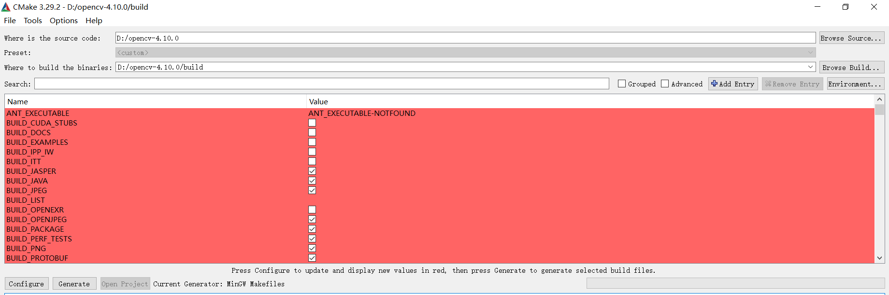

为什么要单独讲这个？我在导入第三方依赖库时遇到很多曲折，且不说那些没有被 CMake 管理的第三方库。综合考虑选择编译安装 OpenCV，因为它本身还依赖其它第三方库，特别适合做为本节内容演示

现在你已经下载并解压 OpenCV 的源码，进入文件夹之后你会看到 根CMakeLists.txt 文件

打开你的 cmake-gui 程序：

1. 点击右侧 Browse Source 指定源文件路径，即根CMakeLists.txt文件存在的路径
2. 点击右侧 Browse Build 指定 build 输出路径，可以自行创建或者 cmake-gui 帮我们自动创建
3. 点击左下角 Configure，会让你选择编译的环境



接下来就关注图中的红色区域的内容，这些都是参数，通常我们需要配置的参数是安装路径 CMAKE_INSTALL_PREFIX


设置好对应的参数之后，再次点击 Configure 对设置的参数进行更新，没有出错之后（会出错，这个后面单独拎出来谈）点击 Generate 即可

退出 cmake-gui 程序，我们来到终端（ OpenCV 源码的 build 目录下，这个 build 文件夹前面我们就创建的，即 Browse Build 指定 build 输出路径），通过命令继续编译

```c++
mingw32-make -j6
    
mingw32-make install
```

然后把我们编译成功之后 OpenCV 的 bin 文件目录加入到环境变量中，重启电脑即可

```c++
D:\opencv-4.10.0\opencv_x64\x64\mingw\bin
```

---

前面有个地方说明，即点击 Configure 对设置的参数进行更新会出错，这是因为 OpenCV 需要去远端下载文件，往往下载失败

当然，这不是我要讲的主题，我要说的是 OpenCV 依赖 ffmpeg，不在编译 OpenCV 指定 ffmpeg 第三方库，OpenCV 将无法处理视频

现在我假定你已经编译安装 ffmpeg 了，你如何为 OpenCV  指定 ffmpeg 的安装路径 ？点击 Configure 对设置的参数进行更新会出错，这里面的出错信息就包含让你如何通过设置参数指定 ffmpeg 的安装路径

在系统环境变量中配置之后，记得重启电脑才能生效


往后，如果你想要在你的项目中使用 OpenCV ，只需要把之前配置的安装路径下的文件拷贝过去即可

但这通常还不够，因为需要配置我们项目的 CMakeLists.txt 文件来找到第三方库

关于如何找到第三方库，学习上节内容之后，各位不会陌生，但是我们上节的文件结构相当简单，如果面对那种文件结构层级很多的怎么办？尽管用上节的内容也可以解决，但非常的麻烦

我想一个好的库文件（用 CMake 管理）应该只需要几个语法就能找到并导入，这通常也是存在的


在我们的安装路径中找到 .cmake 配置文件（通常命名为**库名称+Config.cmake**），里面就会有如何帮我们导入第三方库的方式，打开看看里面前面注释的部分的核心内容

```cmake
FIND_PACKAGE(OpenCV REQUIRED)	#找到库文件
TARGET_LINK_LIBRARIES(MY_TARGET_NAME ${OpenCV_LIBS})	#链接到库文件
```

还有一个参数 OpenCV_INCLUDE_DIRS 提供给我们，这里包含所有头文件，我们只需要通过 include_directories 将其导入即可，这样就找到所有头文件了

```cmake
include_directories(${OpenCV_INCLUDE_DIRS})
```

为了让如上内容都生效，我们就需要设置这个 .cmake 文件的路径

而且你会发现OpenCV_DIR这个参数好像在 .cmake 文件中没有说明，我猜想它的构成应该是FIND_PACKAGE中的库名称，然后加上下划线和DIR构成，即**库名称_DIR**（官网有说明，也就不是猜想了）

```c++
set(OpenCV_DIR "${CMAKE_CURRENT_SOURCE_DIR}/thirdpart/opencv_x64")
```

下面，就看看完整版的 CMakeLists.txt 文件

```cmake
cmake_minimum_required(VERSION 3.17)
project(YourProjectName)

set(CMAKE_CXX_STANDARD 14)

# 设置 OpenCV 的路径
set(OpenCV_DIR "${CMAKE_CURRENT_SOURCE_DIR}/thirdpart/opencv_x64")

find_package(OpenCV REQUIRED)
include_directories(${OpenCV_INCLUDE_DIRS})

add_executable(YourProjectName main.cpp)
target_link_libraries(YourProjectName ${OpenCV_LIBS})
```

这里面有个新语法FIND_PACKAGE，会在下节介绍，如何把我们的库文件也能像这样让用户轻松找到呢？下节就要见分晓


注：**库名称+Config.cmake**文件在build目录下也存在，而且也更详细，建议参考
