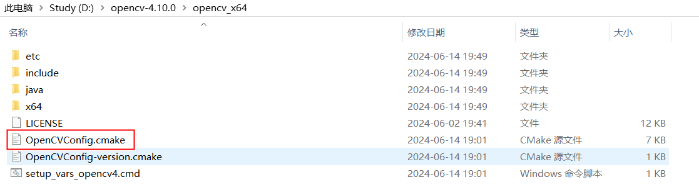

在上一小节当中，查找第三方库用到一个新语法 find_package，这个语法往往被人误解，以为只要是找第三方库就可以用，但如果你看我第三章的那种方式构建库文件，你就无法用 find_package

先把 find_package 的搜索原理讲清楚，再来谈如何把我们的库文件也能够通过 find_package 找到

其次，我在上一小节当中已经讲解 install 部分语法了，本节同样是对 install 语法的继续补充

## find_package 的搜索原理

（一）典型用法

```cmake
find_package(<PackageName> [<version>] [REQUIRED] [COMPONENTS <components>...])
```

<PackageName> 是唯一的必选参数

<version> 通常会被省略，如果没有软件包就无法成功配置项目，则应给出 REQUIRED

一些更复杂的软件包支持组件，可以使用 COMPONENTS 关键字来选择组件，但大多数软件包都没有这种复杂程度

以上节的 OpenCV 举例

```cmake
find_package(OpenCV REQUIRED)
```

（二）搜索包的模式

**Module 模式**：在这种模式下，CMake 会搜索名为 `Find<PackageName>.cmake` 的文件，首先在 `CMAKE_MODULE_PATH` 指定的路径中查找，则在CMake安装目录（即**CMAKE_ROOT**变量）下的**Modules**目录下查找。找到文件后，CMake 会读取并处理它，负责查找包、检查版本，并生成任何必要的消息

```cmake
#查找顺序
CMAKE_MODULE_PATH
CMAKE_ROOT
```

**Config 模式**：在这种模式下，CMake 会搜索名为 `<lowercasePackageName>-config.cmake` 或 `<PackageName>Config.cmake` 的文件。如果指定了版本信息，还会查找 `<lowercasePackageName>-config-version.cmake` 或 `<PackageName>ConfigVersion.cmake`。Config 模式下，可以指定一个包名列表来搜索。CMake 搜索配置和版本文件的位置比 Module 模式复杂得多

```cmake
#查找文件
<lowercasePackageName>-config.cmake 或 <PackageName>Config.cmake
#如果指定版本
<lowercasePackageName>-config-version.cmake` 或 `<PackageName>ConfigVersion.cmake
```

默认情况下是先 Module 模式，如果查找失败就采用 Config 模式

OpenCV 是 Config 模式，见下



如果想让CMake找到<PackageName>Config.cmake文件，需要在CMakeLists.txt中设置参数<PackageName>_DIR来设置路径

比方说OpenCV的设置情况

```c++
set(OpenCV_DIR "${CMAKE_CURRENT_SOURCE_DIR}/thirdpart/opencv_x64")
```

然后你接着去设置头文件路径、库文件路径，最后把库文件链接到可执行程序中

```cmake
find_package(OpenCV REQUIRED)
include_directories(${OpenCV_INCLUDE_DIRS})
 
add_executable(YourProjectName main.cpp)
target_link_libraries(YourProjectName ${OpenCV_LIBS})
```

如果你不设置OpenCV_DIR，也可以通过find_package的 PATHS 参数来设置

```cmake
find_package(<PackageName> PATHS paths... NO_DEFAULT_PATH)

/*

<PackageName>：你要查找的包名
PATHS paths...：指定一个或多个自定义路径，CMake 将在这些路径中查找包
NO_DEFAULT_PATH：如果使用了这个选项，CMake 将只在你指定的路径中查找，而不会使用默认的搜索路径

*/
```

## 通过 find_package 找到库文件