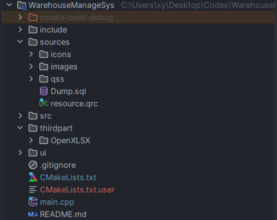

网上就我的搜索经验来看，没有一篇文章实打实的把这个讲清楚，尽管我实践成功也来源于网上公布的文章，因此绝非要嘲讽谁。发此文就是希望那些想要通过CMake来管理Qt项目的人能够成功，网上的文章针对这块比较零散，把这些零散的内容和自身的实际情况结合，此文得以形成



Qt中要管理头文件、源文件、ui文件、qrc资源文件，针对上面这种文件结构对应的CMakeLists.tx文件内容如下：

```cmake
cmake_minimum_required(VERSION 3.26)
project(WarehouseManageSys)

set(CMAKE_CXX_STANDARD 17)

# 务必指定 ，即Qt库的路径
set(CMAKE_PREFIX_PATH "C:/Qt/6.5.3/mingw_64")

# 在当前目录中查找包含文件
set(CMAKE_INCLUDE_CURRENT_DIR ON)

# 查找所需的Qt6组件
find_package(Qt6 COMPONENTS
        Core
        Gui
        Widgets
        Sql
        REQUIRED)


#搜索头文件
include_directories(include/)
file(GLOB HEADER_FILES "include/*.h")

#搜索源文件
file(GLOB SRC_LIST "src/*.cpp")

# 搜索ui文件
file(GLOB UI_FILES "ui/*.ui")

# 搜索资源文件（图片、图标、音乐等）
file(GLOB_RECURSE RESOURCES "sources/*.qrc")

add_subdirectory(src)
add_subdirectory(thirdpart/OpenXLSX)

# 生成头文件的 MOC 文件
QT6_WRAP_CPP(HEADERS_MOC ${HEADER_FILES})
# 生成 UI 文件对应的头文件
QT6_WRAP_UI(FORMS_HEADERS ${UI_FILES})
# 添加资源文件
QT6_ADD_RESOURCES(RCC ${RESOURCES})

add_executable(WarehouseManageSys main.cpp ${HEADERS_MOC} ${SRC_LIST} ${FORMS_HEADERS} ${RCC})

target_link_libraries(WarehouseManageSys
        Qt6::Core
        Qt6::Gui
        Qt6::Widgets
        Qt6::Sql
        OpenXLSX::OpenXLSX
)
```

也许CMake管理Qt项目还有其它语法，但个人实践成功并一直使用的就是如上方式，在今后的项目中只需要参考这份文件应该不会有大碍。如果无法满足需求的话，CMake官方也有有关Qt项目语法介绍，尽管我从来没去看过

最后补充一个点，即由于在CLion上进行Qt开发，因此ui_xx.h文件都在cmake-build-debug中，但是我又没有配置如何找到这些头文件的语法，写程序的时候是如何找到的呢？

在 `CMakeLists.txt` 中，已经使用了 `QT6_WRAP_UI` 来处理 `.ui` 文件。这些宏会生成相应的 `ui_xx.h` 文件，并将其路径添加到编译器的搜索路径中。这个过程是自动处理的，因此你不需要显式地指定这些生成文件的路径