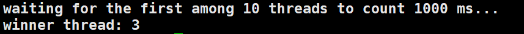

std::call_once 和 std::once_flag 是 C++11 中引入的**线程安全**的函数和类型，用于**确保某个函数只被调用一次**

```c++
template <class Fn, class... Args>
void call_once (once_flag& flag, Fn&& fn, Args&&... args);
```

**flag**：`std::once_flag` 对象，用来确保某个函数只被调用一次

**fn**：要调用的函数

**args**：传递给函数 `fn` 的参数

官网概述：

- 如果另一个线程已经主动执行了带有相同标记的 call_once 调用，则会导致被动执行： 被动执行不会调用 fn
- 如果对 call_once 的主动调用因抛出异常而结束（异常会传播给调用线程），并且存在被动执行，则会从这些被动执行中选择一个，并调用它作为新的主动调用
- 如果一旦主动执行返回，所有当前的被动执行和未来对 call_once 的调用（使用相同的标志）也会返回，而不会成为主动执行

如果一个线程 A 正在执行带有 call_once 标记的函数 fn，其它线程企图调用 fn 是无法成功的（标记为被动执行）。如果前面的线程A执行成功，那么标记为被动执行的其它线程将没有调用 fn 的机会。如果前面的线程A执行失败，哪些标记为被动执行的线程中会有一个被选择化为主动执行，即可以调用 fn，其它没被选中的依旧保持被动执行的标记

```c++
#include <iostream>       
#include <thread>         
#include <chrono>        
#include <mutex>          // std::call_once, std::once_flag

int winner;
void set_winner (int x) { winner = x; }
std::once_flag winner_flag;

void wait_1000ms (int id) {
  for (int i=0; i<1000; ++i)
    std::this_thread::sleep_for(std::chrono::milliseconds(1));
  std::call_once (winner_flag,set_winner,id);
}

int main ()
{
  std::thread threads[10];
  for (int i=0; i<10; ++i)
    threads[i] = std::thread(wait_1000ms,i+1);

  std::cout << "waiting for the first among 10 threads to count 1000 ms...\n";

  for (auto& th : threads) th.join();
  std::cout << "winner thread: " << winner << '\n';

  return 0;
}
```

输出结果：

