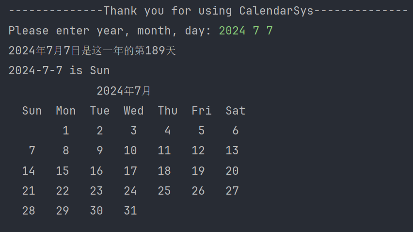

功能效果图如下：



## 接受用户的输入

日历系统只涉及三个变量需要由用户提供，即年, 月, 日

既然用户需要输入数据，任何输入的数据皆认为是恶意输入，我们需要对其进行合法化判断：

- year 不能小于 1900
- month 不能小于 1 或 不能 大于 12
- 判断 day 大小之前，需要先获取这个月的天数，然后判断不能小于 1 或 大于这个月的天数

```c
bool isValidDate(int year, int month, int day) {		// 参数合法化判断

  if (year < 1900) return false;
  if (month < 1 || month > 12) return false;

  int daysInMonth = isLeapYear(year) ? monthOfDaysLeap[month - 1] : monthOfDaysNoLeap[month - 1];
  if (day < 1 || day > daysInMonth) return false;

  return true;
}


int main() {
  int year = 0, month = 0, day = 0;
  printf("--------------Thank you for using CalendarSys--------------\n");
  printf("Please enter year, month, day: ");
  fflush(stdout);  // 强制刷新输出缓冲区
  scanf("%d %d %d", &year, &month, &day);

  // 检查输入的日期是否合理
  if (!isValidDate(year, month, day)) {
    printf("输入的日期不合理，请重新运行程序并输入有效的日期。\n");
    return EXIT_FAILURE;
  }

  // 确认是第多少天
  // 确认日期是星期几
  // 打印日历

  return 0;
}
```

我在 Clion 上完成的该程序，在没有添加 fflush 方法之前，执行程序会导致前面的 printf 方法中的输出不会出现在要求用户输入参数之前，尽管我的打印代码就在要求用户输入参数之前

为什么需要添加 fflush 方法？

在某些环境中，标准输出是缓冲的，这意味着输出的数据会暂时存储在缓冲区中，直到缓冲区被填满或手动刷新。在输入提示信息后立即调用 `scanf` 读取用户输入时，提示信息可能尚未实际显示在屏幕上，因为它还在缓冲区中。这会导致用户在看到提示信息之前就被要求输入数据

使用 `fflush(stdout);` 可以强制刷新标准输出缓冲区，确保提示信息在 `scanf` 之前被实际打印到屏幕上，这样用户可以看到提示信息并正确输入数据

## 判读是不是闰年

公历纪年法中，能被4整除的大多是闰年，但能被100整除而不能被400整除的年份不是闰年，如1900年是平年，2000年是闰年

```c
bool isLeapYear(int year){
  // 如果能被 4 整除，大概率是闰年
  if(year % 4 == 0){
    // 基于前面的条件，如果能被100整除，而不能被400整除的不是闰年
    if((year % 100 == 0) && (year % 400 != 0)){
      return false;
    }
    return true;
  }
  return false;
}
```

可以精简成如下代码：

```c
bool isLeapYear(int year) {
  return (year % 4 == 0 && (year % 100 != 0 || year % 400 == 0));
}
```

## 需要用到的公共参数

```c
enum Week {
  Sunday = 0,
  Monday,
  Tuesday,
  Wednesday,
  Thursday,
  Friday,
  Saturday
};

const char *daysOfWeek[] = {"Sun", "Mon", "Tue", "Wed", "Thu", "Fri", "Sat"};
const int monthOfDaysLeap[] = {31, 28, 31, 30, 31, 30, 31, 31, 30, 31, 30, 31};    // 闰年
const int monthOfDaysNoLeap[] = {31, 29, 31, 30, 31, 30, 31, 31, 30, 31, 30, 31};  // 平年
```

## 确认天数和确认周几

```c
int confirmDay(int year, int month, int day) {
  struct tm date = {0};
  date.tm_year = year - 1900;
  date.tm_mon = month - 1;
  date.tm_mday = day;
  mktime(&date);  // 标准化结构

  return date.tm_yday + 1;
}
```

```c
int confirmWeek(int year, int month, int day) {
  struct tm date = {0};
  date.tm_year = year - 1900;  // tm_year是自1900年以来的年数
  date.tm_mon = month - 1;     // tm_mon是0基的，0表示1月
  date.tm_mday = day;
  mktime(&date);  // 标准化结构

  return date.tm_wday;
}
```

C语言的时间函数个人没怎么使用过，需新建一篇技术文章记录，名为：C语言中的时间函数

## 打印日历

我们的日历系统从左往右是：周天、周一、周二、周三、周四、周五、周六，所以当遇到周六就需要换行

再者，我们的计数 1 的打印是从当前月份的1号代表的周几开始打印的，所以如果当前月份的1号不是周天，那就需要打印对应数量的前置空格

```c
void PrintCalendar(int year, int month) {
  printf("             %d年%d月        \n", year, month);
  printf("  %-3s  %-3s  %-3s  %-3s  %-3s  %-3s  %-3s\n", "Sun", "Mon", "Tue", "Wed", "Thu", "Fri", "Sat");

  int countDay = isLeapYear(year) ? monthOfDaysLeap[month - 1] : monthOfDaysNoLeap[month - 1];
  int curWeek = confirmWeek(year, month, 1);

  // 打印第一行的前置空格
  for (int i = 0; i < curWeek; ++i) {
    printf("     ");
  }

  int count = 1;
  while (count <= countDay) {
    printf("%4d ", count);
    curWeek++;
    if (curWeek % 7 == 0) {  // 如果是周六，换行
      printf("\n");
    }
    count++;
  }

  if (curWeek % 7 != 0) {
    printf("\n");
  }
}
```

再有一个就是如何巧妙的让打印的日期上下对齐，这样看起来更加美观合理? 即使用**固定宽度格式化字符串**

在 `printf` 中，`"%4d"` 中的数字 4 表示了输出字段的宽度。具体来说：

- `%d` 是用来格式化整数的转换说明符
- `4` 表示输出的整数会占据的最小宽度为 4 个字符。如果实际的整数不足 4 个字符宽度，将会在左侧用空格填充，以达到指定的最小宽度

举例来说，假设 `count` 的值为 `42`，那么使用 `printf("%4d ", count);` 将会输出：

```tex
  42
```

注意到输出结果中，`42` 前面有两个空格，这是因为整数 `42` 只占用了两个字符的宽度，而我们指定的宽度是 `4`

## 完整的日历系统的代码

```c
#include <stdio.h>
#include <time.h>
#include <stdbool.h>
#include <stdlib.h>

enum Week {
  Sunday = 0,
  Monday,
  Tuesday,
  Wednesday,
  Thursday,
  Friday,
  Saturday
};

const char *daysOfWeek[] = {"Sun", "Mon", "Tue", "Wed", "Thu", "Fri", "Sat"};
const int monthOfDaysLeap[] = {31, 28, 31, 30, 31, 30, 31, 31, 30, 31, 30, 31};    // 闰年
const int monthOfDaysNoLeap[] = {31, 29, 31, 30, 31, 30, 31, 31, 30, 31, 30, 31};  // 平年

bool isLeapYear(int year) {
  if ((year % 4 == 0 && year % 100 != 0) || year % 400 == 0) {
    return true;
  }
  return false;
}

int confirmWeek(int year, int month, int day) {
  struct tm date = {0};
  date.tm_year = year - 1900;  // tm_year是自1900年以来的年数
  date.tm_mon = month - 1;     // tm_mon是0基的，0表示1月
  date.tm_mday = day;
  mktime(&date);  // 标准化结构

  return date.tm_wday;
}

int confirmDay(int year, int month, int day) {
  struct tm date = {0};
  date.tm_year = year - 1900;
  date.tm_mon = month - 1;
  date.tm_mday = day;
  mktime(&date);  // 标准化结构

  return date.tm_yday + 1;
}

void PrintCalendar(int year, int month) {
  printf("             %d年%d月        \n", year, month);
  printf("  %-3s  %-3s  %-3s  %-3s  %-3s  %-3s  %-3s\n", "Sun", "Mon", "Tue", "Wed", "Thu", "Fri", "Sat");

  int countDay = isLeapYear(year) ? monthOfDaysLeap[month - 1] : monthOfDaysNoLeap[month - 1];
  int curWeek = confirmWeek(year, month, 1);

  // 打印第一行的前置空格
  for (int i = 0; i < curWeek; ++i) {
    printf("     ");
  }

  int count = 1;
  while (count <= countDay) {
    printf("%4d ", count);
    curWeek++;
    if (curWeek % 7 == 0) {  // 如果是周六，换行
      printf("\n");
    }
    count++;
  }

  if (curWeek % 7 != 0) {
    printf("\n");
  }
}

bool isValidDate(int year, int month, int day) {

  if (year < 1900) return false;
  if (month < 1 || month > 12) return false;

  int daysInMonth = isLeapYear(year) ? monthOfDaysLeap[month - 1] : monthOfDaysNoLeap[month - 1];
  if (day < 1 || day > daysInMonth) return false;

  return true;
}


int main() {
  int year = 0, month = 0, day = 0;
  printf("--------------Thank you for using CalendarSys--------------\n");
  printf("Please enter year, month, day: ");
  fflush(stdout);  // 强制刷新输出缓冲区
  scanf("%d %d %d", &year, &month, &day);

  // 检查输入的日期是否合理
  if (!isValidDate(year, month, day)) {
    printf("输入的日期不合理，请重新运行程序并输入有效的日期。\n");
    return EXIT_FAILURE;
  }


  // 确认是第多少天
  int result = confirmDay(year,month,day);
  printf("%d年%d月%d日是这一年的第%d天\n", year, month, day, result);

  // 确认日期是星期几
  int week = confirmWeek(year, month, day);
  printf("%d-%d-%d is %s\n", year, month, day, daysOfWeek[week]);

  // 打印日历
  PrintCalendar(year, month);

  return 0;
}
```

