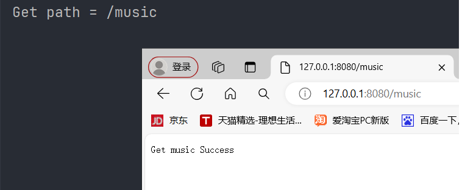

最近打算实践一个Qt的项目，我看博主用的Boost库提供的网络库asio，为了降低学习成本，我不打算按照他提供的方法去做，最好有那种可开箱即用的网络库，我就能把代码的中心放在其它逻辑上。之前学过libevent网络库，但是掌握的也不大好，可能在完成这个项目之后，花时间对libevent再回顾。首先libevent肯定要再进行一层封装，因为我觉得它在使用上依旧不够友好，我不知道要介绍的这个libhv网络库是不是考虑到这个问题了。关于这个网络库，它的描述是：比libevent/libuv/asio更易用的网络库。

## 特征

- 跨平台（Linux, Windows, macOS, Android, iOS, BSD, Solaris） 
- 高性能事件循环（IO，定时器，空闲，自定义，信号） 
- TCP/UDP 客户端/服务器/代理 TCP 支持心跳、重连、上游、多线程安全写入和关闭等
- 内置常见拆包模式（固定长度，分隔符，长度字段） 
- RUDP 支持：WITH_KCP 
- SSL/TLS 支持：（通过 WITH_OPENSSL 或 WITH_GNUTLS 或 WITH_MBEDTLS） 
- HTTP 客户端/服务器（支持 https http1/x http2 grpc） 
- HTTP 支持静态服务，索引服务，正向/反向代理服务，同步/异步 API 处理程序 
- HTTP 支持 RESTful，路由，中间件，保持连接，分块传输，服务器发送事件（SSE）等
- WebSocket 客户端/服务器 
- MQTT 客户端

## 编译和找库的问题

千万不要用MinGW Makefile来编译，你是可以得到对应的库文件和头文件，但是你去测试这个库就是会失败，浪费我很多时间。遇到问题，多去看看issue，你遇到的问题可能别人也已经遇到了

我这边采用MSVC编译，测试库没有问题，下面是测试代码：只要不报错就没问题

```c++
#include "TcpServer.h"
using namespace hv;

int main() {
  int port = 1234;
  TcpServer srv;
  int listenfd = srv.createsocket(port);
  if (listenfd < 0) {
    return -1;
  }
  printf("server listen on port %d, listenfd=%d ...\n", port, listenfd);
  srv.onConnection = [](const SocketChannelPtr& channel) {
    std::string peeraddr = channel->peeraddr();
    if (channel->isConnected()) {
      printf("%s connected! connfd=%d\n", peeraddr.c_str(), channel->fd());
    } else {
      printf("%s disconnected! connfd=%d\n", peeraddr.c_str(), channel->fd());
    }
  };
  srv.onMessage = [](const SocketChannelPtr& channel, Buffer* buf) {
    // echo
    channel->write(buf);
  };
  srv.setThreadNum(4);
  srv.start();

  // press Enter to stop
  while (getchar() != '\n');
  return 0;
}
```

再者，由于之前MinGW Makefile编译本身的问题，导致我以为我找库的方式有问题。我这边也不打算测试了，直接给出当前我的CMakeLists.txt文件中内容，也是从别人的项目中借鉴，我一般不会这么找库文件

```cmake
cmake_minimum_required(VERSION 3.26)
project(Wangdao)

set(CMAKE_CXX_STANDARD 17)

include_directories(${PROJECT_SOURCE_DIR}/libhv_x86/include/hv)

link_directories(${PROJECT_SOURCE_DIR}/libhv_x86/lib)

add_definitions(-DHV_STATICLIB)

add_executable(Wangdao main.cpp)

target_link_libraries(Wangdao hv_static)
```

## 探索HTTP服务器

```c++
#include <iostream>

#include "HttpServer.h"

using namespace hv;

int main() {

  HttpService router;  // 创建 路由

  // 配置路由
  router.GET("/music",[](HttpRequest* req,HttpResponse* resp){
    std::cout<<("Get path = /music")<<std::endl;
    return resp->String("Get music Success");
  });

  HttpServer server(&router); // 把路由交给 HTTP服务器管理
  server.setPort(8080);
  server.setHost("127.0.0.1");
  server.setThreadNum(4);
  server.run();   // 启动 HTTP服务器

  return 0;
}
```

效果如下：



## 探索TCP服务器

```c++
#include "TcpServer.h"
using namespace hv;

int main() {
    int port = 1234;
    TcpServer srv;
    int listenfd = srv.createsocket(port);
    if (listenfd < 0) {
        return -1;
    }
    printf("server listen on port %d, listenfd=%d ...\n", port, listenfd);
    srv.onConnection = [](const SocketChannelPtr& channel) {
        std::string peeraddr = channel->peeraddr();
        if (channel->isConnected()) {
            printf("%s connected! connfd=%d\n", peeraddr.c_str(), channel->fd());
        } else {
            printf("%s disconnected! connfd=%d\n", peeraddr.c_str(), channel->fd());
        }
    };
    srv.onMessage = [](const SocketChannelPtr& channel, Buffer* buf) {
        channel->write(buf);
    };
    srv.setThreadNum(4);
    srv.start();

    // 按下回车停止
    while (getchar() != '\n');
    return 0;
}
```

------

简单了解这么多，到实际去写项目的时候再去细致学习

