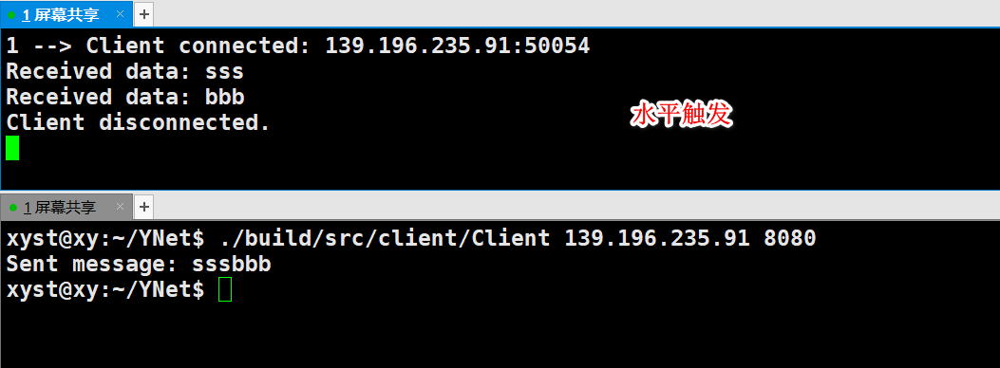
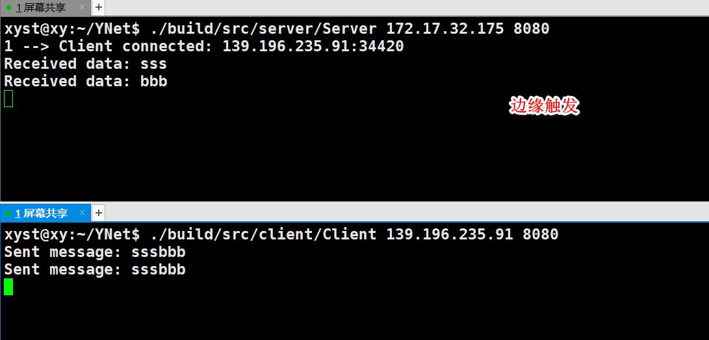

## 系统调用

:green_apple: `epoll_create`：创建一个 epoll 实例

```c++
#include <sys/epoll.h>

int epoll_create(int size);
```

epoll_create 中的参数 size 已被忽略，但它必须是大于零的值。

---

:green_apple: ` epoll_ctl`：用于在 epoll 实例中添加、修改或删除文件描述符

```c++
#include <sys/epoll.h>

int epoll_ctl(int epfd, int op, int fd, struct epoll_event *event);
```

**`epfd`**: epoll_create 返回的 epoll 实例的文件描述符

**`op`**: 操作类型，指定你想要执行的操作，可以是以下之一：

- EPOLL_CTL_ADD：**添加**文件描述符到 epoll 实例中
- EPOLL_CTL_MOD：**修改**已存在的文件描述符的事件
- EPOLL_CTL_DEL：从 epoll 实例中**删除**文件描述符

**`fd`**: 需要添加（监视）、修改或删除（不再监视）的文件描述符

**`event`**: 指向 `epoll_event` 结构体的指针，定义了你希望监视的事件（读写事件）及事件发生时的处理方式

---

:green_apple: `epoll_wait`：等待 epoll 实例中的事件发生

```c++
#include <sys/epoll.h>

 int epoll_wait(int epfd, struct epoll_event *events, int maxevents, int timeout);
```

**`epfd`**: epoll_create 返回的 epoll 实例的文件描述符

**`events`**: 指向 epoll_event 结构体数组的指针。epoll_wait 会将发生的事件填充到这个数组中

**`maxevents`**: events 数组的大小，表示最多可以返回多少个事件

**`timeout`**: 超时时间（以毫秒为单位）。如果设置为 -1，epoll_wait 会无限等待直到有事件发生；如果设置为 0，epoll_wait 会立即返回，不会阻塞；其他值表示超时时间

当你调用 `epoll_wait` 时，它会阻塞，直到有事件发生，或者超时，或者被中断。调用成功的返回值是返回实际发生的事件数，这些实际发生的事件存储在 events 事件数组中，从这里取出来事件并处理。

---

epoll_ctl 和 epoll_wait 都出现 epoll_event 结构体

```c++
struct epoll_event {
    uint32_t events;  // 事件类型
    epoll_data_t data;  // 用户数据
};
```

**`events`**: 你希望监视的事件类型，可以是以下之一（或者它们的组合）：

- EPOLLIN：可读事件（常用）
- EPOLLOUT：可写事件（常用）
- EPOLLERR：错误事件
- EPOLLHUP：挂起事件
- EPOLLET：边缘触发模式（不设置默认是水平触发）
- EPOLLONESHOT：一次性事件

**`data`**: 你可以用来存储用户数据，通常是一个 union，可以存储 int、ptr 或其他数据类型

## 代码实战

```c++
#include <iostream>
#include <cstring>
#include <netinet/in.h>
#include <arpa/inet.h>
#include <sys/socket.h>
#include <unistd.h>
#include <sys/epoll.h>

#define LISTEN_NUM 10
#define EVENT_NUM 20

void handle_client(int epfd, int client_fd);
void accept_connection(int epfd, int socket_fd);

int main(int argc, char *argv[]) {
  if (argc != 3) {
    std::cerr << "Usage: " << argv[0] << " <IP> <PORT>" << std::endl;
    return -1;
  }

  std::string ip = argv[1];
  int port = std::stoi(argv[2]);

  int socket_fd = socket(AF_INET, SOCK_STREAM, 0);
  if (socket_fd < 0) {
    perror("socket error");
    return -1;
  }

  struct sockaddr_in server_addr;
  memset(&server_addr, 0, sizeof(server_addr));
  server_addr.sin_family = AF_INET;
  server_addr.sin_port = htons(port);
  server_addr.sin_addr.s_addr = inet_addr(ip.c_str());

  if (bind(socket_fd, (struct sockaddr *) &server_addr, sizeof(server_addr)) < 0) {
    perror("bind error");
    close(socket_fd);
    return -1;
  }

  if (listen(socket_fd, LISTEN_NUM) < 0) {
    perror("listen error");
    close(socket_fd);
    return -1;
  }

  int epfd = epoll_create(1);
  if (epfd < 0) {
    perror("epoll_create error");
    close(socket_fd);
    return -1;
  }

  struct epoll_event evt;
  evt.events = EPOLLIN;
  evt.data.fd = socket_fd;
  if (epoll_ctl(epfd, EPOLL_CTL_ADD, socket_fd, &evt) < 0) {
    perror("epoll_ctl error");
    close(socket_fd);
    close(epfd);
    return -1;
  }

  while (true) {
    struct epoll_event events[EVENT_NUM];
    int eventNum = epoll_wait(epfd, events, EVENT_NUM, -1);
    if (eventNum < 0) {
      perror("epoll_wait error");
      close(socket_fd);
      close(epfd);
      return -1;
    }

    for (int i = 0; i < eventNum; ++i) {
      if (events[i].data.fd == socket_fd) {
        accept_connection(epfd, socket_fd);
      } else {
        handle_client(epfd, events[i].data.fd);
      }
    }
  }

  close(socket_fd);
  close(epfd);

  return 0;
}

void accept_connection(int epfd, int socket_fd) {
  static int count = 1;
  struct sockaddr_in client_addr;
  socklen_t client_len = sizeof(client_addr);
  int client_fd = accept(socket_fd, (struct sockaddr *) &client_addr, &client_len);
  if (client_fd < 0) {
    perror("accept error");
    return;
  }
  std::cout <<count++<<" --> Client connected: " << inet_ntoa(client_addr.sin_addr) << ":" << ntohs(client_addr.sin_port) << std::endl;

  struct epoll_event evt;
  evt.events = EPOLLIN;
  evt.data.fd = client_fd;
  if (epoll_ctl(epfd, EPOLL_CTL_ADD, client_fd, &evt) < 0) {
    perror("epoll_ctl error");
    close(client_fd);
  }
}

void handle_client(int epfd, int client_fd) {
  char buf[1024];
  ssize_t bytes_read = recv(client_fd, buf, sizeof(buf) - 1, 0);
  if (bytes_read < 0) {
    perror("recv error");
    close(client_fd);
    epoll_ctl(epfd, EPOLL_CTL_DEL, client_fd, nullptr);
  } else if (bytes_read == 0) {
    std::cout << "Client disconnected." << std::endl;
    close(client_fd);
    epoll_ctl(epfd, EPOLL_CTL_DEL, client_fd, nullptr);
  } else {
    buf[bytes_read] = '\0';
    std::cout << "Received data: " << buf << std::endl;

    // 发送响应消息
    const char *response = "Message received!";
    ssize_t bytes_sent = send(client_fd, response, strlen(response), 0);
    if (bytes_sent < 0) {
      perror("send error");
      close(client_fd);
      epoll_ctl(epfd, EPOLL_CTL_DEL, client_fd, nullptr);
    }
  }
}
```

在网络编程中，我们会得到两种 fd，一个是用来监听客户端连接的fd（socket 创建，暂时命名为 listenfd）；一个是用来从全连接队列里面取出来的 fd（accpet 返回，暂时命名为connfd），这个 fd 是客户端和服务端已经建立连接的fd，后续通信都是用此 fd。我们先把  listenfd 添加到 epoll 树中并监听读事件（客户端连接服务器是读事件），然后 在 while 循环中 调用 epoll_wait，如果没有事件发生，epoll_wait会阻塞。

为了区分是 建立连接的fd ，还是和服务器实际通信的fd，只需要根据事件数组中的成员参数 fd 和 listenfd（代码中命名为socket_fd） 比较即可。相等意味着是建立连接的，调用 accept 取到后续通信的 fd，并且加入到 epoll 树中并监听感兴趣的事件。不相等意味着是和服务器实际通信的 fd ，处理发生的感兴趣的事件即可。

## 水平触发和边缘触发

:leaves: 水平触发

- 读事件：如果 epoll_wait 触发了读事件，表示有数据可读，如果程序没有把数据读完，再次调用 epoll_wait 的时候，将立即再次触发读事件。
- 写事件：如果发生缓冲区没有满，表示可以写入数据，只要缓冲区没有被写满，再次调用epoll_wait的时候，将立即再次触发写事件。

:leaves: 边缘触发

- 读事件：如果 epoll_wait 触发了读事件，不管程序有没有处理读事件，epoll_wait 都不会再触发读事件，只有当新的数据到达时，才再次触发读事件。
- 写事件：epoll_wait 触发写事件之后，如果发送缓冲区任可以写（发送缓冲区没有满），epoll_wait 不会再次触发写事件，只有当发送缓冲区由 满 变成 不满 时，才再次触发写事件。

这里就以读事件举例，客户端发生长度为 6 的字符串sssbbb，服务器这边一次读只能读取长度为 3 的字符串。下面看看水平触发和边缘触发的现象：

水平触发：epoll_wait触发读事件，读取字符串sss，epoll_wait再次触发读事件，读取字符串bbb

边缘触发：epoll_wait触发读事件，读取字符串sss

客户端再次发送长度为6的字符串sssbbb：

水平触发：epoll_wait触发读事件，读取字符串sss，epoll_wait再次触发读事件，读取字符串bbb

边缘触发：epoll_wait触发读事件，读取字符串bbb（把之前没读完的字符串读完）

实践效果图如下：



