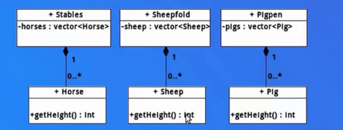
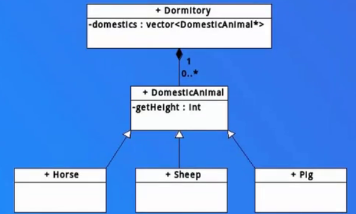
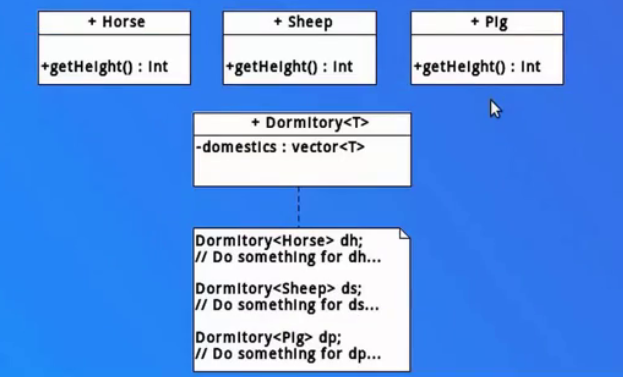

## 模板、元编程和泛型编程

**模板**是一种能够产生代码的代码，本身不进入程序中

**元编程**意味着你撰写一段程序A（前面提到的模板），程序A会运行后生成另外一个程序B，程序B才是真正实现功能的程序。那么这个时候程序A可以称作程序B的元程序，撰写程序A的过程，就称之为“元编程”

如果元编程中所有的变化的量（或者说元编程的参数）都是类型，那么这样的编程，我们称为**泛型编程**

区分泛型编程和元编程，可参考王建伟老师的区分：

- 泛型编程：重点突出的是“通用”的概念，这个“泛”字就是通用的意思。例如函数模板、类模板代码，这些代码很多都以类型作为模板参数进行传递，程序员不需要关心具体的类型，编译器会进行相关的类模板或函数模板的实例化工作。模板的设计初衷也是用于泛型编程--对数据类型和算法等进行抽象
- 元编程：重点突出的是一种程序设计技巧，达到用常规的编程手段难以达到的效果。这种程序设计技巧非常注重模板在实例化过程中的一些推导过程，而这些推导过程恰恰是解决问题和体现程序设计技巧的过程

```C++
template <typename T>
T const& Max (T const& a, T const& b) 
{ 
    return a < b ? b:a; 
} 
```

如上是函数模板，但它并不算是代码，而是用来生成代码（实例化的时候会生成对应的代码），假定你调用如下方法（`Max(3,5)` 和 `Max(1.2,3.1)`）

那么你的程序中只有两部分代码（函数代码 A 和函数代码 B），函数模板并不在其中

从这点我们就明白，模板会在编译期间帮我们把代码生成，而不是在运行时（说此是为了强调和多态机制的不同）

**模板本身并不是最终可执行代码的一部分，而是用于生成最终可执行代码的“蓝图”。模板定义了一个通用的模式，但真正的代码是在模板实例化时生成的**

```c++
Max(3,5);

//生成函数代码 A
int const& Max (int const& a, int const& b) 
{ 
    return a < b ? b:a; 
} 

Max(1.2,3.1);

//生成函数代码 B

float const& Max (float const& a, float const& b) 
{ 
    return a < b ? b:a; 
} 
```

通过模板，我们可以将形形色色的堆栈代码分为两个部分，一个部分是不变的接口，以及近乎相同的实现；另外一部分是元素的类型，它们是需要变化的。因此同函数类似，需要变化的部分，由模板参数来反应；不变的部分，则是模板内的代码。可以看到，使用模板的代码，要比不使用模板的代码简洁许多

## 模板、宏和重载

宏只是替换，没有类型安全检查，代码永远只有一份

模板用来生成代码，编译期间就确定程序所需的代码并实际产生

宏既然是替换，意味着是在运行期间运作，如果暂时不考虑安全问题，效率问题也是不可忽视（通常宏用于短小代码）。函数重载倒是可以编译期间确定，却也因为不具备模板“变化莫测”的特性，略输一筹。这样看来，模板倒是非常强大了，既是在编译期间确定且能应对变化

> 编译期间确定（编译期决策）通常比运行时确定（运行时决策）效率更高。这主要是因为编译期决策在程序运行之前已经确定好了具体的操作，而运行时决策需要在程序执行时进行额外的计算和判断
>
> 比方说 if 判断语句，编译期间就已经判断完成，而运行期间会在运行时才去做这个判断

## 面向过程编程、面向对象编程和模板元编程

以牲口圈舍举例谈三种编程，即有三种动物（马羊猪），要给它们分别搭建一个棚（马棚、羊圈、猪圈）

（1）面向过程

一种动物一个棚，种类越多类越多，代码量增多（关键是得自己一个一个写）

但不得不承认，这种编程符合现实世界，即每种动物放在各自的棚里面



（2）面向对象

把棚抽象为一个类，所有动物都放在一个棚里面，继承者只需要实现抽象基类的虚函数即可

相对于面向过程，尽管方法getHeight依旧需要实现，但是无需每次都创建一个棚了，代码量明显减少

可是这脱离现实了，因为没人会把所有动物放在一个棚里面管理（这个棚也是不存在的，是虚拟的）



（3）模板元编程

面向过程要手写很多代码，因为每个动物的类型不同

面向对象又不符合现实情况，按理改为每种动物在不同的棚中，而不是放在一个棚中管理

模板元编程可以只需要设计一份代码，传入不同的类型并生成实际的代码，完美解决面向过程和面向对象的不足



## 模板函数和模板类的语法

（1）函数模板

```c++
template <typename type> 
ret-type func-name(parameter list)
{
   // 函数的主体
}

// 举例
template <typename T>
inline T const& Max (T const& a, T const& b) 
{ 
    return a < b ? b:a; 
} 
```

（2）类模板

```c++
template <class type> 
class class-name 
{
	//成员变量、成员方法
}

// 举例
template <class T>
class Stack { 
  private: 
    vector<T> elems;     // 元素 
 
  public: 
    void push(T const&);  		// 入栈
    void pop();                 // 出栈
    T top() const;             // 返回栈顶元素
}; 
```

------

参考链接

https://sg-first.gitbooks.io/cpp-template-tutorial/content/TMP_ji_chu_md.html
