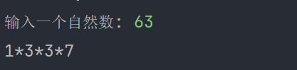

题目：输入一个自然数，输出其各因子的连乘形式，如输入 12，则输出 12=1 * 2 * 2 * 3

```c++
#include <iostream>
#include <vector>
#include <cmath>

// 检测是否为完全平方数
bool checkSquareFull(int num){
  int n = sqrt(num);
  return n * n == num;
}

void func(int num,std::vector<int> &data){
  if (num == 1 || num == 0){
    data.push_back(num);
    return;
  }

  while (num % 2 == 0){   // 保证偶数全部被处理了
    num = num / 2;
    data.push_back(2);
  }

  // 奇数有可能被3整除，有可能通过平方根，有可能再无法被分解（完毕）
  while (num){
    if (num == 1){
      break;
    }
    if (num % 3 == 0){
      num = num / 3;
      data.push_back(3);
    }else if (checkSquareFull(num)){
      num = sqrt(num);
      data.push_back(num);
    }else{
      data.push_back(num);
      break;
    }
  }
}

int main() {

  int num;
  std::vector<int> data;
  std::cout<<"输入一个自然数: ";
  std::cin>>num;

  func(num,data);

  std::cout<<"1";
  for (int i:data) {
    std::cout<<"*"<<i;
  }

  return 0;
}
```

效果：



题目已经明确说输入数字为自然数，也就保证不会出现负数

我们需要对传递进来的 num 进行特殊值处理，即如果 num 为 0 或 1，加入到 data 容器中即可退出

一个数字要么是偶数要么就是奇数。偶数必然能够被2整除，因为循环与2相除，最终得到的数字就必然只能是奇数。奇数可以有三种情况：被 3 整除，完全平方根，不能被任何数整除（结束的标志）

关于求解平方根，可以利用 sqrt 函数求解，但是要注意，这个函数对于任何正数都可以求解，对于负数求解就会报错。在这道题，负数不可能出现，不存在出现错误的情况。如果这个数是完全平方数，可以利用 sqrt 进行求解并加入到 data 容器中；如果这个数不是完全平方数并且还不能被 3 整除，意味着不能再被分解， 把这个不能分解的数加入到容器中，退出质因数分解。

```c++
bool checkSquareFull(int num){	// 检测是否为完全平方数
  int n = sqrt(num);
  return n * n == num;
}
```

