设计的目标：**低**耦合、**高**内聚

何为耦合？强调类与类之间、模块与模块之间的**依赖程度**

**低耦合**意味着模块或类之间的依赖关系尽可能少，这样修改一个模块或类不会大规模影响其他模块或类

何为内聚？强调类的内部或者模块内部各元素之间的**关联程度**

**高内聚**意味着一个模块或类内的所有功能和数据都高度相关，模块或类的职责明确单一

## 单一职责原则

核心思想：一个类，最好只做一件事情

这个表述容易给人误解，特别是后面给的示意图让人误以为一个类只能有一个方法就代表类只做一件事情。一个类最好只做一件事的含义是，不包含本该由其它类完成的功能

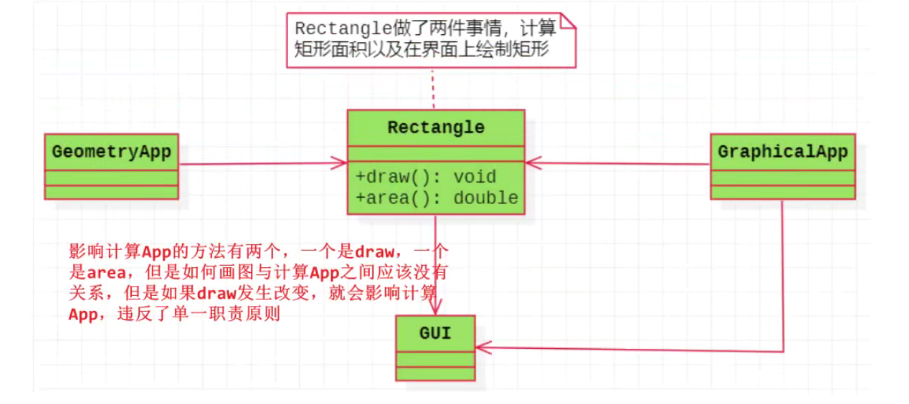

如上图中的Rectangle类有两个功能：计算和绘图

GeometryApp只是用来计算，并不需要画图功能，那么就该把Rectangle类中的绘图功能抽离出一个新的类，以符合单一职责原则

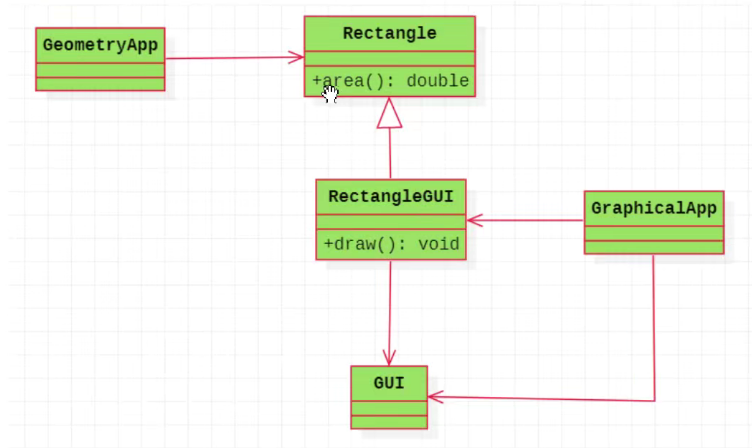

## 开闭原则

核心思想：对于扩展是开放的，对于修改是封闭的

下图类有四个方法，但这个类不是封闭的，因为要增加新功能的话，就得改动这个类

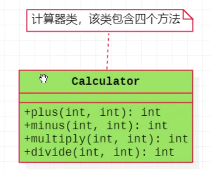

为了实现“对于扩展是开放的，对于修改是封闭的”的原则，把该类改为抽象类，提供一个运算功能的抽象接口，派生类继承并实现即可。以后如果需要新增其它计算方式的功能，无需改动此类，只需要新建类并继承此类，然后实现抽象接口即可

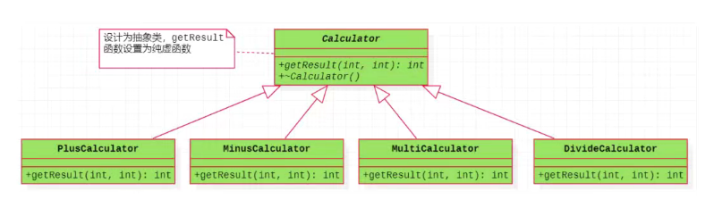

## 里氏代换原则

核心思想：派生类可以扩展基类的功能，但不能改变基类原有的功能

即派生类如果函数名和基类的函数名相同，但这个函数在基类中已经实现对应功能，派生类就会重定义基类的方法，即隐藏基类原有的功能了。调用该方法不会调用基类的功能，而是调用派生类重定义的功能，就相当于改变基类原有的功能了

> 重定义（隐藏）
>
> - 派生类屏蔽了与其同名的基类函数
> - 如果派生类的函数和基类的函数同名，但是参数不同，此时，不管有无virtual，基类的函数被隐藏
> - 如果派生类的函数与基类的函数同名，并且参数也相同，但是基类函数没有关键字，此时，基类的函数被隐藏

如果这个函数基类没有实现（虚函数或纯虚函数）也就没有问题，就只是扩展基类的功能而已，称为重写。而重写是要派生类和基类的函数名以及参数列表相同，并且基类的此函数有virtual关键字

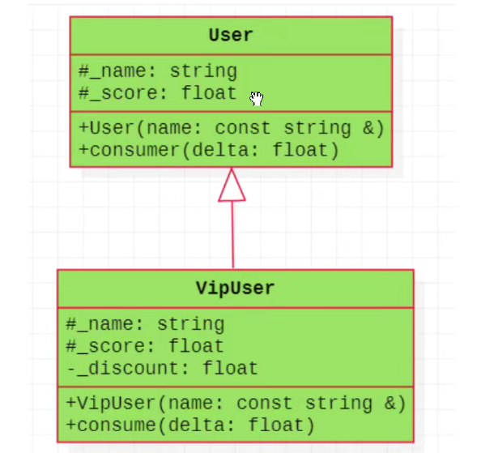

如上图中VipUser重定义基类的consume方法，违背里氏代换原则了

## 接口分离原则

核心思想：使用多个小的专门的接口，而不要使用一个大的总接口

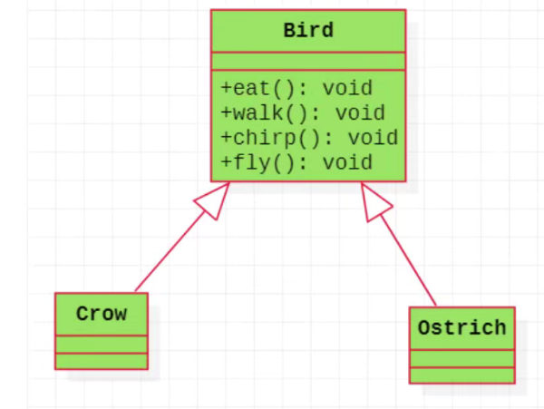

Ostrich类没有飞的功能，这样就不能直接继承Bird类了，需要把fly的虚函数单独抽离到一个类中，如下图那样解决这个问题

这种方式在类中会很少设计，因为会继承太多，我们通常不建议使用多继承（尽可能避免）。不过把一个函数中的功能拆分出子函数却很常见，利于代码阅读以及代码复用

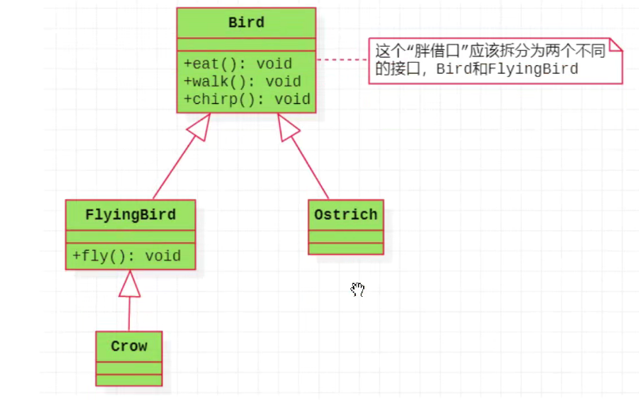

## 依赖倒转原则

该原则初看容易和开闭原则混淆，但区别还是明显的，这里就以顾客去不同的商店买东西为例

顾客购买ShaoguanShop商店的商品代码如下：

```c++
class Customer
{
    public void shopping(ShaoguanShop shop)
    {
        //购物
        printf("shop.sell()");
    }
}
```

但是顾客想要购买其它商品就需要更改代码，代码如下：

```Java
class Customer
{
    public void shopping(WuyuanShop shop)
    {
        //购物
        printf("shop.sell()");
    }
}
```

不如把所有的商店抽象为一个基类Shop，所有商店继承此类并实现抽象函数sell

那么顾客无需再更改代码，以后哪怕有新的商店增加也不用更改代码

```c++
class Customer
{
    public void shopping(Shop shop)
    {
        //购物
        printf("shop.sell()");
    }
}
```

具体的类图见下：

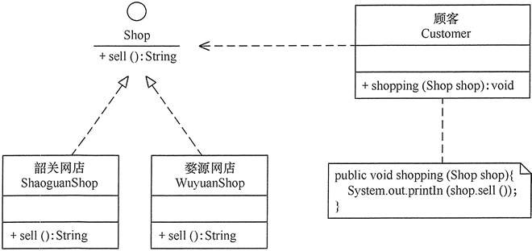

程序的代码：

```c++
#include <iostream>
#include <string>

// 商店接口
class Shop {
public:
    virtual ~Shop() = default;
    virtual std::string sell() const = 0; // 卖
};

// 韶关网店
class ShaoguanShop : public Shop {
public:
    std::string sell() const override {
        return "韶关土特产：香菇、木耳……";
    }
};

// 婺源网店
class WuyuanShop : public Shop {
public:
    std::string sell() const override {
        return "婺源土特产：绿茶、酒糟鱼……";
    }
};

// 顾客
class Customer {
public:
    void shopping(const Shop& shop) const {
        // 购物
        std::cout << shop.sell() << std::endl;
    }
};

int main() {
    Customer wang;
    std::cout << "顾客购买以下商品：" << std::endl;
    ShaoguanShop shaoguanShop;
    WuyuanShop wuyuanShop;

    wang.shopping(shaoguanShop);
    wang.shopping(wuyuanShop);

    return 0;
}

/*

顾客购买以下商品：
韶关土特产：香菇、木耳……
婺源土特产：绿茶、酒糟鱼……

*/
```


## 迪米特法原则

核心思想：一个类或模块应该对其他类或模块保持最少的了解（只与朋友通信）

> 首先来解释一下什么是直接的朋友：每个对象都会与其他对象有耦合关系，只要两个对象之间有耦合关系，我们就说这两个对象之间是朋友关系
>
> 耦合的方式很多，依赖、关联、组合、聚合等。其中，我们称出现成员变量、方法参数、方法返回值中的类为直接的朋友，而出现在局部变量中的类则不是直接的朋友
>
> 也就是说，陌生的类最好不要作为局部变量的形式出现在类的内部

即局部变量的类B出现在类A的内部，那么类B不是类A的朋友

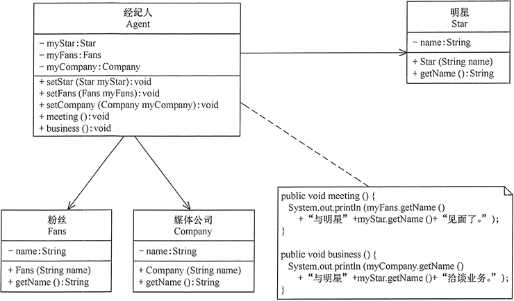

明星由于全身心投入艺术，所以许多日常事务由经纪人负责处理，如与粉丝的见面会，与媒体公司的业务洽淡等。这里的经纪人是明星的朋友，而粉丝和媒体公司是陌生人，所以适合使用迪米特法则

```c++
#include <iostream>
#include <string>

// 明星类
class Star {
private:
    std::string name;
public:
    Star(const std::string& name) : name(name) {}
    std::string getName() const {
        return name;
    }
};

// 粉丝类
class Fans {
private:
    std::string name;
public:
    Fans(const std::string& name) : name(name) {}
    std::string getName() const {
        return name;
    }
};

// 媒体公司类
class Company {
private:
    std::string name;
public:
    Company(const std::string& name) : name(name) {}
    std::string getName() const {
        return name;
    }
};

// 经纪人类
class Agent {
private:
    Star* myStar;
    Fans* myFans;
    Company* myCompany;
public:
    void setStar(Star* star) {
        myStar = star;
    }
    void setFans(Fans* fans) {
        myFans = fans;
    }
    void setCompany(Company* company) {
        myCompany = company;
    }
    void meeting() const {
        std::cout << myFans->getName() << "与明星" << myStar->getName() << "见面了。" << std::endl;
    }
    void business() const {
        std::cout << myCompany->getName() << "与明星" << myStar->getName() << "洽谈业务。" << std::endl;
    }
};

int main() {
    Agent agent;
    Star star("林心如");
    Fans fans("粉丝韩丞");
    Company company("中国传媒有限公司");

    agent.setStar(&star);
    agent.setFans(&fans);
    agent.setCompany(&company);

    agent.meeting();
    agent.business();

    return 0;
}
```

## 组合复用原则

核心思想：使用关联、聚合取代继承关系

即通过将已有的对象纳入新对象中，作为新对象的成员对象来实现的，新对象可以调用已有对象的功能，从而达到复用

汽车按“动力源”划分可分为汽油汽车、电动汽车等；按“颜色”划分可分为白色汽车、黑色汽车和红色汽车等。如果同时考虑这两种分类，其组合就很多

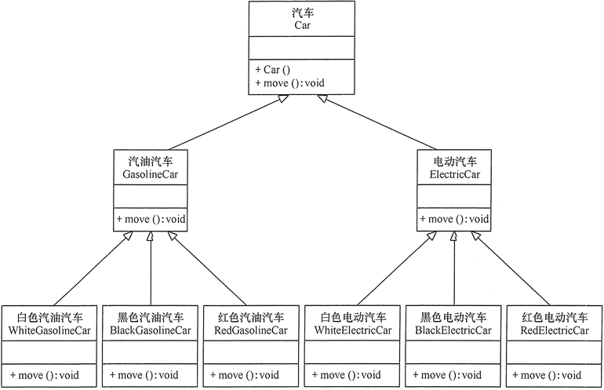

上图可以看出用继承关系实现会产生很多子类，而且增加新的“动力源”或者增加新的“颜色”都要修改源代码，这违背了开闭原则，显然不可取。但如果改用组合关系实现就能很好地解决以上问题，见下图

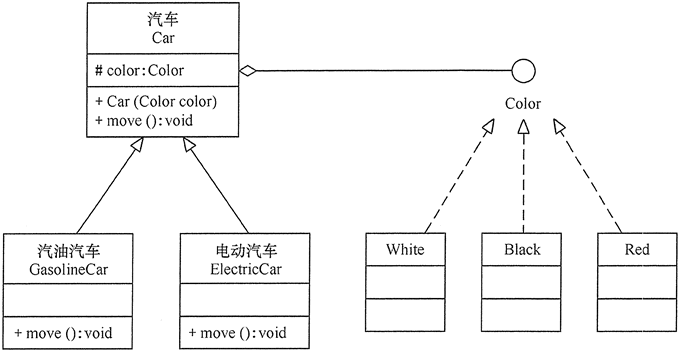

以后想要增加什么颜色的车，只需要在Color类中添加即可，汽油汽车和电动汽车都无需因为颜色而新建类


参考链接：https://docs.oldtimes.me/c.biancheng.net/view/1331.html