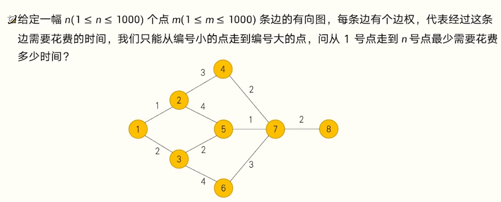

动态规划的两个要求：

1. 最优子结构：大问题的（最优）解可以由小问题的（最优）解推出。比方说在斐波那契题中，大问题 `f(n) `的解可以由小问题 `f(n - 2) `和 `f(n - 1)` 的解推出。**注意在问题拆解过程中不能无限递归**
2. 无后效性：未来与过去无关，一旦得到了一个小问题的解，如何得到它的解的过程不影响大问题的求解。比方说在斐波那契题中，要求`f(n)`，只需要知道`f(n - 2) `和 `f(n - 1)` 的值，而它们到底是怎么得到的已经不关键了

动态规划的两个元素：

1. 状态：求解过程进行到哪一步（可以理解为一个子问题）
2. 转移：从一个状态（小问题）的（最优）解推导出另一个状态（大问题）的（最优）解的过程

## [70. 爬楼梯](https://leetcode.cn/problems/climbing-stairs/)

```c++
class Solution {
public:
    int climbStairs(int n) {
        vector<int> data(n + 1);
        data[0] = 1;
        data[1] = 1;
        for(int i = 2; i <= n; i++){
            data[i] = data[i-1] + data[i-2];
        }
        return data[n];
    }
};
```

定义大问题的解为`f(n)`，n 代表楼梯阶数

`f(n)`的含义是 传递楼梯阶数 n，返回从楼底爬到楼梯阶数 n有多少种不同的方法

题目说每次可以爬 `1` 或 `2` 个台阶，意味着可能从两个地方转移过来，即 `n - 1`阶 和 `n - 2 `阶

也就是说 `f(n)` 的解（状态） 从之前的两个状态 `f(n - 2) `和 `f(n - 1)` 转移（推导）而来

这里的状态转移方程是`f(n)`  = `f(n - 2) `+ `f(n - 1)`


## 最短路



最优子结构：为了算出从 1 号点到 y 号点最少需要花费多少时间，我们可以先计算出所有和 y 号点有边相连，并且标号小于 y 的点 x，从 1 号点到 x 号点最少需要花费多少时间，然后再推导 y 号点的情况

无后效性：我们只关心到每个点最少花费多少时间，不关心具体走了哪条路径

状态：用 `f[i]` 表示从 1 号点到 i 号点最少需要花费多少时间

转移：假设我们已经知道了 `f[x]` 的值，并且存在一条从 x 到 y 的代价为 z 的边，那么有 `f[y] = min(f[y],f[x]+z) `

```c++
#include <iostream>
#include <vector>
#include <climits>  

int main() {
    int n, m;
    std::cin >> n >> m;

    std::vector<std::vector<int>> data(n + 1, std::vector<int>(n + 1, INT_MAX));
    for (int i = 0; i < m; ++i) {
        int x, y, z;
        std::cin >> x >> y >> z;
        data[x][y] = std::min(data[x][y], z);
    }

    
    std::vector<int> result(n + 1, INT_MAX);
    result[1] = 0;  // 起点到自身的距离为0

    for (int i = 2; i <= n; ++i) {
        for (int j = 1; j < i; ++j) {
            if (result[j] < INT_MAX && data[j][i] < INT_MAX) {
                result[i] = std::min(result[i], result[j] + data[j][i]);
            }
        }
    }

    if (result[n] < INT_MAX) {
        std::cout << result[n];
    } else {
        std::cout << -1;  // 如果无法到达n号节点
    }

    return 0;
}

/*
样例：
8 10
1 2 1
1 3 2
2 4 3
2 5 4
3 5 2
3 6 4
4 7 2
5 7 1
6 7 3
7 8 2

s
7

*/
```

